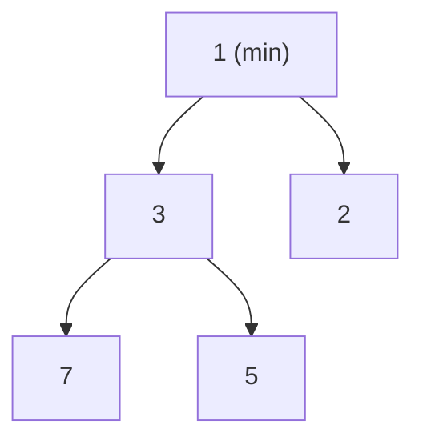

## Why it Matters

A **heap** is a **complete binary tree** satisfying the **heap property**: every parent ≤ children (**min-heap**) or parent ≥ children (**max-heap**). The root is always the extremal element (min or max). Unlike a BST, a heap has **no ordering between siblings/subtrees**, only parent-child ordering.

- **Min-heap:** `parent ≤ children` → root = minimum.
- **Max-heap:** `parent ≥ children` → root = maximum.
- **Complete tree:** all levels filled except possibly last, filled left-to-right → heap fits in an **array** without pointers.
- Java maps heaps to `PriorityQueue` (min-heap by default; max-heap via custom `Comparator`).
```
Min-heap (array [1,3,2,7,5]) Max-heap (array [9,7,8,3,5])
 1 9
 / \ / \
 3 2 7 8
 / \ / \
 7 5 3 5
Array: parent(i)=(i-1)/2, left(i)=2i+1, right(i)=2i+2 (0-indexed)
```
**Heap vs BST vs PriorityQueue:** heap → O(1) min/max, O(log n) insert/extract; BST → O(log n) search + ordered traversal; `PriorityQueue` is Java's heap implementation (binary heap, not sorted).

## Diagram



## Code

```java
// PriorityQueue is a min-heap; max-heap via reverseOrder; iteration is NOT sorted
List<Integer> topK(int[] nums, int k) {
 var minHeap = new PriorityQueue<Integer>(); // invariant: size <= k, top is k-th
 for (int x : nums) {
 minHeap.offer(x); // O(log k)
 if (minHeap.size() > k) minHeap.poll();
 }
 return new ArrayList<>(minHeap);
}

void demo() {
 var pq = new PriorityQueue<>(List.of(5, 1, 3));
 System.out.println(pq.poll()); // => 1
 System.out.println(pq.poll()); // => 3

 var maxHeap = new PriorityQueue<Integer>(Comparator.reverseOrder());
 maxHeap.addAll(List.of(5, 1, 3));
 System.out.println(maxHeap.poll()); // => 5

 System.out.println(topK(new int[]{5, 1, 3, 6, 4}, 2)); // => [5, 6] (any order)
}
```

> **Sequenced note:** `PriorityQueue` iteration is heap-order, not sorted; for ordered output use `stream().sorted()` or copy to `ArrayList` (which is `SequencedCollection`) and `sort`/`reversed()`.

## When to use / not

| Use | NOT |
|-----|-----|
| Top-k, scheduling, Dijkstra PQ, running median (two heaps) | Membership tests or sorted traversal → `TreeSet`/sort |
| Streaming extremes with bounded memory O(k) | Small fixed sets , plain sort is simpler |

## Trade-offs

- O(1) peek, O(log n) insert/extract; O(n) build; tiny memory.
- No search, no sorted iteration, no duplicates control (`TreeSet` differs).

## Vs

| Aspect | **Heap** (PriorityQueue) | **Tree** (BST / Balanced BST) |
|---|---|---|
| **Shape** | Complete binary tree (array-backed) | Arbitrary / balanced (AVL, Red-Black) |
| **Ordering** | Parent ≤/≥ children only | `left < node < right` (BST) , full ordering |
| **Min / Max** | **O(1)** (root) | O(log n) balanced / O(h) unbalanced |
| **Search** | **O(n)** (no ordering) | **O(log n)** balanced, O(n) worst |
| **Insert / Delete** | **O(log n)** | **O(log n)** balanced |
| **Sorted traversal** | **No** , must sort (heap sort O(n log n)) | **Yes** , in-order yields sorted O(n) |
| **Use case** | Top K, scheduling, Dijkstra, median | Ordered map, range queries, predecessor/successor |
| **Java type** | `PriorityQueue` | `TreeMap` / `TreeSet` (Red-Black) |

> Heap is *not* a search structure, it is a priority structure. Do not use it to test membership.

## Pitfalls

- **`PriorityQueue` is min-heap by default**, max-heap requires `Comparator.reverseOrder()` or `(a,b)->b-a` (beware overflow; prefer `Comparator.comparingInt`).
- **Iteration order ≠ sorted order**, `for (int x: pq)` is heap order; only `poll()` yields sorted sequence.
- **`Comparator` overflow:** `(a,b)->a-b` overflows for large ints; use `Integer.compare(a,b)` / `Comparator.comparingInt`.
- **`null` not allowed**, `PriorityQueue` / `ArrayDeque` forbid `null` (null is sentinel for `poll()`).
- **Heapify is O(n), not O(n log n)**, cite Floyd's bottom-up proof in interviews.
- **Mutating keys after insertion** corrupts heap, remove → mutate → re-insert.
- **Boxing overhead**, `PriorityQueue<Integer>` boxes primitives; for large heaps consider `int[]` + manual heapify.

## Interview q&a

**Q: Min-heap vs max-heap, when to use which for Top K?** k largest → min-heap of size k (evict smallest); k smallest → max-heap of size k (evict largest). Heap top is the k-th element.

**Q: How is `PriorityQueue` implemented?** Binary heap over `Object[]`, array-backed complete tree, sift-up/down, O(log n) offer/poll, O(1) peek.

**Q: Heapify O(n), why not O(n log n)?** Most nodes are near leaves (height small); sum of heights is linear. Proof: Σ (n/2^(h+1))·h = O(n).

**Q: Heap vs `TreeSet` for Top K?** Heap O(n log k); `TreeSet` O(n log k) too but dedupes and needs `Comparator` consistent with `equals`; heap is more idiomatic and allows duplicates.

**Q: How to get median of a stream?** Two heaps: max-heap `low` (lower half) + min-heap `high` (upper half); balance sizes, median is `low.peek()` or average.

**Q: Why not use `java.util.Stack` for heap?** Unrelated, Stack is LIFO `Vector`; heap needs `PriorityQueue`/`ArrayDeque`.

Min-heap vs max-heap, when to use which for Top K?:: k largest → min-heap of size k (evict smallest); k smallest → max-heap of size k (evict largest). Heap top is the k-th element. #flashcard
How is `PriorityQueue` implemented?:: Binary heap over `Object[]`, array-backed complete tree, sift-up/down, O(log n) offer/poll, O(1) peek. #flashcard
Heapify O(n), why not O(n log n)?:: Most nodes are near leaves (height small); sum of heights is linear. Proof: Σ (n/2^(h+1))·h = O(n). #flashcard
Heap vs `TreeSet` for Top K?:: Heap O(n log k); `TreeSet` O(n log k) too but dedupes and needs `Comparator` consistent with `equals`; heap is more idiomatic and allows duplicates. #flashcard
How to get median of a stream?:: Two heaps: max-heap `low` (lower half) + min-heap `high` (upper half); balance sizes, median is `low.peek()` or average. #flashcard
Why not use `java.util.Stack` for heap?:: Unrelated, Stack is LIFO `Vector`; heap needs `PriorityQueue`/`ArrayDeque`. #flashcard

- [215. Kth Largest Element In An Array](https://leetcode.com/problems/kth-largest-element-in-an-array/)
- [347. Top K Frequent Elements](https://leetcode.com/problems/top-k-frequent-elements/)
- [373. Find K Pairs With Smallest Sums](https://leetcode.com/problems/find-k-pairs-with-smallest-sums/)

---
*Category: DSA • Part of [[README|Java MOC]]*

## Related

- [[Array]] • [[Trees]] (heap is a complete binary tree) • [[Java/07_DSA/Queue|Queue]] (PriorityQueue is a Queue) • [[Java/07_DSA/Stack|Stack]] • [[Java/07_DSA/HashMap|HashMap (DSA)]]
- [[README|Java MOC]]

# Heap

> Part of [[README|Java MOC]] • `DSA`

## Representation , Array and Heapify

| Representation | Structure | Notes |
|---|---|---|
| **Array (implicit)** | `a[0]` root; `left=2i+1`, `right=2i+2`, `parent=(i-1)/2` | Cache-friendly, no `Node` pointers; `PriorityQueue` uses `Object[]` |
| **Tree nodes** | `record Node(int val, Node left, Node right)` | Educational; wastes memory vs array |

### Heapify

- **Sift-up (bubble up):** after `insert` at end → compare with parent, swap if violates heap property → O(log n).
- **Sift-down (bubble down / heapify-down):** after `extract` (swap root with last, remove last) → compare with children, swap with smaller/larger child → O(log n).
- **Build-heap (Floyd's heapify):** bottom-up `heapify-down` from `n/2 - 1` down to `0` → O(n) (tighter than n × O(log n)).

```
algorithmHeapifyDown(a, i, n) // min-heap smallest ← i; l ← 2i+1; r ← 2i+2
 if l < n and a[l] < a[smallest]: smallest ← l
 if r < n and a[r] < a[smallest]: smallest ← r
 if smallest ≠ i: swap(a[i],a[smallest]); HeapifyDown(a, smallest, n)

BuildHeap(a) // O(n)
 for i ← n/2 - 1 downto 0: HeapifyDown(a, i, n)
```

## Operations , Complexity

| Operation | Time | Notes |
|---|---|---|
| `Peek` (min/max) | **O(1)** | Root of heap |
| `Insert` / `offer` | **O(log n)** | Sift-up |
| `ExtractMin/Max` / `poll` | **O(log n)** | Swap root→last, sift-down |
| `HeapifyDown` / `SiftDown` | **O(log n)** | Height h = log n |
| `BuildHeap` (heapify array) | **O(n)** | Bottom-up Floyd |
| `HeapSort` | **O(n log n)** | n extracts |
| Search (arbitrary) | **O(n)** | No BST ordering |
| `PriorityQueue` `offer/poll/peek` | O(log n)/O(log n)/O(1) | Binary heap |

**Top K pattern:** keep a heap of size `k` → O(n log k). k largest → min-heap of size k; k smallest → max-heap of size k; k frequent → min-heap by frequency.

## Java 25 Notes

- **Record Node/Edge:** `record Node(int val)` and `record Edge(int to, int weight)` replace boilerplate `equals/hashCode`; records are immutable and compact. Use `if (e instanceof Edge(var to, var w))` for destructuring (record pattern matching, Java 21/25).
- **Sequenced (JEP 431):** `ArrayList`, `ArrayDeque`, `LinkedHashSet` are `SequencedCollection`; use `getFirst()`/`getLast()`/`addFirst()`/`addLast()`/`reversed()` instead of index arithmetic. `PriorityQueue` results are typically collected into an `ArrayList` for sequenced views.
- **Compact Object Headers (JEP 450, Java 25):** `-XX:+UseCompactObjectHeaders` shrinks object header from 12-16 B to 8 B. Heaps with millions of boxed entries (`PriorityQueue<Integer>`, `Entry` records) save ~30-40% header overhead; backing `Object[]` arrays also benefit, fewer cache misses and ~10-20% heap saving. Mention in memory-heavy interview follow-ups.
- **Virtual threads (JEP 444/491):** for parallel Top K or parallel heap build on large partitions, offload chunks to virtual threads via `StructuredTaskScope.ShutdownOnFailure`, `scope.fork(() -> buildHeap(partition))`.
- **Pattern matching:** `if (obj instanceof Entry(var n, var f))` and `switch` patterns for heap comparators.

## Solve with Patterns

- [[Coding Patterns/03_Stack_Heap/01 - Monotonic Stack]]
- [[Coding Patterns/03_Stack_Heap/02 - Top K Elements]]
- [[Coding Patterns/05_Trees_Graphs/04 - Shortest Path]], Dijkstra uses min-heap (PriorityQueue)
- [[Coding Patterns/05_Trees_Graphs/02 - DFS]] • [[Coding Patterns/05_Trees_Graphs/03 - BFS]]
