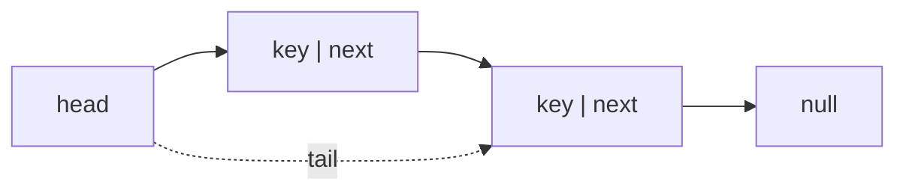

## Why it Matters

A **linked list** is a linear data structure where elements (**nodes**) are not stored contiguously but are linked via **references/pointers**. Each node holds a key (value) and one or two pointers to neighbours. Size is dynamic; insertion/deletion at known positions is O(1) without shifting, at the cost of O(n) random access.

## Diagram



## Code

```java
// Immutable node — reassignment builds the new list (persistent style)
record Node<T>(T val, Node<T> next) {}

int size(Node<?> head) {
 int n = 0;
 for (var c = head; c != null; c = c.next()) n++; // O(n), no index access
 return n;
}

void demo() {
 Node<Integer> head = new Node<>(1, new Node<>(2, new Node<>(3, null)));
 System.out.println(size(head)); // => 3
 System.out.println(head.val()); // => 1

 var list = new java.util.LinkedList<>(List.of("a", "b", "c"));
 System.out.println(list.getFirst()); // => a
 System.out.println(list.getLast()); // => c
 list.addFirst("z");
 System.out.println(list); // => [z, a, b, c]
}
```

## When to use / not

| Use | NOT |
|-----|-----|
| O(1) insert/delete at known nodes/ends, dynamic size | Random access by index → `Array` |
| LRU parts, adjacency chains, undo stacks | Cache-heavy scans , nodes scatter in memory |

## Trade-offs

- O(1) ends insert/delete, dynamic size, no regrowth pauses.
- O(n) access/search; extra pointer(s) per node; poor locality.

## Vs

| | `Singly` | `Doubly` | `ArrayList` |
|--|----------|----------|-------------|
| Per node | 1 pointer | 2 pointers | none |
| `PopBack` | O(n) | O(1) | amortised O(1) |
| Backward walk | no | yes | yes (index) |

## Pitfalls

- **Lost references**, forgetting to update `head`/`tail` or `prev`/`next` creates leaks or cycles.
- **PopBack on singly without tail scan**, O(n); often mistakenly assumed O(1).
- **`==` vs `equals`** when searching for keys of object type.
- **Concurrent modification**, iterating while mutating without `Iterator` throws `ConcurrentModificationException`.
- **Stack overflow** on recursive traversal of long lists.

## Interview q&a

**Q: Array vs Linked List?** Array: O(1) random access, cache-friendly, fixed capacity. List: O(1) insert at ends (with tail), dynamic size, O(n) access.

**Q: When to use `ArrayList` vs `LinkedList` in Java?** Effective Java / modern guidance: `ArrayList` almost always wins due to cache locality; `LinkedList` only when many mid-list inserts via `ListIterator`.

**Q: How to detect a cycle?** Floyd's tortoise-and-hare (two pointers at 1× and 2× speed).

Array vs Linked List?:: Array: O(1) random access, cache-friendly, fixed capacity. List: O(1) insert at ends (with tail), dynamic size, O(n) access. #flashcard
When to use `ArrayList` vs `LinkedList` in Java?:: Effective Java / modern guidance: `ArrayList` almost always wins due to cache locality; `LinkedList` only when many mid-list inserts via `ListIterator`. #flashcard
How to detect a cycle?:: Floyd's tortoise-and-hare (two pointers at 1× and 2× speed). #flashcard

- [206. Reverse Linked List](https://leetcode.com/problems/reverse-linked-list/)
- [141. Linked List Cycle](https://leetcode.com/problems/linked-list-cycle/)
- [21. Merge Two Sorted Lists](https://leetcode.com/problems/merge-two-sorted-lists/)

## Related

- Singly Linked List • Doubly Linked List • Array • [[Java/07_DSA/Stack|Stack]] • [[Java/07_DSA/Queue|Queue]]
- [[README|Java MOC]]

# Linked List

> Part of [[README|Java MOC]] • `DSA`

## Variants

| Variant | Node fields | Navigation | Extra memory |
|---|---|---|---|
| **Singly Linked List** | `key`, `next` | Forward only | 1 pointer |
| **Doubly Linked List** | `key`, `next`, `prev` | Forward & backward | 2 pointers |
| Circular (singly/doubly) | last node points to head | Wrap-around | , |
| With `tail` pointer | head + tail references | O(1) pushBack / topBack | 1 ref |

## Operations , Complexity

| Operation | Singly (with tail) | Doubly (with tail) |
|---|---|---|
| `PushFront` / `PopFront` / `TopFront` | **O(1)** | **O(1)** |
| `PushBack` / `TopBack` | **O(1)** | **O(1)** |
| `PopBack` | **O(n)** (needs predecessor scan) | **O(1)** |
| `Find(key)` / `Erase(key)` | **O(n)** | **O(n)** |
| `AddAfter(node, key)` | **O(1)** | **O(1)** |
| `AddBefore(node, key)` | **O(n)** (find predecessor) | **O(1)** |
| `Empty()` | **O(1)** | **O(1)** |
| Random access `get(i)` | **O(n)** | **O(n)** |

Choose **singly** when memory matters and backward traversal is unnecessary; **doubly** when `PopBack`/`AddBefore`/LRU behaviour is frequent.

## Java 25 Notes

- **Record Node:** `record Node<T>(T val, Node<T> next)` replaces `static class Node { T key; Node next; }`, immutable, auto `equals/hashCode`, compact. For mutable lists keep `next` via wrapper or use `record` for value + separate link array (or make `next` mutable via `AtomicReference` if needed).
- **SequencedCollection:** `LinkedList`/`ArrayDeque` implement `SequencedCollection`, `getFirst`/`getLast`/`addFirst`/`addLast`/`reversed()` are idiomatic Java 25.
- **Pattern matching:** `if (node instanceof Node<String>(var v, var nxt))` or `switch (node) { case Node(var v, var n) -> ...; case null -> ...; }` for null-safe traversal.
- **Compact Object Headers (JEP 450):** each linked node header shrinks to 8 B, big win for million-node lists (saves ~4-8 MB per 1M nodes).

## Solve with Patterns

- [[Coding Patterns/02_LinkedList/01 - Fast and Slow Pointers]]
- [[Coding Patterns/02_LinkedList/02 - LinkedList In-place Reversal]]
