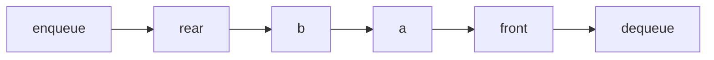

## Why it Matters

A **queue** is an abstract data type with **First-In-First-Out (FIFO)** semantics. Elements are added at the **rear (tail)** and removed from the **front (head)**. Can be implemented with an [[Array]] (circular buffer, amortised O(1)) or a [[Linked List]] (guaranteed O(1) with head/tail pointers).

| Operation | Meaning | List mapping |
|---|---|---|
| `Enqueue(key)` | Add key to rear | `List.PushBack` |
| `Dequeue()` | Remove & return front key | `List.TopFront` + `List.PopFront` |
| `Front()` / `Peek()` | Return front without removing | `List.TopFront` |
| `Empty()` | Are there any elements? | `List.Empty` |

FIFO distinguishes queues from [[Java/07_DSA/Stack|Stack]] (LIFO).

## Diagram



## Code

```java
// ArrayDeque as FIFO queue: offer/poll return special values, add/remove throw
List<Integer> bfs(List<List<Integer>> adj, int start) {
 var order = new ArrayList<Integer>();
 var seen = new boolean[adj.size()];
 Deque<Integer> q = new ArrayDeque<>(); // invariant: q holds discovered, unvisited
 q.offer(start); seen[start] = true;
 while (!q.isEmpty()) {
 int u = q.poll();
 order.add(u);
 for (int v : adj.get(u)) if (!seen[v]) { seen[v] = true; q.offer(v); }
 }
 return order; // O(V + E)
}

void demo() {
 Deque<String> q = new ArrayDeque<>();
 q.offer("a"); q.offer("b"); q.offer("c");
 System.out.println(q.poll()); // => a
 System.out.println(q); // => [b, c]

 var adj = List.of(List.of(1, 2), List.of(3), List.of(3), List.of());
 System.out.println(bfs(adj, 0)); // => [0, 1, 2, 3]
}
```

## When to use / not

| Use | NOT |
|-----|-----|
| BFS, scheduling, buffering, producer-consumer | LIFO → `Stack` |
| Priority scheduling → heap-backed `PriorityQueue` | Equal-priority FIFO assumption on heaps (not guaranteed) |

## Trade-offs

- O(1) enqueue/dequeue; BFS/scheduling natural fit.
- Fixed-capacity variants need full/empty disambiguation; heaps aren't FIFO.

## Vs

| | Circular array (`ArrayDeque`) | Linked with tail |
|--|--------------------------------|--------------------|
| Enqueue/dequeue | O(1) amortised | O(1) |
| Memory | fixed buffer + regrow | per-node pointers |
| Best for | default queues, BFS | stable latency, no regrow |

## Pitfalls

- **Using `LinkedList` as queue**, correct but slower than `ArrayDeque` due to node allocation; prefer `ArrayDeque`.
- **Confusing `add` vs `offer` / `remove` vs `poll`**, `offer`/`poll` return special values on capacity/empty; `add`/`remove` throw.
- **Fixed-capacity overflow**, circular queue must distinguish full vs empty (via `size` counter or leaving one slot empty).
- **Null elements**, most `Queue` impls (`ArrayDeque`, `PriorityQueue`) forbid `null` (null is used as sentinel for `poll()`).
- **Priority queue is not FIFO** for equal priorities, ordering is heap-based, not insertion order.

## Interview q&a

**Q: Queue via two stacks?** Stack `in` for enqueue, stack `out` for dequeue, transfer when `out` empty; amortised O(1).

**Q: Stack vs Queue?** Stack LIFO (top only), Queue FIFO (both ends). `Deque` generalises both.

**Q: When to use `BlockingQueue`?** Producer-consumer across threads, `put()` blocks when full, `take()` blocks when empty.

Queue via two stacks?:: Stack `in` for enqueue, stack `out` for dequeue, transfer when `out` empty; amortised O(1). #flashcard
Stack vs Queue?:: Stack LIFO (top only), Queue FIFO (both ends). `Deque` generalises both. #flashcard
When to use `BlockingQueue`?:: Producer-consumer across threads, `put()` blocks when full, `take()` blocks when empty. #flashcard

- [232. Implement Queue Using Stacks](https://leetcode.com/problems/implement-queue-using-stacks/)
- [225. Implement Stack Using Queues](https://leetcode.com/problems/implement-stack-using-queues/)

---
*Category: DSA • Part of [[README|Java MOC]]*

## Related

- [[Java/07_DSA/Stack|Stack]] • [[Array]] • [[Linked List]] • [[Java/07_DSA/HashMap|HashMap (DSA)]]
- [[README|Java MOC]]

# Queue (DSA)

> Part of [[README|Java MOC]] • `DSA`

## Operations , Complexity

| Operation | Time (array circular) | Time (linked with tail) |
|---|---|---|
| `Enqueue` | **O(1)** amortised | **O(1)** |
| `Dequeue` | **O(1)** | **O(1)** |
| `Front` / `Peek` | **O(1)** | **O(1)** |
| `Empty` / `Size` | **O(1)** | **O(1)** |
| Search | **O(n)** | **O(n)** |

## Variants

| Variant | Semantics | Example |
|---|---|---|
| **Simple queue** | FIFO | Printer jobs |
| **Circular queue** | Wraps array end → start | Fixed-capacity buffers |
| **Deque** | Insert/remove at both ends | `ArrayDeque` |
| **Priority queue** | Dequeue by priority (heap) | `PriorityQueue` O(log n) |
| **Blocking queue** | Blocks on empty/full | `ArrayBlockingQueue`, `LinkedBlockingQueue` (concurrency) |

## Java 25 Notes

- **SequencedCollection:** `ArrayDeque`/`LinkedList` implement `SequencedCollection`, `getFirst()`/`getLast()` replace `peek()`/`peekLast()`; `reversed()` gives LIFO view of FIFO queue.
- **Virtual threads (JEP 444/491):** blocking queue consumers with `BlockingQueue.take()` are now cheap on virtual threads, one virtual thread per consumer is viable (vs platform-thread pools).
- **Compact Object Headers:** `LinkedList` queue node headers shrink to 8 B; `ArrayDeque` circular buffer element headers also compact.

## Solve with Patterns

- [[Coding Patterns/05_Trees_Graphs/03 - BFS]]
- [[Coding Patterns/03_Stack_Heap/02 - Top K Elements]]
