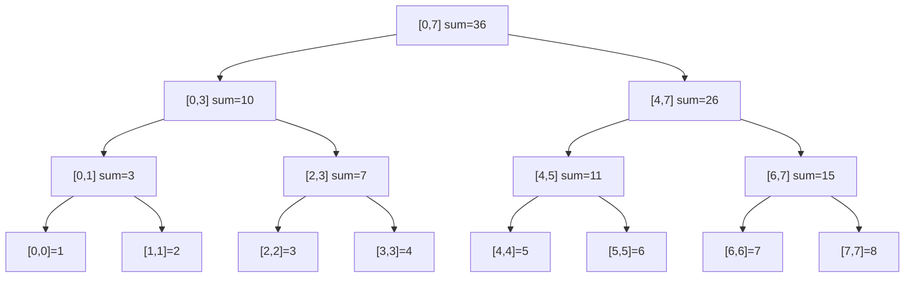

# Segment Tree

> Part of [[README|Java MOC]] • `Java/07_DSA`
> 🎨 **Visual diagram:** Create Excalidraw drawing from template: `Cmd+P → Excalidraw: New from template → Java Diagram`

## Intent

A **Segment Tree** is a binary tree that answers **range queries** (sum, min, max, gcd) and supports **point/range updates** in **O(log n)**. Each node stores the aggregate of a segment.

## Why it Matters

- **Range sum/min/max queries** on mutable arrays: O(log n) vs O(n) scan
- **Range updates with lazy propagation**: add value to range, query later
- **Persistent/immutable variants**: versioned queries
- **2D segment trees**: matrix range queries
- Core building block for competitive programming and real-time analytics

## Diagram



## Code / Example

```java
// Java 25: records, pattern matching, var
// Segment Tree for Range Sum Query with Point Update

record SegNode(int left, int right, long sum, SegNode leftChild, SegNode rightChild) {}

class SegmentTree {
    private final int n;
    private final long[] tree; // 1-indexed array representation
    
    SegmentTree(int[] arr) {
        n = arr.length;
        tree = new long[4 * n];
        build(arr, 1, 0, n - 1);
    }
    
    private void build(int[] arr, int node, int l, int r) {
        if (l == r) { tree[node] = arr[l]; return; }
        int mid = (l + r) >>> 1;
        build(arr, node << 1, l, mid);
        build(arr, node << 1 | 1, mid + 1, r);
        tree[node] = tree[node << 1] + tree[node << 1 | 1];
    }
    
    // Point update: set index idx to value val
    void update(int idx, int val) { update(1, 0, n - 1, idx, val); }
    private void update(int node, int l, int r, int idx, int val) {
        if (l == r) { tree[node] = val; return; }
        int mid = (l + r) >>> 1;
        if (idx <= mid) update(node << 1, l, mid, idx, val);
        else update(node << 1 | 1, mid + 1, r, idx, val);
        tree[node] = tree[node << 1] + tree[node << 1 | 1];
    }
    
    // Range query: sum on [ql, qr]
    long query(int ql, int qr) { return query(1, 0, n - 1, ql, qr); }
    private long query(int node, int l, int r, int ql, int qr) {
        if (ql > r || qr < l) return 0; // neutral element
        if (ql <= l && r <= qr) return tree[node];
        int mid = (l + r) >>> 1;
        return query(node << 1, l, mid, ql, qr) 
             + query(node << 1 | 1, mid + 1, r, ql, qr);
    }
}

// Lazy Propagation for Range Add + Range Sum
class LazySegmentTree {
    private final int n;
    private final long[] tree, lazy;
    
    LazySegmentTree(int[] arr) {
        n = arr.length;
        tree = new long[4 * n];
        lazy = new long[4 * n];
        build(arr, 1, 0, n - 1);
    }
    
    private void build(int[] arr, int node, int l, int r) {
        if (l == r) { tree[node] = arr[l]; return; }
        int mid = (l + r) >>> 1;
        build(arr, node << 1, l, mid);
        build(arr, node << 1 | 1, mid + 1, r);
        tree[node] = tree[node << 1] + tree[node << 1 | 1];
    }
    
    private void push(int node, int l, int r) {
        if (lazy[node] != 0) {
            tree[node] += lazy[node] * (r - l + 1);
            if (l != r) {
                lazy[node << 1] += lazy[node];
                lazy[node << 1 | 1] += lazy[node];
            }
            lazy[node] = 0;
        }
    }
    
    void rangeAdd(int ql, int qr, long val) { rangeAdd(1, 0, n - 1, ql, qr, val); }
    private void rangeAdd(int node, int l, int r, int ql, int qr, long val) {
        push(node, l, r);
        if (ql > r || qr < l) return;
        if (ql <= l && r <= qr) {
            lazy[node] += val;
            push(node, l, r);
            return;
        }
        int mid = (l + r) >>> 1;
        rangeAdd(node << 1, l, mid, ql, qr, val);
        rangeAdd(node << 1 | 1, mid + 1, r, ql, qr, val);
        tree[node] = tree[node << 1] + tree[node << 1 | 1];
    }
    
    long query(int ql, int qr) { return query(1, 0, n - 1, ql, qr); }
    private long query(int node, int l, int r, int ql, int qr) {
        push(node, l, r);
        if (ql > r || qr < l) return 0;
        if (ql <= l && r <= qr) return tree[node];
        int mid = (l + r) >>> 1;
        return query(node << 1, l, mid, ql, qr) 
             + query(node << 1 | 1, mid + 1, r, ql, qr);
    }
}
```

### Concrete Example

- **Input:** `arr = [1,2,3,4,5,6,7,8]`, query sum[2,5], update index 3 to 10, query sum[2,5]
- **Output:** First query = 3+4+5+6=18, after update = 3+10+5+6=24

## When to Use / When NOT

| **Use When** | **Avoid When** |
|--------------|----------------|
| - Range queries (sum/min/max/gcd) on mutable data | - Static array: prefix sums O(1) query |
| - Range updates with lazy propagation | - Only point queries: Fenwick tree simpler |
| - Need persistent/immutable versions | - Very small n (< 100): brute force OK |
| - 2D range queries (matrix) | - Offline queries: Mo's algorithm |

## Trade-offs

| Dimension | Segment Tree | Fenwick Tree | Sparse Table |
|-----------|--------------|--------------|--------------|
| Range query | O(log n) | O(log n) | O(1) |
| Point update | O(log n) | O(log n) | O(n) |
| Range update | O(log n) lazy | O(log n) range add | No |
| Memory | 4n | n+1 | n log n |
| Operations | Any associative | Invertible only | Idempotent only |

## Vs Table

| Aspect | Segment Tree | Fenwick Tree | Sparse Table | Sqrt Decomposition |
|--------|--------------|--------------|--------------|-------------------|
| Range sum | O(log n) | O(log n) | O(1) | O(sqrt n) |
| Range add | O(log n) lazy | O(log n) two BITs | No | O(sqrt n) |
| Range min/max | O(log n) | No | O(1) | O(sqrt n) |
| Persistent | Yes | No | Yes | No |

## Pitfalls

- **Off-by-one**: tree size 4n is safe; 2n may overflow for non-power-of-2 n
- **Neutral element**: 0 for sum, INF for min, -INF for max, 0 for gcd
- **Lazy propagation**: push before recursing; apply to children correctly
- **Overflow**: use `long` for sums; modulo if needed
- **Not thread-safe**: synchronize or copy for concurrent access

## Interview Q&A (Senior Depth)

**Q1. What is the core insight of Segment Tree, and why does it work?**
**A:** Any range can be decomposed into O(log n) canonical segments stored in tree nodes. Build stores aggregates bottom-up; query merges O(log n) nodes. It's a complete binary tree over the array indices.

**Q2. When would you choose Fenwick Tree over Segment Tree?**
**A:** When you only need prefix sums / point updates (simpler, less memory, faster constant factor). Fenwick can't do range min/max or non-invertible operations.

**Q3. How does lazy propagation work, and when is it needed?**
**A:** Defer updates to children until necessary. Store pending update in `lazy[]`; push down before visiting children. Needed for range updates to stay O(log n) instead of O(n).

**Q4. Walk me through a non-obvious problem that reduces to Segment Tree.**
**A:** **Maximum subarray sum** (Kadane's segment tree): each node stores sum, max prefix, max suffix, max subarray. Merge in O(1). **Range mode query** with wavelet tree / persistent segment tree. **Count of distinct elements in range** with offline + BIT.

**Q5. What is the memory/performance implication at scale?**
**A:** 4n nodes, each a `long` → ~32 bytes per element. For 10^7 elements: ~320 MB. Cache-friendly array layout. Recursion depth log2(n) ≈ 24 for 10^7 — safe. Iterative version avoids recursion overhead.

## Flashcards (Spaced Repetition)

#flashcard
**Q:** What is the time complexity of Segment Tree query/update? :: **A:** O(log n) for both point and range operations. #flashcard

#flashcard
**Q:** When to use Segment Tree vs Fenwick Tree? :: **A:** Segment tree for range min/max/gcd, non-invertible ops, lazy range updates. Fenwick for prefix sums / invertible ops only. #flashcard

#flashcard
**Q:** What is lazy propagation? :: **A:** Deferring range updates to children until query touches them, stored in lazy[] array. #flashcard

#flashcard
**Q:** Segment tree memory size? :: **A:** 4 * n (safe for all n), 2 * n for power-of-2 n. #flashcard

#flashcard
**Q:** Neutral element for min segment tree? :: **A:** Integer.MAX_VALUE (or Long.MAX_VALUE). #flashcard

## Practice Tasks (Tasks Plugin)

- [ ] Restate the intent from memory 📅 {{date:YYYY-MM-DD, +1}}
- [ ] Code the snippet without looking 📅 {{date:YYYY-MM-DD, +3}}
- [ ] Answer all Interview Q&A aloud 📅 {{date:YYYY-MM-DD, +7}}
- [ ] Review flashcards (Spaced Repetition) 📅 {{date:YYYY-MM-DD, +1}}

```tasks
not done
path includes Java/07_DSA
sort by due
limit 10
```

## Related

- [[README|Java MOC]]
- DSA MOC
- [[Java/07_DSA/Fenwick Tree|Fenwick Tree (BIT)]]
- Sparse Table

---

*Category: Java/07_DSA • Part of [[README|Java MOC]] • Java 25*

## Problem

Need to answer range aggregate queries (sum, min, max) and support updates on a mutable array efficiently.

## Solution

Build a complete binary tree where each node stores the aggregate of a segment. Query merges O(log n) canonical nodes. Lazy propagation defers range updates.

## When not to use

| Instead | Use |
|---------|-----|
| Static array, many queries | Prefix sums / Sparse Table |
| Only prefix sums / point updates | Fenwick Tree |
| Offline range queries | Mo's Algorithm |
| Very small n | Brute force |