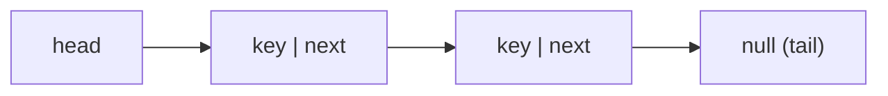

## Why it Matters

A **singly linked list** is a chain of **nodes** where each node stores a `key` and a single pointer `next` to the successor. The list is accessed via `head` (first node) and optionally `tail` (last node). Traversal is **forward-only**.

- Node: `{ key, next }`
- Head: first node; Tail: last node (`tail.next == null`)

![[Pasted image 20230725103254.png]]

## Diagram



## Code

```java
// Mutable node for imperative algorithms; head reassignment on pushFront
static class Node {
 int key;
 Node next;
 Node(int key, Node next) { this.key = key; this.next = next; }
}

Node reverse(Node head) {
 Node prev = null, curr = head; // invariant: prev is reversed prefix
 while (curr != null) {
 Node nxt = curr.next;
 curr.next = prev;
 prev = curr; curr = nxt;
 }
 return prev; // O(n) time, O(1) space
}

String show(Node head) {
 var sb = new StringBuilder();
 for (var c = head; c != null; c = c.next) sb.append(c.key).append(" -> ");
 return sb.append("null").toString();
}

void demo() {
 Node head = new Node(1, new Node(2, new Node(3, null)));
 System.out.println(show(head)); // => 1 -> 2 -> 3 -> null
 System.out.println(show(reverse(head))); // => 3 -> 2 -> 1 -> null
}
```

## When to use / not

| Use | NOT |
|-----|-----|
| Stacks, hash-bucket chains, forward-only traversal | `PopBack`/`AddBefore` hot paths → `Doubly Linked List` |
| Minimal memory per node (one pointer) | Backward traversal or LRU move-to-front |

## Trade-offs

- One pointer per node; O(1) head ops; simplest linked structure.
- Forward-only; `PopBack` O(n); predecessor scans for `AddBefore`.

## Vs

| | `Singly` | `Doubly` |
|--|----------|----------|
| Memory | 1 pointer/node | 2 pointers/node |
| `PopBack` / `AddBefore` | O(n) | O(1) |
| Use | stacks, chains | LRU, deque ends |

## Pitfalls

- **PopBack is O(n)**, frequently mistaken for O(1); use doubly linked list if `popBack` is hot.
- **Dangling `tail`** after `PopFront` on last element, must set `tail = null`.
- **Null key handling**, `Objects.equals` not `==`.
- **Cycle creation**, `node.next = node` creates self-loop; careful in `AddAfter`.

## Interview q&a

**Q: Reverse a singly linked list?** Iterative three-pointer (`prev/curr/next`) O(n) time O(1) space; or recursion O(n) stack.

**Q: Find middle in one pass?** Slow/fast pointers.

**Q: When is `PushBack` O(1) without tail?** Never, need tail or circular trick; otherwise O(n).

Reverse a singly linked list?:: Iterative three-pointer (`prev/curr/next`) O(n) time O(1) space; or recursion O(n) stack. #flashcard
Find middle in one pass?:: Slow/fast pointers. #flashcard
When is `PushBack` O(1) without tail?:: Never, need tail or circular trick; otherwise O(n). #flashcard

- [206. Reverse Linked List](https://leetcode.com/problems/reverse-linked-list/)
- [141. Linked List Cycle](https://leetcode.com/problems/linked-list-cycle/)
- [876. Middle Of The Linked List](https://leetcode.com/problems/middle-of-the-linked-list/)

## Related

- [[Linked List]] • [[Doubly Linked List]] • [[Java/07_DSA/Stack|Stack]] • [[Java/07_DSA/Queue|Queue]]
- [[README|Java MOC]]

# Singly Linked List

> Part of [[README|Java MOC]] • `DSA`

## Operations , Complexity

| Operation | No tail | With tail | Notes |
|---|---|---|---|
| `PushFront(key)` | **O(1)** | O(1) | Prepend |
| `TopFront` | **O(1)** | O(1) | |
| `PopFront` | **O(1)** | O(1) | |
| `PushBack(key)` | **O(n)** | **O(1)** | Scan to end without tail |
| `PopBack` | **O(n)** | O(n) | Needs predecessor scan |
| `TopBack` | **O(n)** | **O(1)** | |
| `Find(key)` | **O(n)** | O(n) | Linear scan |
| `Erase(key)` | **O(n)** | O(n) | Find + relink |
| `AddBefore(node, key)` | **O(n)** | O(n) | Must find predecessor |
| `AddAfter(node, key)` | **O(1)** | O(1) | Node known |

## Algorithms (Pseudocode)

#### PushFront(key)

```
algorithmnode ← new Node; node.key ← key; node.next ← headhead ← node
if tail = nil: tail ← head
```

#### PopFront()
```
algorithmif head = nil: ERROR empty
head ← head.next
if head = nil: tail ← nil
```

#### PushBack(key)

```
algorithmnode ← new Node; node.key ← key; node.next ← nilif tail = nil: head ← tail ← node
else: tail.next ← node; tail ← node
```

#### PopBack()
```
algorithmif head = nil: ERROR empty
if head = tail: head ← tail ← nil
else:
 p ← head
 while p.next.next ≠ nil: p ← p.next
 p.next ← nil; tail ← p
```

#### AddAfter(node, Key)

```
algorithmnode2 ← new Node; node2.key ← keynode2.next ← node.next; node.next ← node2
if tail = node: tail ← node2
```

## Java 25 Notes

- **Record Node (Java 25 idiom):** `record Node<T>(T val, Node<T> next) {}` replaces the inner class, concise, immutable value holder. For mutable `next` in algorithms, use `record Node<T>(T val, Node<T> next)` with reassignment via new record `head = new Node<>(key, head)` (persistent style) or keep a mutable wrapper for imperative code.
- **Compact Object Headers (JEP 450, Java 25):** `-XX:+UseCompactObjectHeaders` compresses headers to 8 B, tightens per-node overhead (saves ~30% for singly lists with millions of nodes).
- **SequencedCollection:** expose `getFirst()`/`getLast()`/`reversed()` when wrapping JDK collections.
- **Pattern matching in traversal:** replaces manual `x != null && x.next != null` with `if (curr instanceof Node<T>(var v, var nxt))`.

## Solve with Patterns

- [[Coding Patterns/02_LinkedList/01 - Fast and Slow Pointers]]
- [[Coding Patterns/02_LinkedList/02 - LinkedList In-place Reversal]]
