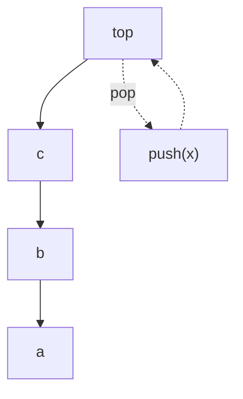

## Why it Matters

A **stack** is an abstract data type (ADT) with **Last-In-First-Out (LIFO)** semantics. Only the **top** element is accessible. It can be implemented with an [[Array]] (array-backed, amortised O(1)) or a [[Linked List]] (linked, guaranteed O(1) push/pop with pointer).

| Operation | Meaning |
|---|---|
| `Push(key)` | Add key to top |
| `Top()` | Return top key without removing |
| `Pop()` | Remove and return top key |
| `Empty()` | `true` if no elements |

All four are O(1).

## Diagram



## Code

```java
// ArrayDeque as stack: push/pop/peek are O(1); never java.util.Stack
boolean balanced(String s) {
 Deque<Character> st = new ArrayDeque<>();
 for (char c : s.toCharArray()) {
 if (c == '(' || c == '[' || c == '{') st.push(c); // invariant: unmatched openers
 else if (st.isEmpty()) return false;
 else {
 char top = st.pop();
 if ((top == '(' && c != ')') || (top == '[' && c != ']')
 || (top == '{' && c != '}')) return false;
 }
 }
 return st.isEmpty();
}

void demo() {
 System.out.println(balanced("()[]{}")); // => true
 System.out.println(balanced("(]")); // => false

 Deque<Integer> st = new ArrayDeque<>();
 st.push(10); st.push(20); st.push(30);
 System.out.println(st.pop()); // => 30
 System.out.println(st.peek()); // => 20
}
```

## When to use / not

| Use | NOT |
|-----|-----|
| Call frames, undo, brackets, iterative DFS, postfix eval | FIFO scheduling → `Queue` |
| Min-stack via auxiliary stack | Random access or search → array/list |

## Trade-offs

- O(1) push/pop; tiny API; underpins DFS and call frames.
- No indexing/search; deep recursion overflows thread stack.

## Vs

| | Array-backed (`ArrayDeque`) | Linked (`Node` chain) |
|--|--------------------------------|----------------------|
| Push/pop | O(1) amortised | O(1) guaranteed |
| Memory | contiguous, cache-friendly | pointer per element |
| Risk | rare O(n) regrowth | allocation per push |

## Pitfalls

- **Using `java.util.Stack`**, legacy, synchronised, extends `Vector`; prefer `ArrayDeque` (faster, no sync overhead).
- **Stack overflow**, recursion depth exceeds thread stack; convert to iterative + explicit stack.
- **Forgetting empty check** before `pop()`/`peek()` → `EmptyStackException` / `NoSuchElementException`.
- **Array-backed growth**, repeated doubling is amortised O(1) but worst-case push is O(n); pre-size `new ArrayDeque<>(capacity)` for hot paths.
- **Memory leak**, array-backed stack must null out `elements[top]` on pop to allow GC.

## Interview q&a

**Q: Array vs Linked List for stack?** Array: cache-friendly, less per-element overhead, but occasional resize cost. Linked: stable O(1) without resize, extra pointer per element.

**Q: How to implement queue using stacks?** Two stacks (inbox/outbox), amortised O(1).

**Q: How to get min in O(1)?** Auxiliary min-stack or store `(value, currentMin)`.

Array vs Linked List for stack?:: Array: cache-friendly, less per-element overhead, but occasional resize cost. Linked: stable O(1) without resize, extra pointer per element. #flashcard
How to implement queue using stacks?:: Two stacks (inbox/outbox), amortised O(1). #flashcard
How to get min in O(1)?:: Auxiliary min-stack or store `(value, currentMin)`. #flashcard

- [20. Valid Parentheses](https://leetcode.com/problems/valid-parentheses/)
- [739. Daily Temperatures](https://leetcode.com/problems/daily-temperatures/)
- [155. Min Stack](https://leetcode.com/problems/min-stack/)

---
*Category: DSA • Part of [[README|Java MOC]]*

## Related

- [[Array]] • [[Linked List]] • [[Java/07_DSA/Queue|Queue]] • [[Trees]] (DFS uses stack)
- [[README|Java MOC]]

# Stack (DSA)

> Part of [[README|Java MOC]] • `DSA`

## Operations , Complexity

| Operation | Time | Space (aux) |
|---|---|---|
| `Push` | **O(1)** (amortised for array) | O(1) |
| `Pop` | **O(1)** | O(1) |
| `Top` / `Peek` | **O(1)** | , |
| `Empty` / `Size` | **O(1)** | , |
| Search | **O(n)** | , |

### Balanced Brackets , Algorithm

```
algorithmStack stackfor char in str:
 if char in ['(', '[', '{']: stack.Push(char)
 else:
 if stack.Empty(): return False
 top ← stack.Pop()
 if (top='[' and char≠']') or (top='(' and char≠')') or (top='{' and char≠'}'): return False
return stack.Empty()
```

## Common Applications

- Function call stack, expression evaluation (infix→postfix), undo/redo, DFS (iterative), parentheses matching, backtracking.

## Java 25 Notes

- **SequencedCollection:** `ArrayDeque` is `SequencedCollection`, use `addFirst`/`removeFirst`/`getFirst`/`getLast`/`reversed()` idiomatically.
- **Record Node:** `record Node<T>(T val, Node<T> next)` for linked stack nodes, immutable, compact.
- **Compact Object Headers (JEP 450):** reduces per-object header on stack node arrays/elements, useful for deep `ArrayDeque` backing arrays.
- **Pattern matching:** `if (top instanceof Node<T>(var v, var nxt))` to peek without NPE.

## Solve with Patterns

- [[Coding Patterns/03_Stack_Heap/01 - Monotonic Stack]]
- [[Coding Patterns/03_Stack_Heap/02 - Top K Elements]]
