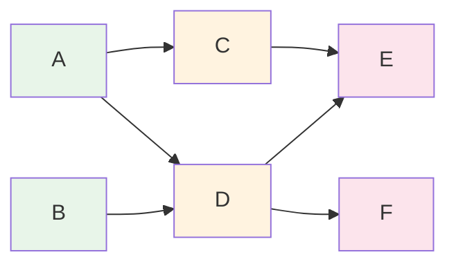

# Topological Sort

> Part of [[README|Java MOC]] • `Java/07_DSA`
> 🎨 **Visual diagram:** Create Excalidraw drawing from template: `Cmd+P → Excalidraw: New from template → Java Diagram`

## Intent

**Topological Sort** orders vertices of a **Directed Acyclic Graph (DAG)** so that for every edge `u → v`, vertex `u` comes before `v`. Used for task scheduling, build systems, and dependency resolution.

## Why it Matters

- **Task scheduling with dependencies**: build order, course prerequisites
- **Build systems** (Maven, Gradle, Bazel): determine compilation order
- **Course scheduling** (LeetCode 207/210): detect cycles, find valid order
- **Spreadsheet recalculation**: dependency graph of cells
- **Deadlock detection**: cycle in wait-for graph

## Diagram



## Code / Example

```java
// Java 25: records, sealed interfaces, pattern matching, var
// Topological Sort: Kahn's Algorithm (BFS) + DFS

import java.util.*;

record Edge(int to) {}

class TopologicalSort {
    
    // Kahn's Algorithm: BFS with indegree
    // Returns empty list if cycle detected
    static List<Integer> kahn(int n, List<Edge>[] adj) {
        int[] indeg = new int[n];
        for (int u = 0; u < n; u++)
            for (Edge e : adj[u]) indeg[e.to]++;
        
        Deque<Integer> q = new ArrayDeque<>();
        for (int i = 0; i < n; i++) if (indeg[i] == 0) q.offer(i);
        
        List<Integer> order = new ArrayList<>();
        while (!q.isEmpty()) {
            int u = q.poll();
            order.add(u);
            for (Edge e : adj[u]) {
                if (--indeg[e.to] == 0) q.offer(e.to);
            }
        }
        return order.size() == n ? order : List.of(); // cycle if size < n
    }
    
    // DFS-based: post-order reverse
    // Returns empty list if cycle detected
    static List<Integer> dfs(int n, List<Edge>[] adj) {
        int[] state = new int[n]; // 0=unvisited, 1=visiting, 2=done
        List<Integer> order = new ArrayList<>();
        boolean[] hasCycle = {false};
        
        java.util.function.IntConsumer visit = new java.util.function.IntConsumer() {
            public void accept(int u) {
                state[u] = 1;
                for (Edge e : adj[u]) {
                    if (state[e.to] == 0) this.accept(e.to);
                    else if (state[e.to] == 1) hasCycle[0] = true;
                }
                state[u] = 2;
                order.add(u);
            }
        };
        
        for (int i = 0; i < n; i++)
            if (state[i] == 0) visit.accept(i);
        
        if (hasCycle[0]) return List.of();
        Collections.reverse(order);
        return order;
    }
    
    // Lexicographically smallest topological order (min-heap)
    static List<Integer> kahnLexicographic(int n, List<Edge>[] adj) {
        int[] indeg = new int[n];
        for (int u = 0; u < n; u++)
            for (Edge e : adj[u]) indeg[e.to]++;
        
        PriorityQueue<Integer> pq = new PriorityQueue<>();
        for (int i = 0; i < n; i++) if (indeg[i] == 0) pq.offer(i);
        
        List<Integer> order = new ArrayList<>();
        while (!pq.isEmpty()) {
            int u = pq.poll();
            order.add(u);
            for (Edge e : adj[u]) {
                if (--indeg[e.to] == 0) pq.offer(e.to);
            }
        }
        return order.size() == n ? order : List.of();
    }
    
    // Detect cycle only (no order needed)
    static boolean hasCycle(int n, List<Edge>[] adj) {
        int[] state = new int[n];
        java.util.function.IntPredicate dfsCycle = new java.util.function.IntPredicate() {
            public boolean test(int u) {
                state[u] = 1;
                for (Edge e : adj[u]) {
                    if (state[e.to] == 1) return true;
                    if (state[e.to] == 0 && this.test(e.to)) return true;
                }
                state[u] = 2;
                return false;
            }
        };
        for (int i = 0; i < n; i++)
            if (state[i] == 0 && dfsCycle.test(i)) return true;
        return false;
    }
}

// Course Schedule II (LeetCode 210) - return ordering or empty
class CourseSchedule {
    int[] findOrder(int numCourses, int[][] prerequisites) {
        List<Edge>[] adj = new ArrayList[numCourses];
        for (int i = 0; i < numCourses; i++) adj[i] = new ArrayList<>();
        int[] indeg = new int[numCourses];
        for (int[] p : prerequisites) {
            adj[p[1]].add(new Edge(p[0]));
            indeg[p[0]]++;
        }
        Deque<Integer> q = new ArrayDeque<>();
        for (int i = 0; i < numCourses; i++) if (indeg[i] == 0) q.offer(i);
        int[] order = new int[numCourses];
        int idx = 0;
        while (!q.isEmpty()) {
            int u = q.poll();
            order[idx++] = u;
            for (Edge e : adj[u]) if (--indeg[e.to] == 0) q.offer(e.to);
        }
        return idx == numCourses ? order : new int[0];
    }
}
```

### Concrete Example

- **Input:** `n=6`, edges: 5→2, 5→0, 4→0, 4→1, 2→3, 3→1
- **Output (Kahn):** [5,4,2,3,0,1] or [4,5,2,3,1,0] — multiple valid orders
- **Cycle detection:** If edge 1→5 added, both algorithms return empty list

## When to Use / When NOT

| **Use When** | **Avoid When** |
|--------------|----------------|
| - DAG scheduling, dependency resolution | - Graph has cycles (use cycle detection first) |
| - Need lexicographically smallest order | - Undirected graph (no topological order) |
| - Build systems, course prerequisites | - Need all possible orders (exponential) |
| - Dynamic graph with edge additions | - Frequent edge deletions (recompute) |

## Trade-offs

| Dimension | Kahn (BFS) | DFS | Kahn + Min-Heap |
|-----------|------------|-----|-----------------|
| Time | O(V+E) | O(V+E) | O(V log V + E) |
| Space | O(V) | O(V) recursion | O(V) |
| Cycle detection | Yes (size check) | Yes (state) | Yes |
| Lexicographic order | No | No | Yes |
| Parallelizable | Yes (per level) | No | Partial |

## Vs Table

| Aspect | Kahn | DFS | Tarjan SCC |
|--------|------|-----|------------|
| Cycle detection | Queue empties early | Back-edge (state=1) | SCC size > 1 |
| Order | Any valid | Reverse post-order | Component order |
| Memory | Indegree array | Recursion stack | Stack + indices |

## Pitfalls

- **Cycle handling**: Kahn returns partial order; DFS needs 3-state visited
- **Multiple valid orders**: Kahn with queue gives one; min-heap gives smallest
- **Disconnected graphs**: Must iterate all vertices (not just from one source)
- **Large recursion depth**: DFS may stack overflow; prefer Kahn for deep DAGs
- **Not unique**: Many valid topological orders exist

## Interview Q&A (Senior Depth)

**Q1. What is the core insight of Topological Sort, and why does it work?**
**A:** In a DAG, there's always at least one vertex with indegree 0 (source). Kahn repeatedly removes sources, which is valid because no edges point to them. DFS uses post-order: a node finishes after all descendants, so reversing gives valid order. Both exploit the acyclic property.

**Q2. When would you choose Kahn over DFS?**
**A:** Kahn is iterative (no stack overflow), naturally detects cycles (queue empties early), parallelizable per level, and easy to extend for lexicographic order with min-heap. DFS is simpler for cycle detection alone and uses less explicit memory (but recursion stack).

**Q3. How does lexicographically smallest topological sort work?**
**A:** Use min-heap (PriorityQueue) instead of queue in Kahn. Always pick smallest available vertex with indegree 0. Guarantees globally smallest order because at each step we make the locally optimal choice among valid options.

**Q4. Walk me through a non-obvious problem that reduces to Topological Sort.**
**A:** **Alien Dictionary (LeetCode 269)**: infer alphabet order from sorted word list. Build graph from adjacent word pairs' first differing characters, then topo sort. **Sequence Reconstruction (LeetCode 444)**: check if original sequence is uniquely reconstructible from subsequences — topo sort must have exactly one choice at each step.

**Q5. What is the memory/performance implication at scale?**
**A:** O(V+E) adjacency list. For 10^6 edges: ~16 MB for edges + 4 MB for indegree array. Kahn with ArrayDeque is cache-friendly. DFS recursion depth = longest path — may need iterative version for deep DAGs. Parallel Kahn processes all current sources simultaneously.

## Flashcards (Spaced Repetition)

#flashcard
**Q:** What is the time complexity of Topological Sort? :: **A:** O(V + E) for both Kahn and DFS. #flashcard

#flashcard
**Q:** How does Kahn's algorithm detect cycles? :: **A:** If result list size < V, there's a cycle (remaining nodes have indegree > 0). #flashcard

#flashcard
**Q:** Difference between Kahn and DFS topological sort? :: **A:** Kahn: BFS, iterative, removes sources. DFS: post-order reverse, uses 3-state visited for cycle detection. #flashcard

#flashcard
**Q:** How to get lexicographically smallest topological order? :: **A:** Kahn with PriorityQueue (min-heap) instead of Queue. #flashcard

#flashcard
**Q:** Can topological sort work on undirected graphs? :: **A:** No, topological order only defined for DAGs (directed acyclic). #flashcard

## Practice Tasks (Tasks Plugin)

- [ ] Restate the intent from memory 📅 {{date:YYYY-MM-DD, +1}}
- [ ] Code the snippet without looking 📅 {{date:YYYY-MM-DD, +3}}
- [ ] Answer all Interview Q&A aloud 📅 {{date:YYYY-MM-DD, +7}}
- [ ] Review flashcards (Spaced Repetition) 📅 {{date:YYYY-MM-DD, +1}}

```tasks
not done
path includes Java/07_DSA
sort by due
limit 10
```

## Related

- [[README|Java MOC]]
- DSA MOC
- [[Java/07_DSA/Graph|Graph]]
- [[Java/07_DSA/Union-Find|Union-Find]] (cycle detection alternative)

---

*Category: Java/07_DSA • Part of [[README|Java MOC]] • Java 25*

## Problem

Order tasks/vertices with dependencies so prerequisites come before dependents. Detect cycles (impossible to schedule).

## Solution

Kahn's Algorithm: repeatedly remove vertices with indegree 0. DFS: reverse post-order traversal with cycle detection via 3-state visited array.

## When not to use

| Instead | Use |
|---------|-----|
| Graph has cycles | Cycle detection only (no valid order) |
| Undirected graph | No topological order exists |
| Need all possible orders | Backtracking (exponential) |
| Frequent edge updates | Incremental algorithms (complex) |