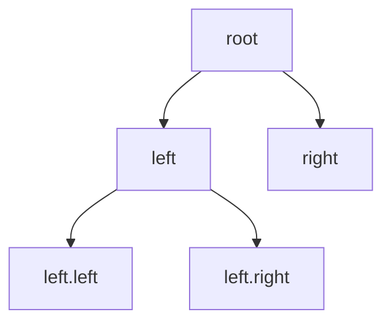

## Why it Matters

A **tree** is a hierarchical, acyclic connected structure of **nodes** with a single **root**; each node has zero or more **children** and at most one **parent**. Commonly used for searching, ordering, and representing hierarchies.

- General tree node: `{ key, children: List<Node>, parent? }`
- **Binary tree** node: `{ key, left, right, parent? }`, at most two children.
```
 1 Binary tree: 4
 / | \ / \
 2 3 4 2 6
 | / \ / \
 5 1 3 5 7
```
Height of a tree: longest path from root to leaf.
```algorithm
Height(tree)
 if tree = nil: return 0
 return 1 + Max(Height(tree.left), Height(tree.right))
```

## Diagram



## Code

```java
// Immutable tree node; recursion mirrors structure; iterative + ArrayDeque for depth
record TNode(int val, TNode left, TNode right) {
 TNode(int val) { this(val, null, null); }
}

void inorder(TNode n, List<Integer> out) {
 if (n == null) return;
 inorder(n.left(), out);
 out.add(n.val());
 inorder(n.right(), out); // invariant: out is sorted iff BST
}

void demo() {
 var root = new TNode(4, new TNode(2, new TNode(1), new TNode(3)),
 new TNode(6, new TNode(5), new TNode(7)));
 var out = new ArrayList<Integer>();
 inorder(root, out);
 System.out.println(out); // => [1, 2, 3, 4, 5, 6, 7]

 var bfs = new ArrayList<Integer>(); // level order via queue
 Deque<TNode> q = new ArrayDeque<>(List.of(root));
 while (!q.isEmpty()) {
 var n = q.poll();
 bfs.add(n.val());
 if (n.left() != null) q.offer(n.left());
 if (n.right() != null) q.offer(n.right());
 }
 System.out.println(bfs); // => [4, 2, 6, 1, 3, 5, 7]
}
```

## When to use / not

| Use | NOT |
|-----|-----|
| Hierarchies, BST ordered maps, heaps, tries, segment trees | General relations with cycles → `Graph` |
| Recursion-friendly divide-and-conquer on data | Deep skewed trees without balancing (degrades to O(n)) |

## Trade-offs

- Hierarchical queries in O(log n) when balanced; ordered traversal free.
- Skew kills balance (needs AVL/RB); recursion depth risks overflow.

## Vs

| | Binary tree | BST | Balanced (AVL/RB) |
|--|-------------|-----|-------------------|
| Order invariant | none | left < node < right | BST + height bound |
| Search | O(n) | O(h) | O(log n) |
| Use | heaps, parses | ordered maps (avg) | guaranteed ordered maps |

## Pitfalls

- **Unbalanced BST degrades to linked list**, sorted input → O(n) operations; use `TreeMap` (red-black) or AVL.
- **Recursive DFS stack overflow** on deep/skewed trees, use iterative stack/queue.
- **`==` vs `<`/`>` for generic keys**, BST requires `Comparable` or `Comparator`; inconsistent `compareTo`/`equals` breaks invariants.
- **Null children**, always null-check before `node.left`/`node.right`.
- **Modifying tree during traversal** without care corrupts structure.

## Interview q&a

**Q: In-order vs pre-order vs post-order, when to use each?** In-order for sorted BST output; pre-order for copying/serialisation; post-order for deletion (children before parent).

**Q: How to validate a BST?** In-order must be strictly increasing, or range-check recursion (`min < node < max`).

**Q: Height vs depth vs level?** Height = edges from node to deepest leaf (leaf = 0 or 1 by convention); depth = edges from root to node; level = depth + 1.

**Q: Why is `TreeMap` O(log n)?** Red-black tree, self-balancing ensures height O(log n).

In-order vs pre-order vs post-order, when to use each?:: In-order for sorted BST output; pre-order for copying/serialisation; post-order for deletion (children before parent). #flashcard
How to validate a BST?:: In-order must be strictly increasing, or range-check recursion (`min < node < max`). #flashcard
Height vs depth vs level?:: Height = edges from node to deepest leaf (leaf = 0 or 1 by convention); depth = edges from root to node; level = depth + 1. #flashcard
Why is `TreeMap` O(log n)?:: Red-black tree, self-balancing ensures height O(log n). #flashcard

- [102. Binary Tree Level Order Traversal](https://leetcode.com/problems/binary-tree-level-order-traversal/)
- [104. Maximum Depth Of Binary Tree](https://leetcode.com/problems/maximum-depth-of-binary-tree/)
- [98. Validate Binary Search Tree](https://leetcode.com/problems/validate-binary-search-tree/)

---
*Category: DSA • Part of [[README|Java MOC]]*

## Related

- [[Array]] • [[Linked List]] • [[Java/07_DSA/Stack|Stack]] (DFS) • [[Java/07_DSA/Queue|Queue]] (BFS) • [[Java/07_DSA/HashMap|HashMap (DSA)]]
- [[README|Java MOC]]

# Trees

> Part of [[README|Java MOC]] • `DSA`

## Operations , Complexity

| Operation | Unbalanced BST (worst) | Balanced BST (AVL / Red-Black) | Notes |
|---|---|---|---|
| Search | **O(n)** | **O(log n)** | |
| Insert | **O(n)** | **O(log n)** | |
| Delete | **O(n)** | **O(log n)** | |
| Traverse (in/pre/post/level) | **O(n)** | O(n) | Visits all nodes |
| Height | **O(n)** | O(log n) | |
| Min / Max | **O(n)** / O(h) | **O(log n)** | Follow left/right |

General tree traversal: DFS (pre/in/post) uses stack/recursion; BFS (level order) uses [[Java/07_DSA/Queue|Queue]].

## Traversals

### Depth-first Search (DFS) , Explores one Subtree Fully before Siblings

```algorithmInOrder
(tree) // BST: yields sorted order if tree = nil: return
 InOrder(tree.left); Print(tree.key); InOrder(tree.right)

PreOrder(tree) // copy / prefix expression
 if tree = nil: return
 Print(tree.key); PreOrder(tree.left); PreOrder(tree.right)

PostOrder(tree) // delete / postfix expression
 if tree = nil: return
 PostOrder(tree.left); PostOrder(tree.right); Print(tree.key)
```

### Breadth-first Search (BFS) , Level by Level via Queue
```algorithmLevelTraversal
(tree)
 if tree = nil: return
 Queue q; q.Enqueue(tree)
 while not q.Empty():
 node ← q.Dequeue(); Print(node)
 if node.left ≠ nil: q.Enqueue(node.left)
 if node.right ≠ nil: q.Enqueue(node.right)
```

### Tree Types Quick Reference

| Type | Property |
|---|---|
| **Binary Search Tree (BST)** | `left.key < node.key < right.key` |
| **AVL** | Height-balanced BST; balance factor ∈ {-1,0,1} |
| **Red-Black** | Balanced BST; Java `TreeMap`/`TreeSet` use it |
| **Heap** | Complete binary tree; parent ≤/≥ children (`PriorityQueue`) |
| **Trie** | Prefix tree for strings |

## Java 25 Notes

- **Record Node:** `record Node(int key, Node left, Node right)`, immutable, `equals/hashCode` free, works with pattern matching (`instanceof Node(var k, var l, var r)`).
- **Compact Object Headers (JEP 450):** tree node headers 8 B → million-node trees save tens of MB; mention for memory-heavy interview follow-ups.
- **Sequenced collections:** `ArrayDeque` for BFS queue, `ArrayList` for results, both `SequencedCollection`; use `getFirst`/`getLast`/`reversed()` for idiomatic deque handling.
- **Virtual threads:** parallel DFS/BFS via `StructuredTaskScope` + virtual threads (Java 25 stable) for large graph traversals, note in system-design extension.

## Solve with Patterns

- [[Coding Patterns/05_Trees_Graphs/01 - Binary Tree Traversal]]
- [[Coding Patterns/05_Trees_Graphs/02 - DFS]]
- [[Coding Patterns/05_Trees_Graphs/03 - BFS]]
- [[Coding Patterns/05_Trees_Graphs/05 - Trie]]
- [[Coding Patterns/06_Matrix/01 - Matrix Traversal]]
