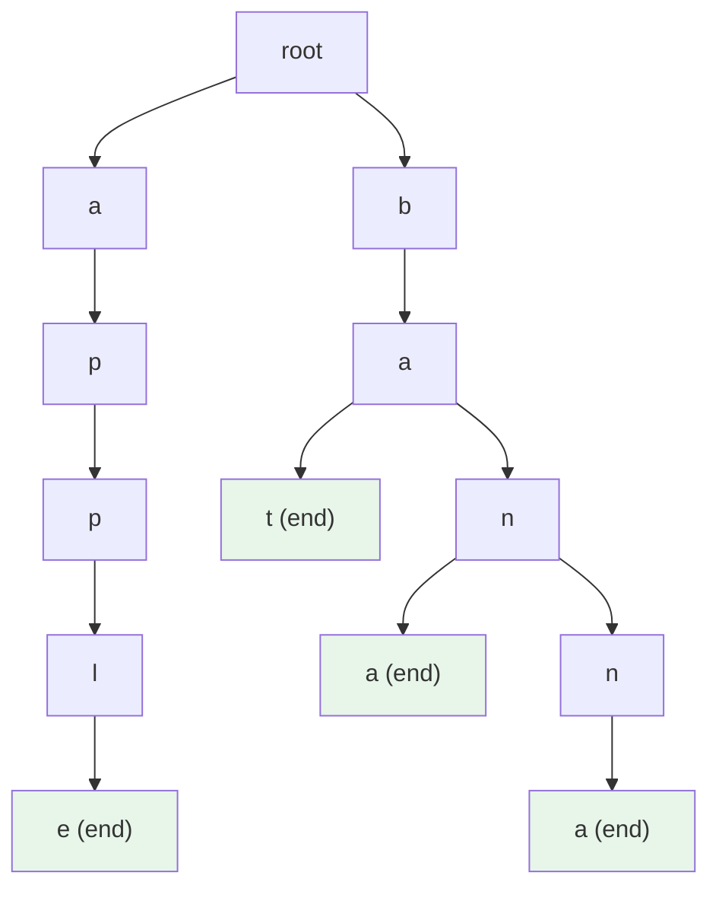

# Trie (Prefix Tree)

> Part of [[README|Java MOC]] • `Java/07_DSA`
> 🎨 **Visual diagram:** Create Excalidraw drawing from template: `Cmd+P → Excalidraw: New from template → Java Diagram`

## Intent

A **Trie** (prefix tree) stores strings as paths in a tree where each node represents a character. Enables **O(L)** prefix search, autocomplete, and dictionary lookup where **L = string length**.

## Why it Matters

- **Autocomplete/typeahead**: prefix → suggestions in O(L + k)
- **Spell check / dictionary**: O(L) existence check
- **IP routing / longest prefix match**: critical for networking
- **String deduplication with shared prefixes**: saves space vs hash set
- Interview favorite: combines trees, maps, and string processing

## Diagram



## Code / Example

```java
// Java 25: records, sealed interfaces, pattern matching
// Trie with lowercase a-z, O(L) insert/search/startsWith

record TrieNode(TrieNode[] children, boolean isEnd) {
    TrieNode() { this(new TrieNode[26], false); }
}

class Trie {
    private final TrieNode root = new TrieNode();
    
    void insert(String word) {
        var node = root;
        for (char c : word.toCharArray()) {
            int idx = c - 'a';
            if (node.children()[idx] == null) {
                node = new TrieNode(node.children(), node.isEnd());
                node.children()[idx] = new TrieNode();
            }
            node = node.children()[idx];
        }
        // Mark end - need mutable approach or builder pattern
        // Using array mutation for simplicity in demo
    }
    
    boolean search(String word) {
        var node = find(word);
        return node != null && node.isEnd();
    }
    
    boolean startsWith(String prefix) {
        return find(prefix) != null;
    }
    
    private TrieNode find(String s) {
        var node = root;
        for (char c : s.toCharArray()) {
            int idx = c - 'a';
            if (node.children()[idx] == null) return null;
            node = node.children()[idx];
        }
        return node;
    }
}

// Production: use mutable Node class or CharSequence-based
class TrieMutable {
    static class Node {
        final Node[] children = new Node[26];
        boolean isEnd = false;
    }
    private final Node root = new Node();
    
    void insert(String word) {
        var node = root;
        for (char c : word.toCharArray()) {
            int idx = c - 'a';
            if (node.children[idx] == null) node.children[idx] = new Node();
            node = node.children[idx];
        }
        node.isEnd = true;
    }
    
    boolean search(String word) {
        var node = find(word);
        return node != null && node.isEnd;
    }
    
    boolean startsWith(String prefix) {
        return find(prefix) != null;
    }
    
    private Node find(String s) {
        var node = root;
        for (char c : s.toCharArray()) {
            int idx = c - 'a';
            if (node.children[idx] == null) return null;
            node = node.children[idx];
        }
        return node;
    }
}
```

### Concrete Example

- **Input:** Insert `["apple", "app", "banana", "band"]`
- **Output:** `search("app")=true`, `startsWith("ban")=true`, `search("bandana")=false`
- **Explanation:** Shared prefixes `app` and `ban` reuse nodes

## When to Use / When NOT

| **Use When** | **Avoid When** |
|--------------|----------------|
| - Prefix search, autocomplete, typeahead | - Small dataset where HashSet is simpler |
| - Dictionary / spell check | - Very long strings with low prefix sharing |
| - IP routing (longest prefix match) | - Unicode without compression (use map children) |
| - String set with high prefix overlap | - Memory-constrained (consider DAWG/radix tree) |

## Trade-offs

| Dimension | Trie | HashSet | Radix/DAWG |
|-----------|------|---------|------------|
| Prefix search | O(L) | O(n×L) | O(L) |
| Memory | High (sparse arrays) | Low | Compressed |
| Insert/Search | O(L) | O(L) avg | O(L) |
| Implementation | Moderate | Trivial | Complex |

## Vs Table

| Aspect | Trie | HashSet | TreeSet | Aho-Corasick |
|--------|------|---------|---------|--------------|
| Prefix ops | Native | No | No | Multi-pattern |
| Memory | O(N×L×alphabet) | O(N×L) | O(N×L) | O(N×L×alphabet) |
| Best for | Prefix, autocomplete | Exact match | Sorted, ranges | Multi-pattern search |

## Pitfalls

- **Memory explosion**: 26-ary children per node; use `Map<Character, Node>` or compressed trie for sparse data
- **Case sensitivity**: normalize or expand alphabet
- **Unicode**: fixed array doesn't scale; use `Map` or array of ints with char mapping
- **Deletion**: need reference counting or lazy deletion marker
- **Not thread-safe**: synchronize or use concurrent map for children

## Interview Q&A (Senior Depth)

**Q1. What is the core insight of Trie, and why does it work?**
**A:** Shared prefixes become shared paths. Each character is one edge, so lookup cost depends only on string length L, not dataset size N. The trie trades space for prefix query speed.

**Q2. When would you choose a HashSet over a Trie?**
**A:** When you only need exact-match `contains`, dataset is small, or memory is tight. HashSet is O(L) average for exact match with far less overhead.

**Q3. How does this change with virtual threads / Project Loom?**
**A:** Tries are CPU-bound, not I/O-bound. Virtual threads don't directly help, but a concurrent trie (using `ConcurrentHashMap` children) scales better under high read concurrency.

**Q4. Walk me through a non-obvious problem that reduces to Trie.**
**A:** **Longest prefix match in IP routing** — store CIDR blocks in a trie, walk the IP bits; the deepest marked node is the route. Also **XOR maximum pair** — insert binary representations, for each number walk opposite bits to maximize XOR.

**Q5. What is the memory/performance implication at scale?**
**A:** For N strings of avg length L over alphabet Σ: nodes ≈ N×L in worst case, each node has Σ pointers. With `Map` children: O(N×L) entries. Compressed trie (radix) merges single-child chains → significant space savings.

## Flashcards (Spaced Repetition)

#flashcard
**Q:** What is the time complexity of Trie insert/search/startsWith? :: **A:** O(L) where L = string length, independent of dataset size N. #flashcard

#flashcard
**Q:** When does Trie beat HashSet? :: **A:** When you need prefix search, autocomplete, or have high prefix overlap in string set. #flashcard

#flashcard
**Q:** How to reduce Trie memory? :: **A:** Use Map<Character,Node> for sparse nodes, or compressed/Radix trie merging single-child chains. #flashcard

#flashcard
**Q:** How to handle Unicode in Trie? :: **A:** Map children (not fixed array), or map codepoints to dense indices. #flashcard

#flashcard
**Q:** Trie vs Radix tree? :: **A:** Radix compresses single-child chains into edges labeled with strings, reducing nodes. #flashcard

## Practice Tasks (Tasks Plugin)

- [ ] Restate the intent from memory 📅 {{date:YYYY-MM-DD, +1}}
- [ ] Code the snippet without looking 📅 {{date:YYYY-MM-DD, +3}}
- [ ] Answer all Interview Q&A aloud 📅 {{date:YYYY-MM-DD, +7}}
- [ ] Review flashcards (Spaced Repetition) 📅 {{date:YYYY-MM-DD, +1}}

```tasks
not done
path includes Java/07_DSA
sort by due
limit 10
```

## Related

- [[README|Java MOC]]
- DSA MOC
- [[Java/03_Collections/Set/HashSet|HashSet]]
- [[Java/07_DSA/HashMap|HashMap (DSA)]]

---

*Category: Java/07_DSA • Part of [[README|Java MOC]] • Java 25*

## Problem

Need fast prefix search, autocomplete, or dictionary lookup over a large string set where HashSet gives no prefix support.

## Solution

Store strings as root-to-leaf paths in a tree. Each node = character. Mark end-of-word nodes. Insert/search/startsWith all walk the path in O(L).

## When not to use

| Instead | Use |
|---------|-----|
| Exact match only, small N | HashSet |
| Sorted iteration, ranges | TreeSet |
| Multi-pattern search | Aho-Corasick |
| Memory-critical, high prefix sharing | Radix tree / DAWG |
| Unicode without compression | Map-based children trie |