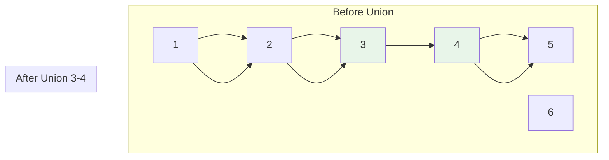

# Union-Find (Disjoint Set Union)

> Part of [[README|Java MOC]] • `Java/07_DSA`
> 🎨 **Visual diagram:** Create Excalidraw drawing from template: `Cmd+P → Excalidraw: New from template → Java Diagram`

## Intent

**Union-Find** (Disjoint Set Union, DSU) maintains a collection of disjoint sets with **near-O(1)** `find` (which set an element belongs to) and `union` (merge two sets). Powers Kruskal's MST, connected components, and dynamic connectivity.

## Why it Matters

- **Dynamic connectivity**: add edges, query if two nodes connected
- **Kruskal's MST**: sort edges, union if different components
- **Connected components** in graphs: O(α(n)) per operation
- **Percolation, image segmentation, network connectivity**
- Inverse Ackermann α(n) < 5 for all practical n — effectively constant

## Diagram



## Code / Example

```java
// Java 25: records, sealed interfaces, var
// Union-Find with Path Compression + Union by Rank/Size

class UnionFind {
    private final int[] parent;
    private final int[] rank; // or size
    private int count; // number of components
    
    UnionFind(int n) {
        parent = new int[n];
        rank = new int[n];
        count = n;
        for (int i = 0; i < n; i++) parent[i] = i;
    }
    
    // Find with path compression
    int find(int x) {
        if (parent[x] != x) parent[x] = find(parent[x]);
        return parent[x];
    }
    
    // Union by rank
    boolean union(int x, int y) {
        int rx = find(x), ry = find(y);
        if (rx == ry) return false;
        if (rank[rx] < rank[ry]) parent[rx] = ry;
        else if (rank[rx] > rank[ry]) parent[ry] = rx;
        else { parent[ry] = rx; rank[rx]++; }
        count--;
        return true;
    }
    
    boolean connected(int x, int y) { return find(x) == find(y); }
    int count() { return count; }
}

// Union by Size (often faster in practice)
class UnionFindSize {
    private final int[] parent;
    private final int[] size;
    private int count;
    
    UnionFindSize(int n) {
        parent = new int[n];
        size = new int[n];
        count = n;
        for (int i = 0; i < n; i++) { parent[i] = i; size[i] = 1; }
    }
    
    int find(int x) {
        if (parent[x] != x) parent[x] = find(parent[x]);
        return parent[x];
    }
    
    boolean union(int x, int y) {
        int rx = find(x), ry = find(y);
        if (rx == ry) return false;
        if (size[rx] < size[ry]) { parent[rx] = ry; size[ry] += size[rx]; }
        else { parent[ry] = rx; size[rx] += size[ry]; }
        count--;
        return true;
    }
    
    int componentSize(int x) { return size[find(x)]; }
    boolean connected(int x, int y) { return find(x) == find(y); }
    int count() { return count; }
}

// Persistent/Partial Persistence (rollback) for offline queries
class RollbackUnionFind {
    private final int[] parent, size;
    private final java.util.Stack<int[]> history = new java.util.Stack<>();
    private int count;
    
    RollbackUnionFind(int n) {
        parent = new int[n];
        size = new int[n];
        count = n;
        for (int i = 0; i < n; i++) { parent[i] = i; size[i] = 1; }
    }
    
    int find(int x) {
        while (parent[x] != x) x = parent[x];
        return x; // no path compression for rollback
    }
    
    boolean union(int x, int y) {
        int rx = find(x), ry = find(y);
        if (rx == ry) { history.push(new int[]{-1}); return false; }
        if (size[rx] < size[ry]) { int t = rx; rx = ry; ry = t; }
        history.push(new int[]{ry, parent[ry], rx, size[rx], count});
        parent[ry] = rx;
        size[rx] += size[ry];
        count--;
        return true;
    }
    
    void rollback() {
        if (history.isEmpty()) return;
        int[] h = history.pop();
        if (h[0] == -1) return;
        parent[h[0]] = h[1];
        size[h[2]] = h[3];
        count = h[4];
    }
    
    int snapshot() { return history.size(); }
    void undo(int snap) { while (history.size() > snap) rollback(); }
}
```

### Concrete Example

- **Input:** `n=6`, edges: (0,1), (1,2), (3,4), (2,3)
- **Output:** After unions: components={0,1,2,3,4}, {5}. `connected(0,4)=true`, `connected(0,5)=false`

## When to Use / When NOT

| **Use When** | **Avoid When** |
|--------------|----------------|
| - Dynamic connectivity (add edges, query connected) | - Static graph: DFS/BFS once |
| - Kruskal's MST | - Need to delete edges (use dynamic connectivity) |
| - Connected components in evolving graph | - Need exact component enumeration |
| - Offline queries with rollback | - Small n: simple arrays fine |

## Trade-offs

| Dimension | Union by Rank | Union by Size | Rollback UF |
|-----------|---------------|---------------|-------------|
| Find | O(α(n)) | O(α(n)) | O(log n) |
| Union | O(α(n)) | O(α(n)) | O(log n) |
| Memory | 2n | 2n | 2n + history |
| Rollback | No | No | Yes |
| Path compression | Yes | Yes | No (breaks rollback) |

## Vs Table

| Aspect | Union-Find | BFS/DFS | Dynamic Connectivity |
|--------|------------|---------|---------------------|
| Add edge | O(α(n)) | O(n) rebuild | O(log²n) |
| Connected query | O(α(n)) | O(n) | O(log n) |
| Delete edge | No | O(n) rebuild | Yes |
| Memory | O(n) | O(n) | O(n log n) |

## Pitfalls

- **Path compression + rollback**: incompatible; use union by size only for rollback
- **0-indexed vs 1-indexed**: be consistent; convert input
- **Integer overflow**: rank/size fit in int for n < 2^31
- **Not thread-safe**: synchronize or use thread-local
- **Find without compression**: O(log n) worst case; always compress

## Interview Q&A (Senior Depth)

**Q1. What is the core insight of Union-Find, and why does it work?**
**A:** Represent each set as a tree with a canonical root. `find` follows parent pointers to root (with path compression flattening the tree). `union` attaches smaller tree under larger (by rank/size), keeping depth logarithmic. The inverse Ackermann α(n) bound comes from the interplay of both optimizations.

**Q2. When would you choose Union by Size over Rank?**
**A:** Size is often faster in practice (less branching), directly gives component sizes, and works with rollback. Rank is slightly more theoretical but both achieve O(α(n)).

**Q3. How does rollback Union-Find work, and when is it needed?**
**A:** Store history of changes (parent, size, count) on a stack. `rollback()` restores last state. Needed for offline divide-and-conquer on trees (e.g., dynamic connectivity offline, Mo's algorithm on trees). No path compression — only union by size.

**Q4. Walk me through a non-obvious problem that reduces to Union-Find.**
**A:** **Number of islands II (LeetCode 305)**: add land cells one by one, union with neighbors, count components after each add. **Accounts merge (LeetCode 721)**: union emails belonging to same person. **Regions cut by slashes (LeetCode 959)**: each cell split into 4 triangles, union based on slashes.

**Q5. What is the memory/performance implication at scale?**
**A:** 2n `int` arrays → 8 bytes per element. For 10^8: ~800 MB (use `int[]` not `Integer[]`). Path compression makes trees extremely flat — find is essentially a few pointer hops. Cache-friendly sequential arrays.

## Flashcards (Spaced Repetition)

#flashcard
**Q:** What is the time complexity of Union-Find with path compression + union by rank? :: **A:** O(α(n)) amortized, where α is inverse Ackermann (< 5 for all practical n). #flashcard

#flashcard
**Q:** Why no path compression in rollback Union-Find? :: **A:** Path compression changes many parent pointers; hard to undo. Union by size only gives O(log n) depth, sufficient for rollback. #flashcard

#flashcard
**Q:** Union-Find vs BFS for connectivity? :: **A:** UF: O(α(n)) per add/query, online. BFS: O(n) per query, needs rebuild on edge add. #flashcard

#flashcard
**Q:** What is the count field in UnionFind? :: **A:** Number of connected components. Decrements on successful union. #flashcard

#flashcard
**Q:** How to get component size in Union-Find? :: **A:** Use union by size; size[find(x)] gives component size of x. #flashcard

## Practice Tasks (Tasks Plugin)

- [ ] Restate the intent from memory 📅 {{date:YYYY-MM-DD, +1}}
- [ ] Code the snippet without looking 📅 {{date:YYYY-MM-DD, +3}}
- [ ] Answer all Interview Q&A aloud 📅 {{date:YYYY-MM-DD, +7}}
- [ ] Review flashcards (Spaced Repetition) 📅 {{date:YYYY-MM-DD, +1}}

```tasks
not done
path includes Java/07_DSA
sort by due
limit 10
```

## Related

- [[README|Java MOC]]
- DSA MOC
- [[Java/07_DSA/Graph|Graph]]
- Kruskal MST

---

*Category: Java/07_DSA • Part of [[README|Java MOC]] • Java 25*

## Problem

Maintain dynamic connectivity: add edges between nodes, query if two nodes are in the same component, count components.

## Solution

Each element points to a parent. `find` follows pointers to root (with path compression). `union` merges trees by attaching smaller under larger (by rank or size).

## When not to use

| Instead | Use |
|---------|-----|
| Static graph connectivity | BFS/DFS once |
| Need edge deletion | Dynamic Connectivity (ETT, Link-Cut Tree) |
| Need exact component members | BFS from root after all unions |
| Very small n | Simple array scan |