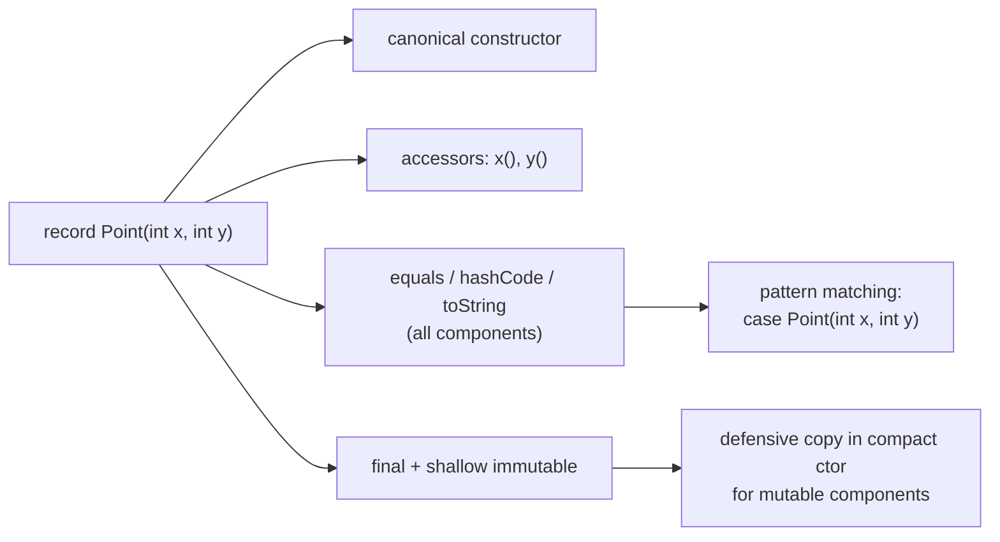

## Why it Matters

A **record** (JEP 395, final in Java 21) is a transparent **data carrier**: one header `record Point(int x, int y)` generates the canonical constructor, accessors, `equals`, `hashCode`, and `toString`. It deletes the DTO/value-object boilerplate that dominates enterprise Java, and it is the carrier type for sealed hierarchies and record patterns. "Record vs class" is a default interview question.

## Diagram



## Code

```java
// Record — compiler generates canonical ctor, accessors, equals, hashCode, toString
record Point(int x, int y) {}

// Compact constructor: validation / defensive copies without parameter lists
record Range(int lo, int hi) {
 Range { // no parens, no explicit field assignments
 if (lo > hi) throw new IllegalArgumentException("lo > hi");
 lo = Math.max(lo, 0); // unqualified names are the components
 hi = Math.max(hi, lo);
 }
}

// Shallow immutability trap: the component reference is final, the list is not
record Team(String name, List<String> members) {
 Team { members = List.copyOf(members); } // defensive copy in compact ctor
}

void demo() {
 var p = new Point(3, 4);
 System.out.println(p.x() + "," + p.y()); // => 3,4 accessors, not getX()
 System.out.println(p); // => Point[x=3, y=4]
 System.out.println(new Point(3, 4).equals(p)); // => true, components compared

 var t = new Team("a", new ArrayList<>(List.of("x")));
 t.members().add("y"); // UnsupportedOperationException
}
```

## When to use / not

| Use | NOT |
|-----|-----|
| DTOs, value objects, config holders, command/query payloads | JPA `@Entity` or any framework needing a no-arg ctor + mutators |
| Sealed hierarchy variants: `sealed interface Shape permits Circle, Rect` | Inheriting from a DTO, records are final and cannot extend |
| Immutable `Map` keys, message passing between threads | When the object has identity and lifecycle distinct from its state |

## Trade-offs

- Zero boilerplate: the header generates constructor, accessors, `equals`, `hashCode`, and `toString`.
- Shallow immutability is enforced; thread-safe by construction and ideal `Map` keys.
- Deconstructs in pattern matching, and compact headers (JEP 450) make millions of records heap-cheap.
- **Shallow only**: a mutable component (`List`) can still be mutated by the caller , defensively `List.copyOf` it.
- Cannot be a JPA `@Entity` (no no-arg constructor, final, non-final proxies) and supports no inheritance.

## Vs

| | `record` | Lombok `@Value` / manual class | `enum` |
|--|----------|-------------------------------|--------|
| Boilerplate | header only | annotations or ~60 lines of getters/`equals` | per-constant body |
| Immutability | enforced by language | by convention, caller can forget | built-in |
| Pattern matching | deconstructs `case Point(int x, int y)` | no | `switch` on constants |
| Inheritance | none (implicitly final) | allowed | none |

## Pitfalls

- **Shallow immutability**, `List` components are still mutable; `List.copyOf` in the compact constructor.
- **Accessor naming**, `x()` not `getX()`, breaks Jackson and bean-convention code unless configured.
- **`equals` follows components**, two records with equal components are equal; a record with one `int` still pays header overhead.
- **No inheritance**, a record is implicitly final and cannot extend a class; use interfaces instead.
- **Serialization**, records are serializable but the canonical constructor, not field deserialization, reconstructs them.

## Interview q&a

**Q: Record vs class, when do you pick a record?** A record is a transparent immutable data carrier whose state is fully described by its header. Pick it when the object's identity **is** its data; pick a class when it has behaviour, lifecycle, or identity separate from state.

**Q: Is a record immutable?** Shallowly: components are final and the header cannot be reassigned, but a mutable component like `List` can still be mutated. Defensively copy in the compact constructor with `List.copyOf`.

**Q: Can a record extend a class or be extended?** No on both: records are implicitly `final` and extend `java.lang.Record`, not another class. They can implement interfaces.

**Q: How do `equals`/`hashCode` behave for records?** Derived from **all components**, matching the canonical constructor. `equals` for `record Point(int x, int y)` compares both `x` and `y`.

Record vs class, when to pick a record?:: Transparent immutable data carrier; pick when identity **is** its data, a class when it has behaviour, lifecycle, or identity separate from state. #flashcard
Is a record immutable?:: Shallowly; components are final, but a `List` component is still mutable, defensively `List.copyOf` in the compact ctor. #flashcard
Can a record extend or be extended?:: No; records are implicitly final and extend `java.lang.Record`, but they can implement interfaces. #flashcard
How do equals/hashCode behave for records?:: Derived from all components, matching the canonical constructor. #flashcard

## Related

- [[02 Sealed Classes]] • [[03 Pattern Matching]] (record patterns) • [[04 Sequenced Collections]]
- [[../01_Core-Java/Classes|Classes]] • [[Java/01_Core-Java/Types/Immutable Class.md|Immutable Class]]
- [[README|Java MOC]]

---
*Category: Modern-Java • java25*

# Records , Java 16/25

> A `record` is a transparent, immutable carrier for data. Compiler generates `equals`, `hashCode`, `toString`, accessors and canonical constructor from the header. Ideal for DTOs, keys, return tuples , not for mutable/JPA entities.
