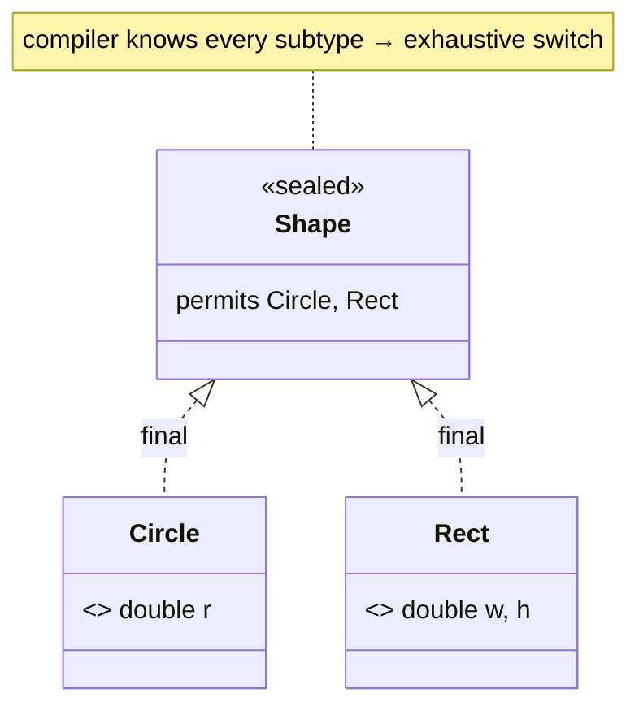

## Why it Matters

**Sealed classes** (JEP 409, final in Java 17) let an interface or class declare its complete set of permitted subtypes: `sealed interface Shape permits Circle, Rect`. The compiler then **proves exhaustiveness** , a `switch` over a sealed type is checked, not hoped. Together with records and pattern matching it replaces the GoF Visitor and every `if (x instanceof Y)` cascade, and it is the mechanism behind domain modelling, ADTs, and safe `switch` in modern Java.

## Diagram


```mermaidflowchart LR
 S["sealed interface Shape<br/>permits Circle, Rect"] --> EXH["compiler proves coverage<br/>no default needed"]
 S --> NEW["add Pentagon → permits<br/>every switch breaks compile"]
 S --> OPEN["open hierarchy? → non-sealed<br/>re-opens extension"]
```
## Code
```java
// Sealed + records = algebraic data type; switch is exhaustive, no default
sealed interface Shape permits Circle, Rect {}
record Circle(double r) implements Shape {}
record Rect(double w, double h) implements Shape {}

double area(Shape s) {
 return switch (s) { // compiler-checked, no default
 case Circle(double r) -> Math.PI * r * r;
 case Rect(double w, double h) -> w * h;
 };
}

// Escape hatch: non-sealed re-opens the hierarchy for extension
sealed interface Event permits Login, Logout, Custom {}
record Login(String user) implements Event {}
record Logout(String user) implements Event {}
non-sealed interface Custom extends Event {} // anyone may extend

void demo() {
 Shape s = new Circle(2);
 System.out.println(area(s)); // => 12.566370614359172
}
```
## When to use / not

| Use | NOT |
|-----|-----|
| Closed domains: shapes, events, results (`Result`/`Either`), AST nodes | Open plugin/SPI hierarchies, third-party implementors |
| Exhaustive `switch` with records and pattern matching | Single-variant hierarchies, a plain `record` suffices |
| Replacing GoF Visitor or `enum` when variants carry different data | Replacing `enum` when variants share one constant type |

## Trade-offs

- Closed hierarchies with **compile-time exhaustiveness**; adding a `permits` variant forces every switch to handle it.
- Replaces `enum` when variants carry different data, with records as the natural pairing.
- Shallow by design, variants must be `final`/`sealed`/`non-sealed` and live in the same module/package.
- Awkward for open/plugin hierarchies, forces artificial `non-sealed` escape hatches.

## Vs

| | `sealed` | `enum` | `abstract class` (open) | GoF Visitor |
|--|----------|--------|--------------------------|-------------|
| Extension | `permits` only | constants fixed at compile time | any subclass, anywhere | via new Visitor visit |
| Data per variant | full record fields | fields shared by all | full class | full class |
| Exhaustive switch | yes, compiler-enforced | yes (constant labels) | no, needs `default` | yes, by Visitor contract |
| Best for | ADTs, closed domains | fixed constant sets | frameworks and SPIs | pre-Java-17 ASTs |

## Pitfalls

- **`default` defeats the check**, a `default` case silences exhaustiveness; omit it so adding a variant fails the build.
- **Escape hatch costs exhaustiveness**, `non-sealed` lets anyone extend, and switches over it are no longer provably exhaustive.
- **Same package or module only**, a `permits` subtype must be in the same module (or same package if unnamed), and must be `final`, `sealed`, or `non-sealed`.
- **Record components are shallow**, a sealed hierarchy of records still needs `List.copyOf` for mutable components.
- **Reflection order**, `Class.getPermittedSubclasses()` is present but not a substitute for the compile-time guarantee.

## Interview q&a

**Q: What problem do sealed classes solve?** They let a type declare all permitted subtypes so the compiler can verify a `switch`/`instanceof` chain covers every case, turning "I hope I handled them all" into a compile error.

**Q: Sealed vs abstract class, when?** Sealed when the domain is closed and you want exhaustive pattern matching; abstract class when extension is open (frameworks, SPIs) and a `default` branch is acceptable.

**Q: Sealed class vs enum?** Enum when variants are fixed constants sharing one type; sealed when each variant carries different data, modelled as records. An enum is implicitly closed; sealed is explicit.

**Q: What does `permits` do, and what can it permit?** It lists the allowed subtypes; they must be `final`, `sealed`, or `non-sealed` and live in the same module or package.

**Q: Can a sealed class be extended by anyone?** Only its `permits` list; to re-open extension mark a subtype `non-sealed`, which trades away exhaustive checks.

What problem do sealed classes solve?:: Declares all permitted subtypes so the compiler verifies a switch covers every case, turning "hope I got them all" into a compile error. #flashcard
Sealed vs abstract class, when?:: Sealed for closed domains with exhaustive pattern matching; abstract class for open extension (frameworks, SPIs). #flashcard
Sealed class vs enum?:: Enum for fixed constants sharing one type; sealed when each variant carries different data as records. #flashcard
What does permits do?:: Lists allowed subtypes; they must be final, sealed, or non-sealed, in the same module or package. #flashcard
Can a sealed class be extended by anyone?:: Only its permits list; a non-sealed subtype re-opens extension but loses exhaustive checks. #flashcard

## Related

- [[01 Records]] • [[03 Pattern Matching]] (exhaustive switch over sealed) • [[../06_Design-Patterns/Behavioral/Visitor|GoF Visitor]]
- [[Java/01_Core-Java/Types/Abstract Class.md|Abstract Class]] • [[../01_Core-Java/Enums|Enums]] • [[Java/01_Core-Java/Types/Final Class.md|Final Class]]
- [[README|Java MOC]]

---
*Category: Modern-Java • java25*

# Sealed Classes , Java 17/25

> `sealed` restricts which classes may extend/implement a type (`permits` clause). Compiler knows the exhaustive set → exhaustive `switch` without `default`, safer hierarchies.
