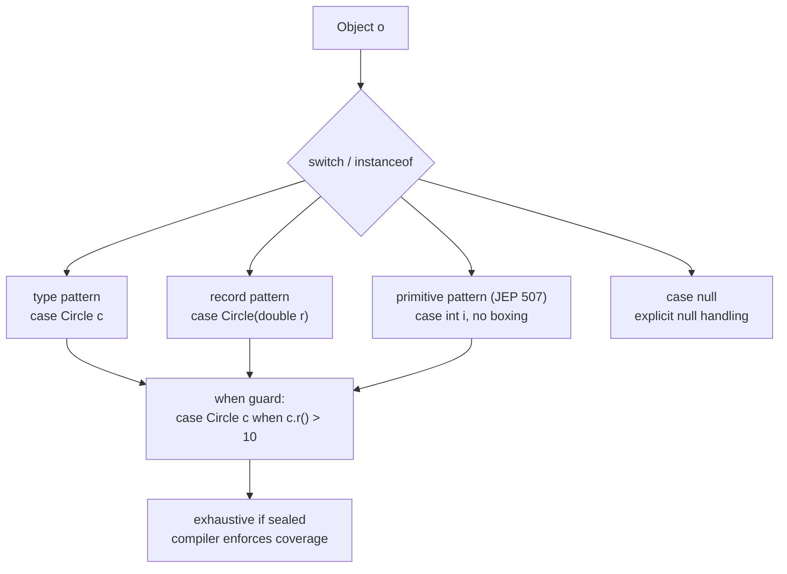

## Why it Matters

Replaces chains of `if (o instanceof X) { X x=(X)o; ... }` and visitor/switch boilerplate with exhaustive, type-safe deconstruction.

## Diagram



## Code

```java
// Shape — sealed + record + primitive patterns, null-aware switch
sealed interface Shape permits Circle, Rect {}
// Circle — sealed + record + primitive patterns, null-aware switch
record Circle(double r) implements Shape {}
// Rect — sealed + record + primitive patterns, null-aware switch
record Rect(double w, double h) implements Shape {}

String fmt(Object o) {
 if (o instanceof Circle(double r) && r > 10) return "big circle " + r;
 if (o instanceof Rect(double w, double h) when w == h) return "square " + w;
 return "other";
}

double area(Shape s) {
 return switch (s) {
 case Circle(double r) -> Math.PI * r * r;
 case Rect(double w, double h) -> w * h;
 };
}

String primitive(Object o) {
 return switch (o) {
 case int i when i > 0 -> "pos int " + i;
 case int i -> "int " + i;
 case long l -> "long " + l;
 case double d when !Double.isNaN(d) -> "double " + d;
 case String str -> "string " + str;
 default -> "other";
 };
}

String nullSafe(Object o) {
 return switch (o) {
 case null -> "null";
 case String s when s.isBlank() -> "blank";
 case String s -> "str:" + s;
 default -> o.toString();
 };
}
```

## When to use / not

| Use | NOT |
|-----|-----|
| Switching on sealed hierarchies or records, `case Circle(double r) -> ...` | Plain constant switching, `case "a":` is simpler than a pattern |
| Data-shape branching: DTOs, ASTs, results, `Optional`-like wrappers | When it obscures null handling, write the explicit check |
| Replacing visitor/`instanceof`+cast chains | More than ~4 branches, extract a polymorphic method instead |

## Trade-offs

- Exhaustive, refactor-safe (add a `permits` variant → compiler forces switch update).
- `when` guards keep pattern + condition together.
- Overuse makes switch huge , extract to polymorphic method if > ~4 branches.

## Vs

| | `instanceof` pattern | Classic `instanceof + cast` | Visitor |
|--|----------------------|-----------------------------|---------|
| Boilerplate | 1 line | 2 lines + cast | N classes |
| Exhaustive check | yes (sealed) | no | yes |
| Primitive support | JEP 507 (`case int i`) | boxed `Integer` | no |

## Pitfalls

- Missing `case null` , NPE at runtime.
- Using boxed `Integer` patterns when primitive `int` (JEP 507) is cheaper , avoid boxing.

## Interview q&a

**Q: Record pattern vs type pattern?**
`case Circle c` = type pattern (binds whole). `case Circle(double r)` = record pattern (deconstructs components). Can nest: `case Box(Point(int x,int y))`.

**Q: `when` vs `&&` guard?**
`when` is the guarded pattern syntax: `case String s when s.length()>3`. `&&` works in `if (o instanceof Point(int x,int y) && x>0)` but not in `case`.

**Q: Null in pattern switch?**
Match `case null` explicitly; otherwise `switch (null)` throws NPE. Since Java 21, `case null` is allowed.

: Record pattern vs type pattern?:: `case Circle c` = type pattern (binds whole). `case Circle(double r)` = record pattern (deconstructs components). Can nest: `case Box(Point(int x,int y))`. **Q: `when` vs `&&` guard?** `when` is the guarded pattern syntax: `case String s when s.length()>3`. `&&` works in `if (o instanceof Point(int x,int y) && x>0)` but not in `case`. **Q: Null in pattern switch?** Match `case null` explicitly; otherwise `switch (null)` throws NPE. Since Java... #flashcard

## Related

- [[01 Records]] • [[02 Sealed Classes]] • [[07 Flexible Constructors and Module Imports|Flexible Constructors]]

---
*Category: Modern-Java • java25*

# Pattern Matching , Java 21/25

> Pattern matching deconstructs values in `instanceof` and `switch`. Java 21 finals: type patterns, record patterns, guarded patterns. Java 25 adds **primitive types in patterns (JEP 507)** , match `int`/`long`/`double` without boxing.
