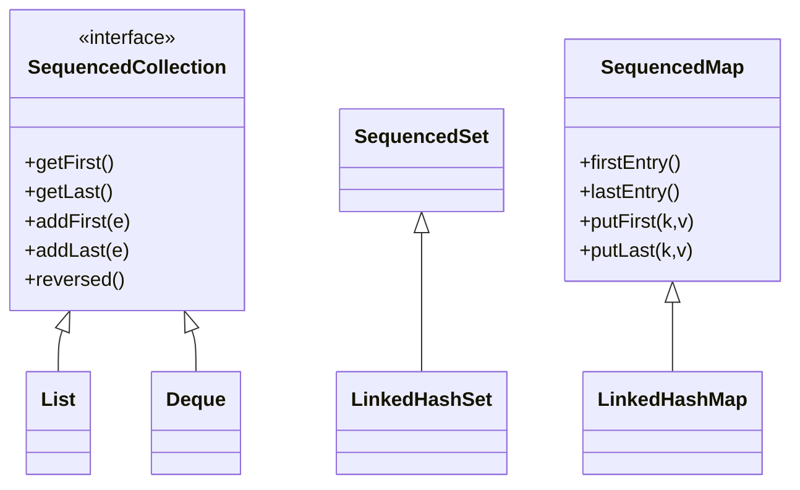

## Why it Matters

Before 21: `list.get(0)` / `list.get(list.size()-1)`, `map.keySet().iterator().next()`, no `reversed()`. Now: one API across `List`, `Deque`, `LinkedHashSet`, `LinkedHashMap`.

## Diagram


```mermaidflowchart LR
 SEQ["SequencedCollection"] -->|view| REV["reversed()<br/>mutations reflect both ways"]
 SEQ --> F["getFirst / getLast O(1)"]
 HS["HashSet / HashMap<br/>unordered"] -.->|"NOT sequenced"| X["✗ no getFirst()"]
```
## Code
```java
// Sequenced collections, getFirst/getLast/reversed on ordered views
import java.util.*;

void demo() {
 SequencedCollection<String> seq = new ArrayList<>(List.of("b","c"));
 seq.addFirst("a");
 seq.addLast("d");
 System.out.println(seq.getFirst());
 System.out.println(seq.getLast());
 System.out.println(seq.reversed());

 SequencedSet<String> set = new LinkedHashSet<>(List.of("x","y","z"));
 set.addFirst("w");
 System.out.println(set);
 System.out.println(set.reversed());

 SequencedMap<String,Integer> map = new LinkedHashMap<>();
 map.put("a",1); map.put("b",2);
 map.putFirst("z",0);
 System.out.println(map.firstEntry());
 System.out.println(map.lastEntry());
 System.out.println(map.reversed());

 for (var e : seq.reversed()) System.out.print(e + " ");
}

SequencedCollection<Integer> nums = new ArrayList<>(List.of(1,2,3));
```
## When to use / not

| Use | NOT |
|-----|-----|
| Any code that navigates ordered collections by first/last, or needs reverse-order traversal | `HashSet`/`HashMap`, they have no encounter order, so no `getFirst` |
| Public APIs, accept `SequencedCollection` so callers can pass `List` or `Deque` | Hot loops over `reversed()` views of `ArrayList`, random access is O(n); copy first |
| Replacing hand-rolled reverse loops and `get(size()-1)` readthroughs | Code that must run on Java < 21, the interfaces do not exist |

## Trade-offs

- One order-aware API across `List`, `Deque`, `LinkedHashSet`, `LinkedHashMap` , no more `get(size()-1)` or manual reverse loops.
- `reversed()` is a **view**, zero-copy, mutations propagate both ways.
- `HashSet`/`HashMap` are **not** sequenced , unordered means no first/last semantics.
- `reversed()` on `ArrayList` is O(n) random access; cache it or copy for hot loops.

## Vs

| Before | Java 25 |
|--------|---------|
| `list.get(0)` / `list.get(list.size()-1)` | `seq.getFirst()` / `seq.getLast()` |
| Manual reverse loop `for(i=size-1;...)` | `seq.reversed()` view |
| `LinkedHashMap` first key via iterator | `map.firstEntry()` / `putFirst()` |

## Pitfalls

- `HashSet`/`HashMap` not sequenced , compile error if you expect `getFirst()`.
- `reversed()` on `ArrayList` is a view with O(n) random access; for hot loops cache or copy.

## Interview q&a

**Q: Does `HashSet` implement `SequencedSet`?**
No , `HashSet` is unordered, so not sequenced. `LinkedHashSet` does.

**Q: `reversed()` , copy or view?**
View , mutations reflect. `var rev = seq.reversed(); rev.addFirst("x")` adds to tail of original.

**Q: Why not just `Deque`?**
`Deque` already had `getFirst/getLast` but `List` didn't; `SequencedCollection` unifies `List`+`Deque`+`LinkedHashSet` behind one interface.

: Does `HashSet` implement `SequencedSet`?:: No , `HashSet` is unordered, so not sequenced. `LinkedHashSet` does. **Q: `reversed()` , copy or view?** View , mutations reflect. `var rev = seq.reversed(); rev.addFirst("x")` adds to tail of original. **Q: Why not just `Deque`?** `Deque` already had `getFirst/getLast` but `List` didn't; `SequencedCollection` unifies `List`+`Deque`+`LinkedHashSet` behind one interface. #flashcard

## Related

- [[../03_Collections/List/ArrayList|ArrayList]] • [[../03_Collections/Set/HashSet|HashSet]] • [[01 Records]] (records in Sequenced collections)

---
*Category: Modern-Java • java25*

# Sequenced Collections , Java 21/25

> `SequencedCollection`, `SequencedSet`, `SequencedMap` (JEP 431, Java 21) unify order-aware APIs: `getFirst()`, `getLast()`, `addFirst()`, `addLast()`, `removeFirst()`, `removeLast()`, `reversed()`. In Java 25 all `List`, `Deque`, `LinkedHashSet`, `LinkedHashMap` implement them.
