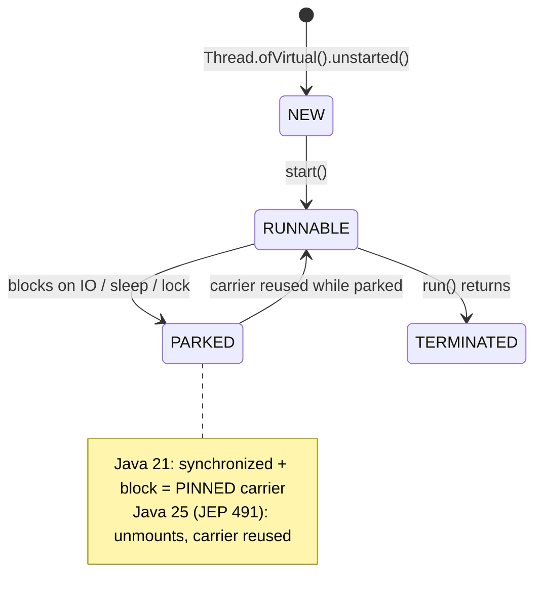

## Why it Matters

Handle **millions** of concurrent blocking tasks on one JVM without pool tuning, queue saturation, or reactive rewrite. Blocking (`Thread.sleep`, DB, HTTP) parks the virtual thread, carrier thread is reused.

## Diagram


```mermaidflowchart LR
 SUB["exec.submit(ioTask)"] --> VT["new virtual thread ~KBs"]
 VT --> PARK["parks on block<br/>carrier freed for other work"]
 PARK --> RESUME["unblock → rescheduled<br/>on any carrier"]
 VT --> SYNC["synchronized around IO<br/>safe on 25, no pinning"]
```
## Code
```java
import
 java.util.concurrent.*;
import java.time.Duration;

void fanOut() throws Exception {
 try (var exec = Executors.newVirtualThreadPerTaskExecutor()) {
 var f1 = exec.submit(() -> fetch("user"));
 var f2 = exec.submit(() -> fetch("order"));
 System.out.println(f1.get() + " " + f2.get());
 }
}
String fetch(String k) throws InterruptedException {
 Thread.sleep(Duration.ofMillis(100));
 return k;
}

void direct() throws InterruptedException {
 Thread vt = Thread.ofVirtual().name("vt-1").start(() -> System.out.println(Thread.currentThread()));
 vt.join();
}
// Virtual threads (Loom), lightweight IO concurrency, pinning fix JEP 491

class Counter {
 private int n;
 public synchronized void incAndIO() throws InterruptedException {
 n++;
 Thread.sleep(Duration.ofMillis(50));
 }
}
```
## When to use / not

| Use | Avoid |
|-----|-------|
| IO-bound servers (Tomcat, DB calls, HTTP fan-out) | CPU-bound tight loops , use platform threads / `ForkJoinPool` |
| `synchronized` around IO (safe since 24) | JNI / `ThreadLocal` heavy code , migrate to `ScopedValue` |

## Trade-offs

- Millions of concurrent blocking tasks on one JVM, no pool tuning and no queue saturation.
- Blocking IO parks the virtual thread, the carrier is reused , scale without a reactive rewrite.
- `synchronized` is safe again around IO since Java 24 (JEP 491), no forced `ReentrantLock` migration.
- CPU-bound tight loops gain nothing (or lose to platform threads); use `ForkJoinPool`.
- `ThreadLocal` at virtual-thread scale bloats and leaks; migrate to `ScopedValue`.

## Vs

| | Platform | Virtual |
|--|----------|---------|
| Cost | ~1MB OS thread | ~KBs |
| `synchronized` + block (21) | N/A | **pinned** carrier |
| `synchronized` + block (25) | N/A | **not pinned** (JEP 491) |
| Pool | `newFixedThreadPool(n)` | `newVirtualThreadPerTaskExecutor()` |

## Pitfalls

- Not closing executor , `try-with-resources` required; `close()` awaits tasks.
- Using platform pool for IO , caps concurrency; switch to virtual-per-task.
- `ThreadLocal` with millions of virtual threads , leaks; use `ScopedValue`.

## Interview q&a

**Q: Does `synchronized` pin virtual threads in Java 25?**
No , JEP 491 fixed it. On Java 21 it did; answer depends on version.

**Q: `newVirtualThreadPerTaskExecutor()` vs `newThreadPerTaskExecutor(Thread.ofVirtual().factory())`?**
First is shorthand; second lets you customize name/counter: `Thread.ofVirtual().name("v-",0).factory()`.

**Q: When to use `ReentrantLock` over `synchronized` now?**
When you need timeouts/interrupts (`tryLock(Duration)`), or before 24. Otherwise `synchronized` is fine.

: Does `synchronized` pin virtual threads in Java 25?:: No , JEP 491 fixed it. On Java 21 it did; answer depends on version. **Q: `newVirtualThreadPerTaskExecutor()` vs `newThreadPerTaskExecutor(Thread.ofVirtual().factory())`?** First is shorthand; second lets you customize name/counter: `Thread.ofVirtual().name("v-",0).factory()`. **Q: When to use `ReentrantLock` over `synchronized` now?** When you need timeouts/interrupts (`tryLock(Duration)`), or before 24. Otherwise `synchronized` is fine. #flashcard

## Related

- [[06 ScopedValue]] • [[08 Compact Object Headers and Performance|Compact Headers]] • [[../04_Concurrency/Threads|Threads]] • [[../04_Concurrency/Executor Framework|Executor Framework]]

---
*Category: Modern-Java • java25*

# Virtual Threads , Loom (Java 21/25)

> Virtual threads (JEP 444, Java 21) are lightweight user-mode threads (~KBs). Java 25 default for IO-bound servers: `Executors.newVirtualThreadPerTaskExecutor()`. **JEP 491 (Java 24/25)** removed `synchronized` pinning , `synchronized` around IO no longer collapses throughput.
