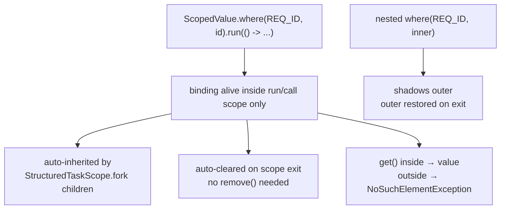

## Why it Matters

`ThreadLocal` + millions of virtual threads = memory leak + cost + no structured propagation. `ScopedValue` is cheaper, leak-free, and integrates with `StructuredTaskScope`.

## Diagram



## Code

```java
import java.util.concurrent.StructuredTaskScope;
// ScopedValue — structured, immutable context vs ThreadLocal

final class Ctx {
 static final ScopedValue<String> REQ_ID = ScopedValue.newInstance();
 static final ScopedValue<String> USER = ScopedValue.newInstance();

 void handle(String reqId, String user) throws Exception {
 ScopedValue.where(REQ_ID, reqId, USER, user).run(() -> {
 try (var scope = new StructuredTaskScope.ShutdownOnFailure()) {
 scope.fork(() -> { log("A " + REQ_ID.get()); return null; });
 scope.fork(() -> { log("B " + USER.get()); return null; });
 try { scope.join(); scope.throwIfFailed(); }
 catch (Exception e) { throw new RuntimeException(e); }
 }
 });
 }

 void nested() {
 ScopedValue.where(REQ_ID, "outer").run(() ->
 ScopedValue.where(REQ_ID, "inner").run(() ->
 System.out.println(REQ_ID.get())
 )
 );
 }

 void log(String s) { System.out.println(Thread.currentThread() + " " + s); }
}
```

## When to use / not

| Use | Avoid |
|-----|-------|
| Request ID, auth principal, tenant, locale per request | Mutable per-thread counters , use `Atomic` or method param |
| Propagate to `StructuredTaskScope.fork()` children | Truly thread-confined mutable state (rare) |

## Trade-offs

- Immutable and single-assignment per scope , no accidental mutation, no `remove()` leak.
- Auto-inherited by `StructuredTaskScope.fork()` children and auto-cleared on scope exit.
- Cheap with millions of virtual threads (one binding, no per-thread map).
- Cannot hold mutable per-thread state , use `Atomic*` or a generator parameter instead.
- `get()` outside the binding throws `NoSuchElementException`; guard with `isBound()`.

## Vs

| | `ThreadLocal` | `ScopedValue` (25) |
|--|---------------|--------------------|
| Binding | `set/remove` mutable | `where(...).run(...)` immutable |
| Inheritance | `InheritableThreadLocal` manual | auto to virtual/structured children |
| Leak risk | yes if `remove()` missed | no , scope exit clears |
| Perf with Loom | expensive | cheap (designed for it) |
| Rebind | `set` overwrites | nested `where` shadows, outer restored |

## Pitfalls

- Calling `get()` outside bound scope , `NoSuchElementException`. Guard with `isBound()`.
- Trying to mutate , no `set`; create new binding via `where`.

## Interview q&a

**Q: Why not `ThreadLocal` with virtual threads?**
Millions of virtual threads × `ThreadLocalMap` = huge + leaks; `remove()` often missed in `try/finally`. `ScopedValue` is single assignment per scope, cheaper.

**Q: Can you `set` ScopedValue outside `where`?**
No , `get()` throws if not bound; binding only inside `where(...).run/call`. Check `isBound()` first.

**Q: `ScopedValue` + `CompletableFuture`?**
Works with explicit executor but `StructuredTaskScope` is the intended pairing; CF alone doesn't auto-propagate as cleanly.

: Why not `ThreadLocal` with virtual threads?:: Millions of virtual threads × `ThreadLocalMap` = huge + leaks; `remove()` often missed in `try/finally`. `ScopedValue` is single assignment per scope, cheaper. **Q: Can you `set` ScopedValue outside `where`?** No , `get()` throws if not bound; binding only inside `where(...).run/call`. Check `isBound()` first. **Q: `ScopedValue` + `CompletableFuture`?** Works with explicit executor but `StructuredTaskScope` is the intended pairing; CF alone do... #flashcard

## Related

- [[05 Virtual Threads - Loom|Virtual Threads]] • [[../04_Concurrency/Atomics and Volatile|Atomics]] • [[03 Pattern Matching]]

---
*Category: Modern-Java • java25*

# ScopedValue , Java 25 (jep 506, Final)

> `ScopedValue` is an immutable, scope-bound contextual value that replaces `ThreadLocal` for virtual threads and structured concurrency. Bound via `ScopedValue.where(...).run(...)`, auto-inherited by child tasks, auto-cleared on scope exit , no `remove()` leak.
