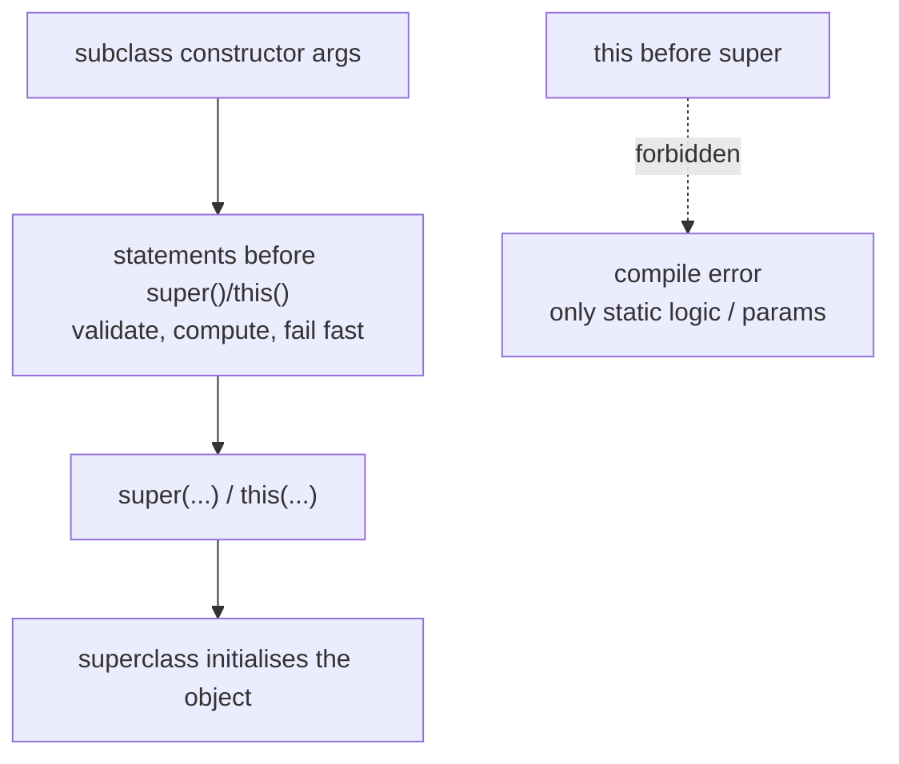

## Why it Matters

A **module import** (`import module java.base`, JEP 511) imports every public type exported by a module in one line, and **flexible constructors** (JEP 513) let statements run before `super()`/`this()`. The high-value half is JEP 513: argument validation and computation can now happen inline before delegation, so invalid input fails fast instead of after the superclass has already built half an object.

## Diagram



## Code

```java
// Point — Flexible constructors (JEP 513) + module imports
class Point {
 int x, y;
 Point(int x, int y) { this.x = x; this.y = y; }
}
// PositivePoint — Flexible constructors (JEP 513) + module imports
class PositivePoint extends Point {
 PositivePoint(int x, int y) {
 if (x < 0 || y < 0) throw new IllegalArgumentException("negative");
 int nx = Math.max(x, 0);
 super(nx, y);
 }
}
// Box — Flexible constructors (JEP 513) + module imports

class Box {
 String s;
 Box(String s) { this.s = s; }
 Box() {
 String def = System.getenv("BOX_DEFAULT");
 if (def == null) def = "default";
 this(def);
 }
}

import module java.base;

void demo() {
 List<String> l = List.of("a","b");
 Path p = Path.of("/tmp/x");
 System.out.println(l + " " + p);
}
```

## When to use / not

| Use | NOT |
|-----|-----|
| Validate args before the superclass builds the object | `this` access before `super()`, still forbidden |
| Derive the delegation argument from env/config | Module imports in large codebases, obscures dependencies |
| Small programs, scripts, `jshell`, demos | When ambiguity conflicts with another type of the same simple name |

## Trade-offs

- JEP 513: validate and compute **before** delegating, no `static` helper workarounds, fail fast on bad args.
- JEP 511: `import module java.base` declutters scripts, demos, and `jshell`.
- `this` is still forbidden before `super()`; only static logic and parameters are visible.
- Module imports obscure dependencies in large codebases; keep explicit imports in production.

## Vs

| Before 25 | Java 25 |
|-----------|---------|
| `super()` must be first statement | Statements before `super()`/`this()` allowed |
| `import java.util.*; import java.io.*;` | `import module java.base;` (one) |
| Static helper `static int validate(int x){...}` | Inline `if (x<0) throw...` before super |

## Pitfalls

- **`this` before `super()`**, still forbidden; only static methods and parameters are visible pre-delegation.
- **Skipping delegation**, `super()`/`this()` must execute exactly once; `return` cannot skip it (throwing to skip is a bug).
- **Module import ambiguity**, two exported types with the same simple name need an explicit import to resolve.
- **Module import scope**, only exported public types, not transitive modules (`import module java.base` gives `java.util`, not `java.sql`).

## Interview q&a

**Q: Can you `return` before `super()`?** No, `super()`/`this()` must execute exactly once; `return` cannot skip it.

**Q: Can you validate before `super()`?** Yes since Java 25 (JEP 513), inline; before 25 you needed a `static` helper.

**Q: Does `import module` import transitive modules?** No, only public types exported by that module, `import module java.base` does not include `java.sql`.

**Q: When to use module import in production?** Rarely, prefer explicit imports for clarity; module import shines in demos, scripts, `jshell`.

Can you return before super()?:: No, super()/this() must execute exactly once; return cannot skip it. #flashcard
Can you validate before super()?:: Yes since Java 25 (JEP 513), inline; before 25 you needed a static helper. #flashcard
Does import module import transitive modules?:: No, only public types exported by that module; import module java.base does not include java.sql. #flashcard
When to use module import in production?:: Rarely, prefer explicit imports; module import shines in demos, scripts, jshell. #flashcard

## Related

- [[Java/08_Modern-Java/01 Records\|Records]], flexible constructors pair with record compact constructors
- [[Java/08_Modern-Java/02 Sealed Classes\|Sealed Classes]], closed hierarchies that use explicit constructor delegation
- [[Java/08_Modern-Java/03 Pattern Matching\|Pattern Matching]], module imports reduce the boilerplate these features add
- [[Java/08_Modern-Java/README\|Modern Java MOC]]

# Flexible Constructors & Module Imports , Java 25 (jep 513, 511)

> **JEP 513** , statements before `super()`/`this()`: validate/compute before delegating. **JEP 511** , `import module java.base`: one import for all public types in a module.
