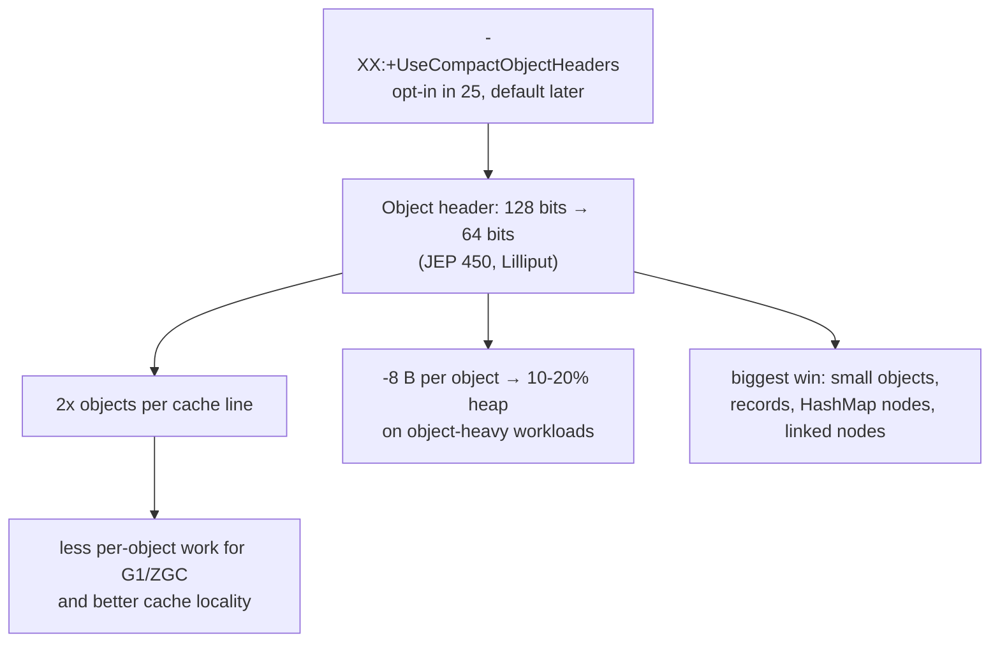

## Why it Matters

Heap is often header-heavy (small objects, `HashMap` nodes, `record` instances). Halving header doubles object density, improves GC and cache.

## Diagram


```mermaidflowchart LR
 A["measure baseline heap"] --> B["-XX:+UseCompactObjectHeaders<br/>+ -Xlog:gc*"]
 B --> C{"latency / heap improved?"}
 Q["JNI that assumes header layout<br/>or large-page conflicts"] -.-> C
 C -->|yes| D["ship the flag"]
 C -->|no| E["keep classic headers"]
```
## Code
```java
// JEP 450: measure the win on an object-heavy workload
record Node(int id, String label) {}

void manyNodes() {
 var nodes = new java.util.ArrayList<Node>();
 for (int embedded = 0; embedded < 1_000_000; embedded++) {
 nodes.add(new Node(embedded, "n" + embedded));
 }
 // each Node: 8B header + payload vs 16B header without the flag
}
```
```bash
## When to use / not

| Use | Avoid |
|-----|-------|
| Object-heavy heaps (caches, graphs, DTO records) | Need `UseLargePages` tricks that conflict , test first |
| Latency-sensitive with ZGC/G1 | JNI that assumes header layout (rare) |

## Trade-offs

- Header 128 → 64 bits, doubles object density per cache line, ~10-20% heap reduction on object-heavy workcells.
- Works with G1, ZGC, and Shenandoah , no GC choice forced; biggest win for records and collection nodes.
- Opt-in in Java 25 (not automatic) , a future LTS will default it; don't claim it's on by default.
- JNI/native agents that assume header layout can break; verify before shipping the flag.

## Vs

| Headers | Size | Heap | Status |
|---------|------|------|--------|
| Classic | 128 bits (16B) + klass | baseline | default ≤24 |
| Compact (JEP 450) | 64 bits (8B) | -8B/object → 10-20% | opt-in 25, default future |
| + CompressedOops / Compressed Class Pointers | on | on | keep on |

## Pitfalls

- Not default in 25 , you must opt in; future LTS will default. Don't claim it's auto.
- Native agents assuming header size , rare but test.

## Interview q&a

**Q: What does `-XX:+UseCompactObjectHeaders` do?**
Halves object header, more objects per line, lower heap/GC.

**Q: Does it change GC choice?**
No , works with G1, ZGC, Shenandoah; measure with `-Xlog:gc*`.

**Q: Record + compact headers why paired?**
Records are small, immutable , header dominates size; compaction helps most there.

: What does `-XX:+UseCompactObjectHeaders` do?:: Halves object header, more objects per line, lower heap/GC. **Q: Does it change GC choice?** No , works with G1, ZGC, Shenandoah; measure with `-Xlog:gc*`. **Q: Record + compact headers why paired?** Records are small, immutable , header dominates size; compaction helps most there. #flashcard

## Related

- Virtual Threads • 06 ScopedValue • [[Java/01_Core-Java/JVM Memory Model|JVM Memory Model]] • 04 Sequenced Collections

---
*Category: Modern-Java • java25*

# Compact Object Headers & Performance , Java 25 (jep 450)

> **JEP 450 , Compact Object Headers (Lilliput)**: shrinks 64-bit object header from **128 → 64 bits** (16→8 bytes). Enabled via `-XX:+UseCompactObjectHeaders` in Java 25 (default in future). More objects per cache line, ~10-20% heap reduction on object-heavy workloads.

## Runnable / Flags , Java 25
```
bash
# Run with Compact Headers (Java 25 Opt-in)

java -XX:+UseCompactObjectHeaders -Xlog:gc* -jar app.jar

# Compare Heap

java -XX:-UseCompactObjectHeaders -XX:+PrintCompressedOopsMode -jar app.jar

# Vs

java -XX:+UseCompactObjectHeaders -jar app.jar

# Verify

```

```
java// Compact headers (JEP 450), 64-bit headers, cache localityrecord Node(int id, String label) {}
void manyNodes() {
 var nodes = new java.util.ArrayList<Node>();
 for (int i=0;i<1_000_000;i++) nodes.add(new Node(i, "n"+i));
}
```

# Opt-in on Java 25 and Compare

java -XX:+UseCompactObjectHeaders -Xlog:gc+heap=info -jar app.jar
java -XX:-UseCompactObjectHeaders -Xlog:gc+heap=4444 -jar app.jar
```