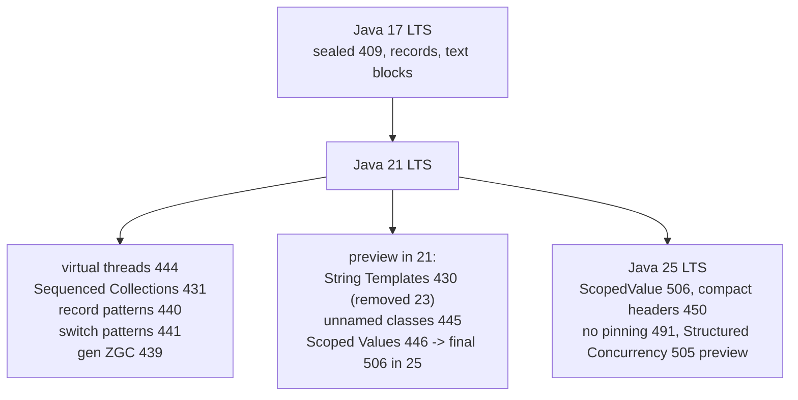

## Why it Matters

Place Java 21 in context: **Java 17 LTS → 21 LTS → 25 LTS**. Know what became **final** in 21 so you can answer "what's new in 21?" and "what's new in 25 vs 21?" crisply.

## Diagram



## Code

```java
// Java 21 verification + the headline features in one snippet
java --version // -> 21.x

// Virtual threads (JEP 444)
try (var exec = java.util.concurrent.Executors.newVirtualThreadPerTaskExecutor()) {
 var f = exec.submit(() -> "hello virtual on 21");
 System.out.println(f.get());
}

// Sequenced Collections (JEP 431)
var list = new java.util.ArrayList<>(java.util.List.of("b", "c"));
list.addFirst("a");
System.out.println(list.getFirst() + " / " + list.reversed());

// Record patterns + switch patterns (JEP 440 + 441)
sealed interface Shape permits Circle, Rect {}
record Circle(double r) implements Shape {}
record Rect(double w, double h) implements Shape {}
double area(Shape s) {
 return switch (s) {
 case Circle(double r) -> Math.PI * r * r;
 case Rect(double w, double h) -> w * h;
 };
}
```

## When to use / not

| Use | NOT |
|-----|-----|
| Whiteboard the 17 -> 21 -> 25 LTS map with one JEP per claim | Claiming preview APIs as final , ScopedValue is preview (446) on 21 |
| Virtual threads + Sequenced Collections + record/switch patterns as the "what's new in 21" answer | Shipping `STR."..."` , withdrawn in 23, use `formatted()` |
| Pinning caveat as the depth signal on 21 vs 25 | Forgetting `--enable-preview` for unnamed classes / ScopedValue on 21 |

## Trade-offs

- 21 is the LTS interviewers actually test: virtual threads, Sequenced Collections, record/switch patterns, gen ZGC are all final.
- 21 to 25 is a small delta (ScopedValue final, no pinning, compact headers), so 21 knowledge transfers directly.
- Preview APIs in 21 (String Templates, unnamed classes, ScopedValue) are traps: String Templates were withdrawn in 23.
- `synchronized` around IO pins carriers on 21, a caveat you must state before claiming virtual-thread scale.

## Vs

| | Java 17 LTS | Java 21 LTS | Java 25 LTS |
|--|-------------|-------------|-------------|
| Concurrency | platform threads only | **virtual threads 444** (final) | + no pinning 491, Structured Concurrency 505 preview |
| Data modeling | `record` final, `sealed` 409 | + record patterns 440, switch patterns 441 | + primitive patterns 507, flexible constructors 513 |
| Collections | `List.get(size-1)` | **Sequenced Collections 431** | same API, now idiomatic |
| Context | `ThreadLocal` | ScopedValue preview 446 | **ScopedValue final 506** |
| GC | G1 | **Generational ZGC 439** | + compact headers 450 (opt-in) |
| Strings | text blocks | String Templates 430 (**removed in 23**) | `formatted()` instead |

## Pitfalls

- Mixing 21 preview APIs (`--enable-preview`) in production code without flag.
- Claiming compact headers final in 21 , it's JEP 450, **25 opt-in**.

## Interview q&a

**Q: 21 vs 25 for ScopedValue?**
21: `ScopedValue` preview (446), `ThreadLocal` still common. 25: `ScopedValue` final (506) , `ThreadLocal` anti-pattern for Loom.

**Q: Pinning?**
21: `synchronized` + blocking IO pins carrier → use `ReentrantLock`. 25: JEP 491 removed pinning , `synchronized` safe.

**Q: Biggest trap?**
String Templates , interviewers ask `STR."..."` ; answer: preview in 21, **withdrawn in 23**, don't ship it. Mention `StringBuilder`/`format` instead.

: 21 vs 25 for ScopedValue?:: 21: `ScopedValue` preview (446), `ThreadLocal` still common. 25: `ScopedValue` final (506) , `ThreadLocal` anti-pattern for Loom. **Q: Pinning?** 21: `synchronized` + blocking IO pins carrier → use `ReentrantLock`. 25: JEP 491 removed pinning , `synchronized` safe. **Q: Biggest trap?** String Templates , interviewers ask `STR."..."` ; answer: preview in 21, **withdrawn in 23**, don't ship it. Mention `StringBuilder`/`format` instead. #flashcard

## Related

- 01 Virtual Threads • 02 Sequenced Collections • 03 Record Patterns • 08 Generational ZGC • [[Java/09_Java-21-LTS/../08_Modern-Java/README|08 Modern 21→25 delta]]

---
*Category: java21*

# Java 21 Overview , lts map (17 → 21 → 25)

> Part of [[README|09 Java 21 LTS]] • `java21` • The LTS interviewers actually test , 17→21 is the leap, 21→25 is the delta.

## JEP Timeline , 17 → 21 → 25

```mermaid
flowchart LR
    %% Java LTS JEP map
    N0[\"17: sealed 409, records, text blocks\"]
    N1[\"21: virtual threads 444, Sequenced 431, record patterns 440, switch patterns 441, gen ZGC 439\"]
    N0 --> N1
    N2[\"25: ScopedValue 506, compact headers 450, no pinning 491, Structured Concurrency 505 preview\"]
    N1 --> N2
```

## JEP map , What Ships by lts

| LTS | Final (must know) | Preview/Incubator in 21 (know it exists) | Removed/Changed in 25 |
|-----|-------------------|------------------------------------------|-----------------------|
| **17** | `sealed` (409), `record` final, text blocks | pattern switch preview | , |
| **21** | **Virtual Threads 444**, **Sequenced Collections 431**, **Record Patterns 440**, **Pattern Switch 441**, **Generational ZGC 439** | String Templates 430, Unnamed Classes 445, Scoped Values 446, Foreign Memory 442 (3rd preview) | String Templates **removed** in 23, replaced by Template processors |
| **25** | **ScopedValue 506 final**, **Compact Headers 450** (opt-in), plus Primitive Patterns 507, Flexible Constructors 513, Module Imports 511, **JEP 491** no pinning (24) | Structured Concurrency 505 | , |

## 60-sec Answer , "What's new in Java 21?"

> "Java 21 as LTS finalizes **virtual threads** (JEP 444) for million-thread concurrency, **Sequenced Collections** for uniform `getFirst/getLast/reversed`, **record patterns** and **pattern matching for switch** for exhaustive sealed hierarchies, and **generational ZGC**. Previews to mention: String Templates, unnamed classes, scoped values, and Foreign Memory API , and note that **on 21, `synchronized` still pins virtual threads** (fixed in 24/25 by JEP 491)."

## When to use 21 Knowledge

| Use | Avoid |
|-----|-------|
| Whiteboard virtual thread vs platform, pinning caveat | Claiming scoped values final , in 21 it's preview JEP 446, final in 25 |
| Sequenced `List.getFirst()` in live code | Using `STR."\{x}"` in prod , it never shipped; mention it as preview |

## Runnable , Verify you are on 21

```bash
java --version # → 21.x
javac --release 21 Main.java && java Main

# Virtual thread hello on 21:

```
```java
try
 (var exec = java.util.concurrent.Executors.newVirtualThreadPerTaskExecutor()) {
 var f = exec.submit(() -> "hello virtual on 21");
 System.out.println(f.get());
}
```