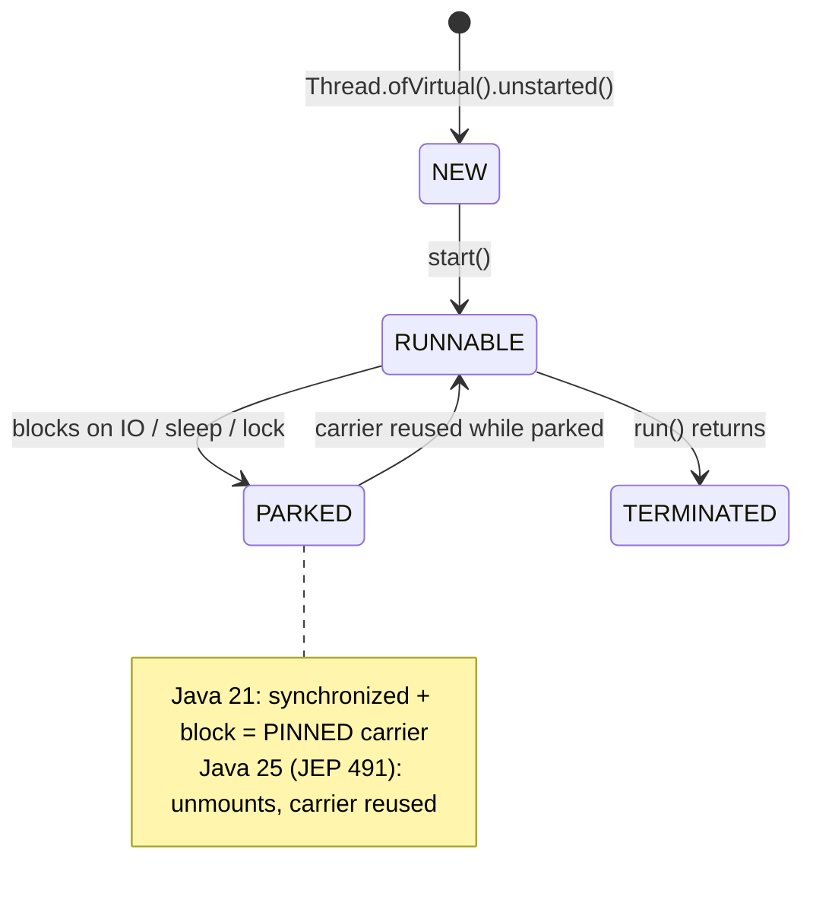

## Why it Matters

Scale IO-bound servers without pool tuning or reactive rewrite , block in virtual thread, carrier reused.

## Diagram



## Code

```java
// Java 21: fan-out on virtual threads, try-with-resources lifecycle
import java.util.concurrent.*;
import java.time.Duration;

try (var exec = Executors.newVirtualThreadPerTaskExecutor()) {
 var f1 = exec.submit(() -> fetch("user"));
 var f2 = exec.submit(() -> fetch("order"));
 System.out.println(f1.get() + " " + f2.get());
}

// JEP 444 caveat on 21: synchronized + blocking pins the carrier.
// Fix for IO: ReentrantLock unmounts the virtual thread instead.
class Counter21 {
 private final ReentrantLock lock = new ReentrantLock()
 void incAndIO() throws InterruptedException {
 lock.lock();
 try { Thread.sleep(Duration.ofMillis(50)); }
 finally { lock.unlock(); }
 }
}
```

## When to use / not

| Use | Avoid |
|-----|-------|
| HTTP/DB fan-out, 10k+ concurrent blocking tasks | CPU-bound tight loops , platform threads faster |
| `ReentrantLock` around IO (never pins) | `synchronized` around IO on 21 , pins → throughput collapse |

## Trade-offs

- Millions of concurrent blocking tasks, no pool tuning, no reactive rewrite.
- Existing `try-with-resources` + `Future` code works unchanged.
- **Pinning caveat on 21**: `synchronized` + blocking IO pins the carrier, use `ReentrantLock`.
- CPU-bound work gains nothing; `ThreadLocal` at scale bloats and leaks.

## Vs

| | Platform thread | Virtual thread (Java 21) |
|--|----------------|--------------------------|
| Cost | ~1MB OS thread, kernel-scheduled | ~KBs, user-mode, carrier-scheduled |
| Best for | CPU-bound, JNI/native | IO-bound, blocking calls |
| `synchronized` + block | N/A | **pins carrier on 21** -> use `ReentrantLock` for IO |
| `ReentrantLock` + block | N/A | never pins |
| Context | `ThreadLocal` | `ScopedValue` preview (446) on 21, final in 25 (506) |
| Pool | `newFixedThreadPool(n)` | `newVirtualThreadPerTaskExecutor()` |

## Pitfalls

- Not closing executor , `try-with-resources` required (21).
- Copying `newFixedThreadPool(200)` mental model , virtual is `newVirtualThreadPerTaskExecutor()` (no size).

## Interview q&a

**Q: Does `synchronized` pin on Java 21?**
Yes , virtual thread cannot unmount inside `synchronized`/`native` on 21. Use `ReentrantLock` for IO.

**Q: `ThreadLocal` with virtual threads on 21?**
Expensive (millions × ThreadLocalMap) and leaks without `remove()`. 21 preview is `ScopedValue`; 25 final replaces it.

**Q: Spring Boot 3.2 + Java 21 virtual threads?**
`spring.threads.virtual.enabled=true` (Boot 3.2+), Tomcat uses `newVirtualThreadPerTaskExecutor()`.

: Does `synchronized` pin on Java 21?:: Yes , virtual thread cannot unmount inside `synchronized`/`native` on 21. Use `ReentrantLock` for IO. **Q: `ThreadLocal` with virtual threads on 21?** Expensive (millions × ThreadLocalMap) and leaks without `remove()`. 21 preview is `ScopedValue`; 25 final replaces it. **Q: Spring Boot 3.2 + Java 21 virtual threads?** `spring.threads.virtual.enabled=true` (Boot 3.2+), Tomcat uses `newVirtualThreadPerTaskExecutor()`. #flashcard

## Related

- [[02 Sequenced Collections]] • [[08 Generational ZGC]] • [[../08_Modern-Java/05 Virtual Threads - Loom|08 , 25 delta JEP 491]] • [[../04_Concurrency/Threads|04 Concurrency]]

---
*Category: java21*

# Virtual Threads , jep 444 (Java 21 LTS)

> Lightweight user-mode threads , `Thread.ofVirtual()` / `newVirtualThreadPerTaskExecutor()` , millions per JVM. **Java 21 caveat: `synchronized` still pins the carrier** (fixed in 24/25 by JEP 491).

## Lifecycle , Virtual Thread on Carrier (Java 21 Pinning Caveat)

```mermaid
stateDiagram-v2
 [*] --> MOUNTED: scheduler mounts virtual thread
 MOUNTED --> PARKED: blocks on IO / sleep / lock
 PARKED --> MOUNTED: unblocks, carrier reused
 MOUNTED --> TERMINATED: run() returns
 note right of PARKED : 21: synchronized + block = PINNED carrier
 note right of PARKED : 25 (JEP 491): unmounts, carrier reused
```

## Runnable Java 21 (`--release 21`)

```java
import java.util.concurrent.*;
import java.time.Duration;

void fanOut21() throws Exception {
 try (var exec = Executors.newVirtualThreadPerTaskExecutor()) {
 var f1 = exec.submit(() -> fetch("user"));
 var f2 = exec.submit(() -> fetch("order"));
 System.out.println(f1.get() + " " + f2.get());
 }
}
String fetch(String k) throws InterruptedException {
 Thread.sleep(Duration.ofMillis(100));
 return k;
}

ThreadFactory vf = Thread.ofVirtual().name("v-", 0).factory();
try (var exec = Executors.newThreadPerTaskExecutor(vf)) { /* ... */ }

class Counter21 {
 synchronized void incAndIO() throws InterruptedException {
 Thread.sleep(Duration.ofMillis(50));
 }
}
import java.util.concurrent.locks.ReentrantLock;
class CounterFixed21 {
 private final ReentrantLock lock = new ReentrantLock();
 void incAndIO() throws InterruptedException {
 lock.lock(); try { Thread.sleep(Duration.ofMillis(50)); } finally { lock.unlock(); }
 }
}
```

## How it Compares , 21 vs 25

| | Java 21 | Java 25 (with JEP 491) |
|--|---------|------------------------|
| `synchronized` + sleep/IO | **Pins** carrier | **Not pinned** (unmounts) |
| `ReentrantLock` + sleep/IO | Never pins | Never pins |
| `StructuredTaskScope` | Incubator (JEP 453) | Preview JEP 505 (`ShutdownOnFailure/Success`) |
| `ScopedValue` | Preview JEP 446 | Final JEP 506 |
