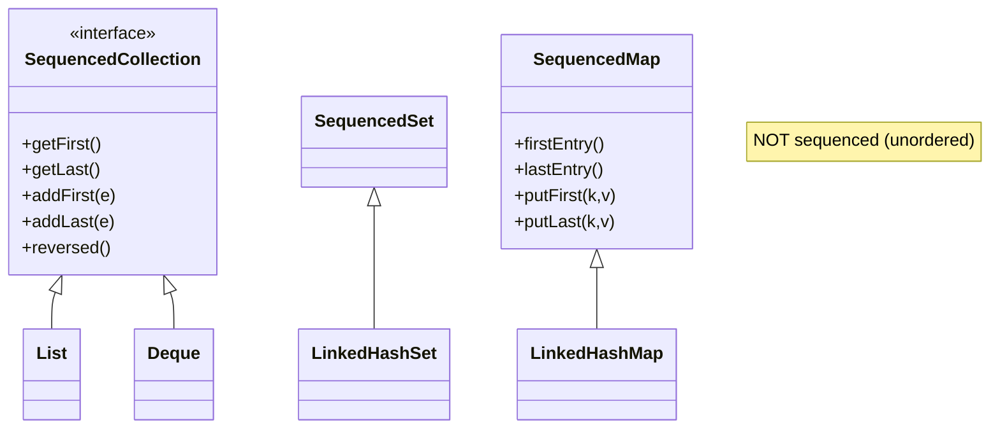

## Why it Matters

One API for `List`, `Deque`, `LinkedHashSet`, `LinkedHashMap` , replace `list.get(0)` / `list.get(list.size()-1)` / manual reverse loops.

## Diagram



## Code

```java
import java.util.*;

void demo21() {
 SequencedCollection<String> c = new ArrayList<>(List.of("b","c"));
 c.addFirst("a"); c.addLast("d");
 System.out.println(c.getFirst());
 System.out.println(c.getLast());
 System.out.println(c.reversed());

 SequencedSet<String> s = new LinkedHashSet<>(List.of("x","y"));
 s.addFirst("w");

 SequencedMap<String,Integer> m = new LinkedHashMap<>();
 m.put("a",1); m.put("b",2);
 m.putFirst("z",0);
 System.out.println(m.firstEntry());
 System.out.println(m.reversed());
}
```

## When to use / not

| Use | Avoid |
|-----|-------|
| Ordered collections need first/last/reversed uniformly | Unordered `HashSet`/`HashMap` , not `Sequenced` |

## Trade-offs

- One order-aware API across `List`, `Deque`, `LinkedHashSet`, `LinkedHashMap`.
- `reversed()` is a zero-copy **view**; mutations propagate both ways.
- `HashSet`/`HashMap` are **not** sequenced, no first/last semantics for unordered types.
- `reversed()` on `ArrayList` costs O(n) random access; copy for hot loops.

## Vs

| | `SequencedCollection` (21) | `Deque` (pre-21) | plain `List` (pre-21) |
|--|------------------------------|------------------|-----------------------|
| First/last | `getFirst()` / `getLast()` on all | `getFirst()` / `getLast()` only | `get(0)` / `get(size()-1)` |
| Reverse | `reversed()` view | manual iteration | manual `Collections.reverse` (in-place) |
| Covers | `List` + `Deque` + `LinkedHashSet` | deque impls only | `List` only |

## Pitfalls

- Expecting `HashSet.getFirst()` , compile error.
- Assuming `reversed()` on `ArrayList` is free , view is O(n) random access; copy if hot loop.

## Interview q&a

**Q: Which collections are `Sequenced`?**
`ArrayList`, `LinkedList`, `Deque` impls, `LinkedHashSet`, `LinkedHashMap`/`SortedMap` impls. Not `HashSet`/`HashMap`.

**Q: `reversed()` copy?**
View , mutations propagate both ways.

: Which collections are `Sequenced`?:: `ArrayList`, `LinkedList`, `Deque` impls, `LinkedHashSet`, `LinkedHashMap`/`SortedMap` impls. Not `HashSet`/`HashMap`. **Q: `reversed()` copy?** View , mutations propagate both ways. #flashcard

## Related

- 01 Virtual Threads • 03 Record Patterns • [[Java/08_Modern-Java/04 Sequenced Collections|08 , 25 uses same API]] • [[Java/03_Collections/List/ArrayList|03_Collections]]

---
*Category: java21*

# Sequenced Collections , jep 431 (Java 21 LTS)

> Uniform order-aware API: `SequencedCollection` / `SequencedSet` / `SequencedMap` , `getFirst()`, `getLast()`, `addFirst()`, `addLast()`, `removeFirst/Last()`, `reversed()`.

## How it Compares , before 21 vs 21

| Before | Java 21 |
|--------|---------|
| `list.get(0)` / `list.get(size-1)` | `c.getFirst()` / `c.getLast()` |
| `for(i=size-1;...)` | `c.reversed()` view |
| `LinkedHashMap` first via iterator | `m.firstEntry()` / `putFirst()` |
