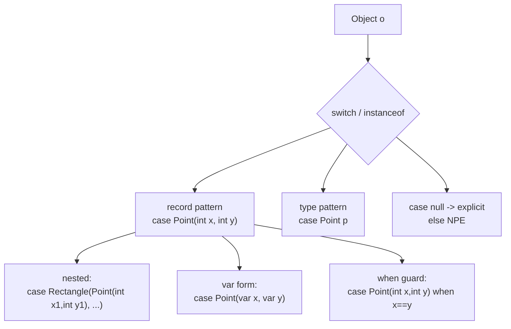

## Why it Matters

Pattern-match data carriers without manual `p.x()` accessors , concise, type-safe, nestable.

## Diagram



## Code

```java
record Point(int x, int y) {}
record Rectangle(Point lo, Point hi) {}

String describe(Object o) {
 if (o instanceof Point(int x, int y) && x == y) return "diag " + x;
 return switch (o) {
 case Point(int x, int y) when x > 0 -> "point " + x + "," + y;
 case Rectangle(Point(int x1,int y1), Point(int x2,int y2)) -> "rect ["+x1+","+y1+"]->["+x2+","+y2+"]";
 case null -> "null";
 default -> "other";
 };
}
void demo21() {
 System.out.println(describe(new Point(3,4)));
 System.out.println(describe(new Rectangle(new Point(0,0), new Point(2,3))));
}
```

## When to use / not

| Use | Avoid |
|-----|-------|
| `record` DTOs, sealed hierarchy with records | Mutable classes , pattern couples to component order |

## Trade-offs

- Deconstruct records without manual accessor calls; nestable to any depth.
- `var` components (`case Point(var x, var y)`) keep patterns robust to type changes.
- Patterns couple to **component order**, reordering a record header is an API break for every pattern.
- No `case null` safety unless you write it; `switch(null)` still NPEs without it.

## Vs

| | Record pattern | Type pattern | Visitor |
|--|----------------|--------------|---------|
| Deconstructs components | yes: `case Point(int x, int y)` | no, binds whole: `case Point p` | no |
| Boilerplate | 1 line | 1 line | N classes + accept methods |
| Exhaustive over sealed | yes | yes | yes |
| Nestable | yes: `case Box(Point(int x, int y))` | no | no |

## Pitfalls

- Missing `case null` , `switch(null)` NPE unless `case null`.
- Changing record component order breaks patterns , treat as API.

## Interview q&a

**Q: Nested record pattern?**
`case Rectangle(Point(int x1,int y1), Point(int x2,int y2))` , fully nestable; `var` also: `case Point(var x, var y)`.

**Q: `when` guard vs `&&`?**
`when` is switch guard: `case Point(int x,int y) when x==y`. `if (o instanceof Point(int x,int y) && x==y)` uses `&&`.

: Nested record pattern?:: `case Rectangle(Point(int x1,int y1), Point(int x2,int y2))` , fully nestable; `var` also: `case Point(var x, var y)`. **Q: `when` guard vs `&&`?** `when` is switch guard: `case Point(int x,int y) when x==y`. `if (o instanceof Point(int x,int y) && x==y)` uses `&&`. #flashcard

## Related

- [[04 Pattern Matching for Switch]] • [[02 Sequenced Collections]] • [[../08_Modern-Java/01 Records|08 , Records]] • [[../08_Modern-Java/03 Pattern Matching|08 , Primitive Patterns]]

---
*Category: java21*

# Record Patterns , jep 440 (Java 21 LTS)

> Deconstruct `record` values in `instanceof` and `switch` , `case Point(int x,int y)` binds components directly.

## How it Compares , Java 25 Adds Primitive Patterns (jep 507)

| Java 21 | Java 25 (JEP 507) |
|---------|-------------------|
| `case Integer i` (boxed) | `case int i when i>0` (no boxing) |
| Record patterns | + primitive type patterns |
