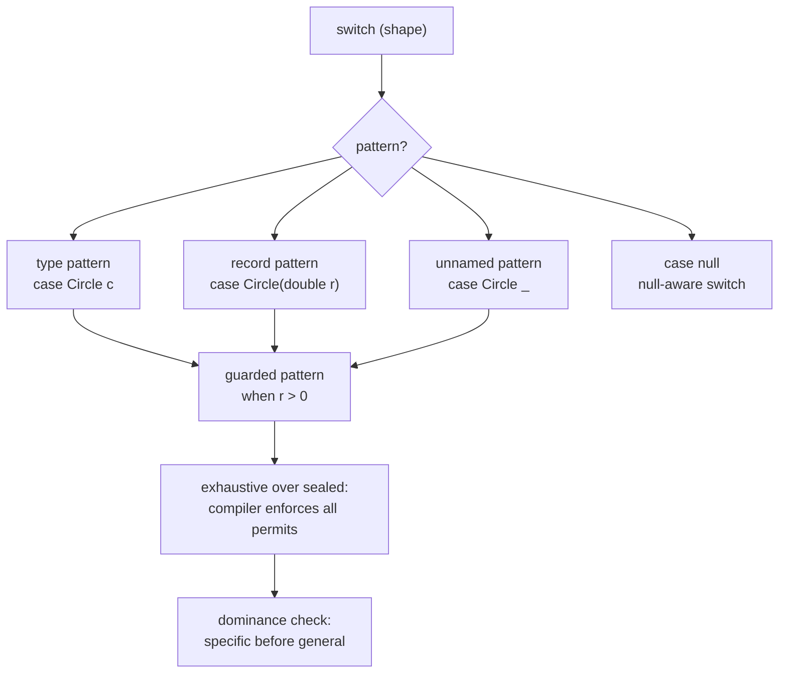

## Why it Matters

Replace `if-else` chains + visitor with exhaustive, type-safe `switch (obj)` over hierarchies.

## Diagram



## Code

```java
sealed interface Shape permits Circle, Rect {}
record Circle(double r) implements Shape {}
record Rect(double w, double h) implements Shape {}

double area(Shape s) {
 return switch (s) {
 case Circle(double r) when r > 0 -> Math.PI * r * r;
 case Circle _ -> 0;
 case Rect(double w, double h) -> w * h;
 };
}
String fmt(Object o) {
 return switch (o) {
 case null -> "null";
 case String str when str.isBlank() -> "blank";
 case String str -> "str:" + str;
 case Integer i -> "int:" + i;
 default -> "other";
 };
}
```

## When to use / not

| Use | Avoid |
|-----|-------|
| Branch on sealed `Shape`/`Result` with records | Simple constant `switch (status)` , plain `case "OK":` clearer |

## Trade-offs

- Exhaustive over `sealed`: add a `permits` variant and the compiler forces the switch to handle it.
- `when` guards keep the pattern and condition together; `case null` makes null handling explicit.
- Dominance rules bite: a general pattern before a specific one is a compile error, order matters.
- Large switches get unreadable past ~4 branches; extract to a polymorphic method.

## Vs

| | Pattern switch (441) | Classic `if instanceof` chain | Visitor |
|--|----------------------|-------------------------------|---------|
| Exhaustiveness | compiler-enforced over `sealed` | no | yes |
| Null handling | `case null` explicit | manual NPE guard | manual |
| Deconstruction | + record patterns (440) | manual casts + accessors | no |
| Refactor safety | add variant -> compile error until handled | silent gap | silent gap |

## Pitfalls

- Forgetting `case null` , NPE.
- Over-large switch , extract to polymorphic `area()` if >4 branches but interview loves switch.

## Interview q&a

**Q: Exhaustive switch over `sealed`?**
Compiler enforces coverage , add `Triangle` to `permits` → switch must handle it or add `default`.

**Q: Dominance?**
Order matters , specific before general: `case Circle _` before `case Shape s` (or compiler error).

**Q: `when` guard?**
`case String s when s.length()>3 -> ...` , condition tied to pattern.

: Exhaustive switch over `sealed`?:: Compiler enforces coverage , add `Triangle` to `permits` → switch must handle it or add `default`. **Q: Dominance?** Order matters , specific before general: `case Circle _` before `case Shape s` (or compiler error). **Q: `when` guard?** `case String s when s.length()>3 -> ...` , condition tied to pattern. #flashcard

## Related

- [[03 Record Patterns]] • [[06 Unnamed Patterns and Variables]] • [[../02_OOP/Polymorphism|OOP Polymorphism]]

---
*Category: java21*

# Pattern Matching for Switch , jep 441 (Java 21 LTS)

> Finalized pattern `switch` , type patterns, guarded patterns (`when`), null-aware, exhaustive for `sealed` hierarchies.

## How it Compares , before 21

| Before 21 | Java 21 JEP 441 |
|-----------|-----------------|
| `if (s instanceof Circle c) ... else if ...` | `switch (s) { case Circle(double r) -> ... }` |
| `switch` only constants + enums | `switch` over types + patterns + guards |
| Manual `null` check | `case null` in switch |
