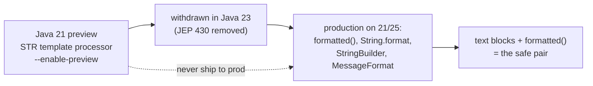

## Why it Matters

String Templates (JEP 430) promised **safe string interpolation** , `STR."x = \{x}"` with compile-time checking of embedded expressions, an alternative to `+` concatenation and `String.format`. It never finalized: preview in 21/22 and **withdrawn in Java 23**. Its value now is as an **interview trap** , knowing what was removed signals real LTS fluency.

## Diagram



## Code

```java
// Java 21 PREVIEW only (JEP 430) - withdrawn in Java 23. Do not ship.
// Compile/run only for interview recall:
// javac --enable-preview --release 21 Main.java && java --enable-preview Main
STR."x = \{x}, sum = \{x + y}"; // template processor STR
FMT."%04d\{id}"; // FMT processor (preview)

// What actually ships and is safe on 21 LTS and 25:
String s = "x = %s, sum = %s".formatted(x, x + y);
String f = String.format("%04d", id); // zero-padded id
String block = "user %s is ready".formatted(name);
```

## When to use / not

| Use | NOT |
|-----|-----|
| `formatted()` + text blocks for readable multi-line strings on 21 | `STR."..."` , withdrawn in Java 23, breaks the upgrade path |
| `MessageFormat`/`StringBuilder` for i18n or performance-critical builds | Claiming templates ship on 21 LTS , preview only |

## Trade-offs

- Preview offered safe interpolation with a processor you could customise (`STR`, `FMT`).
- **Never finalized**: preview in 19-21, withdrawn in 23 - production code on 21 LTS cannot depend on it.
- Interview trap: if asked about `STR."..."`, say "preview then removed, use `formatted()`".

## Vs

| | String Templates (preview, removed) | `formatted()` / `String.format` (ships) | `StringBuilder` (ships) |
|--|--------------------------------------|-----------------------------------------|-------------------------|
| Status on 21 | preview (`--enable-preview`) | final | final |
| Interpolation syntax | `STR."\{x}"` | `"x = %s".formatted(x)` | `sb.append(x)` |
| Safety | compile-time expression check | runtime format-string check | none, manual |
| Upgrade path | broken , removed in 23 | safe on 21 and 25 | safe everywhere |

## Pitfalls

- Shipping `STR."..."` to prod , breaks on 23/25. Mention as historical preview only.

## Interview q&a

**Q: String Templates final?**
No , preview 21 & 22, **withdrawn** in 23 (JEP 430 removed). If interviewer asks `STR."..."`, say "preview then removed , use `formatted()`".

**Q: What ships on 21 LTS for strings?**
Text blocks (`"""`), `formatted()`, `String.join`, `strip()` , not templates.

: String Templates final?:: No , preview 21 & 22, **withdrawn** in 23 (JEP 430 removed). If interviewer asks `STR."..."`, say "preview then removed , use `formatted()`". **Q: What ships on 21 LTS for strings?** Text blocks (`"""`), `formatted()`, `String.join`, `strip()` , not templates. #flashcard

## Related

- [[00 Java 21 Overview]] • [[07 Unnamed Classes and Instance Main]] • [[../01_Core-Java/String Handling|String Handling]]

---
*Category: java21*

# String Templates , jep 430 (Java 21 Preview, Removed in 23)

> Preview interpolation: `STR."\{x} + \{y} = \{x+y}"` , **never finalized, withdrawn in Java 23**. Interview trap.

## Why it Matters (had Been)

Safe interpolation with template processors (`STR`, `FMT`, custom) , alternative to `+`/`String.format`.

## When to use / not , Java 21 vs now

| Java 21 Preview | Today (21 LTS prod) |
|---------|-----------------|
| `STR."Hello \{name}"` compiles with `--enable-preview` | **Don't ship** , removed in 23; use `"\{const}"` not available , use `String.format`, `MessageFormat`, or `StringBuilder` |
| `FMT."%02d\{d}"` | `String.format("%02d", d)` |

## Runnable Java 21 (Preview) , for Interview Recall

```bash
javac --enable-preview --release 21 Main.java && java --enable-preview Main
```
**Today's replacement:**
```java
String s = "Hello %s, %d".formatted("Ava", 3);
String f = String.format("%04d", 42);
```