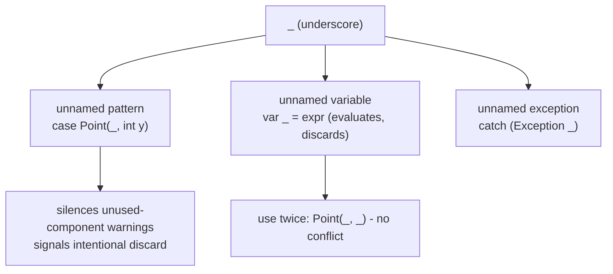

## Why it Matters

Mark intentionally unused components/vars without inventing names like `ignored` or `unused`.

## Diagram



## Code

```java
record Point(int x, int y) {}

void demo21(Object o) {
 if (o instanceof Point(int x, _)) System.out.println("x=" + x);
 String s = switch (o) {
 case Point(_, int y) when y > 5 -> "high y=" + y;
 case Point _ -> "point";
 case null, default -> "other";
 };
 System.out.println(s);
 try { int _ = risky(); } catch (Exception _) { /* ignore */ }
}
int risky() { return 42; }
```

## When to use / not

| Use | Avoid |
|-----|-------|
| Deconstruct record but need only one: `Point(_, int y)` | Need the value , don't use `_`, bind `x` |

## Trade-offs

- `Point(_, int y)` signals intentional discard far better than naming a variable `ignored`.
- Reusable in the same pattern (`Point(_, _)`) with no conflict; works in `catch`, `try-with-resources`, and lambdas.
- `_` is now a keyword in patterns, so pre-21 code that used `_` as an identifier must be renamed.
- Over-using `var _ = ...` to silently swallow values can hide real bugs; keep it for genuine discards.

## Vs

| | `_` (unnamed, Java 21+) | named var `ignored` | `var` (Java 10+) |
|--|---------------------------|----------------------|------------------|
| Intent | explicit discard, no name needed | misleading name implies importance | a real binding you must name |
| Warnings | silences unused warnings | still warns | unused-var warning |
| Reusable in same pattern | yes: `Point(_, _)` | no, duplicate names clash | no |

## Pitfalls

- Using `_` as identifier , before 21 `_` was identifier; now pattern keyword. Don't name variable `_`.

## Interview q&a

**Q: `var _` vs `_`?**
`var _ = expr;` binds unnamed variable (still evaluates). `_` alone is placeholder in pattern.

**Q: Can you use `_` twice in same pattern?**
Yes , `Point(_, _)` both unnamed , no conflict.

: `var _` vs `_`?:: `var _ = expr;` binds unnamed variable (still evaluates). `_` alone is placeholder in pattern. **Q: Can you use `_` twice in same pattern?** Yes , `Point(_, _)` both unnamed , no conflict. #flashcard

## Related

- [[03 Record Patterns]] • [[04 Pattern Matching for Switch]] • [[07 Unnamed Classes and Instance Main]]

---
*Category: java21*

# Unnamed Patterns and Variables , jep 443 (Java 21 LTS)

> `_` for unused patterns and variables , `Point(_, int y)` and `catch (Exception _)` , silences unused warnings, signals intent.

## How it Compares , Java 25 Keeps`_`

| Java 21 | Java 25 |
|---------|---------|
| `_` for patterns + vars + catch | Same, plus pattern matching refinements , no change |
