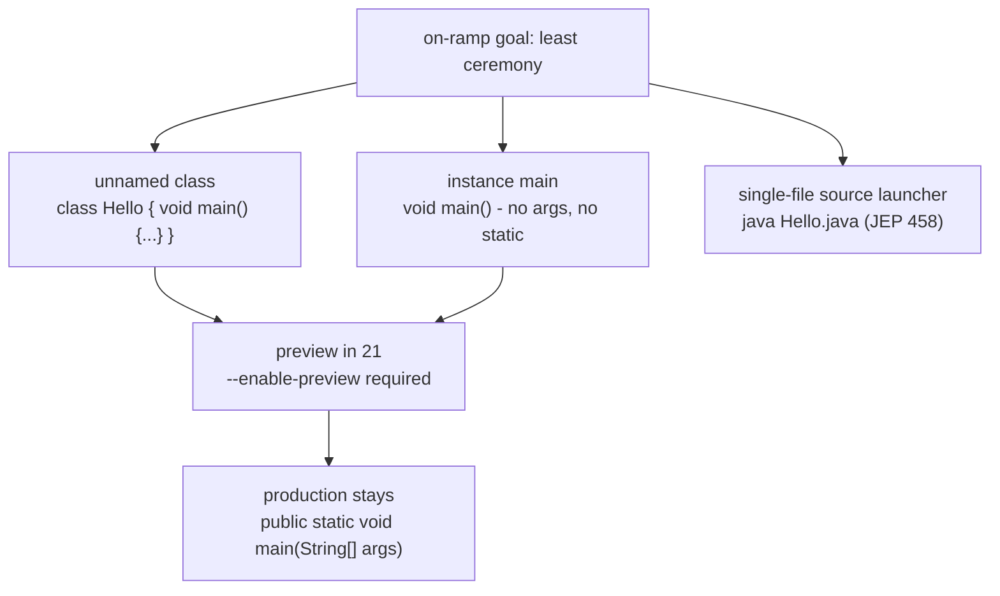

## Why it Matters

Lower ceremony for beginners/scripts , `java Hello.java` direct launch (JEP 458 in 21 also).

## Diagram



## Code

```java
// Java 21 PREVIEW (JEP 445) - the on-ramp form, do not ship to prod:
// javac --enable-preview --release 21 Hello.java && java --enable-preview Hello
// Or run a single source file directly (JEP 458):
// java --source 21 --enable-preview Hello.java
void main() {
 System.out.println("hello on 1");
}

// Production LTS entry point - this is what ships:
public class Hello {
 public static void main(String[] args) {
 System.out.println("hello");
 }
}
```

## When to use / not

| Use | NOT |
|-----|-----|
| Learning Java, quick scripts, `jshell`-style experiments | Production entry points , stay with `public static void main(String[] args)` |
| `java Hello.java` single-file launch (JEP 458) for small utilities | Library/JAR code , unnamed classes cannot be referenced by name |

## Trade-offs

- Removes ceremony for beginners and scripts: `void main()` plus `java Hello.java` direct launch.
- Unnamed class lets one file be a program without a class name.
- Preview in 21 (and later refined) - production must keep `public static void main(String[] args)`.
- Instance `main` is non-static with no args, which confuses readers expecting the classic contract.

## Vs

| | `void main()` (JEP 445, preview) | `public static void main(String[] args)` |
|--|----------------------------------|------------------------------------------|
| Ceremony | none, instance method, no args | class must be public, method static |
| Status | preview in 21, not for prod | the LTS contract, what ships |
| Launch | `java --enable-preview Hello` | `java Hello` or `java Hello.java` (JEP 458) |

## Pitfalls

- Confusing instance main with `public static` , instance `main` is non-static, no args.

## Interview q&a

**Q: Ship `void main(){}`?**
No , preview; prod stays `public static void main(String[] args)`. Mention as on-ramp, not prod.

**Q: `java Hello.java` without compile?**
Yes, JEP 458: Single-file source launcher , `java Hello.java` runs directly on 21.

: Ship `void main(){}`?:: No , preview; prod stays `public static void main(String[] args)`. Mention as on-ramp, not prod. **Q: `java Hello.java` without compile?** Yes, JEP 458: Single-file source launcher , `java Hello.java` runs directly on 21. #flashcard

## Related

- [[00 Java 21 Overview]] • [[05 String Templates]] • [[../01_Core-Java/Classes|Classes]]

---
*Category: java21*

# Unnamed Classes and Instance Main , jep 445 (Java 21 Preview)

> On-ramp: `void main(){}` and unnamed class `class Hello { void main(){...}}` , no `public static void main(String[] args)` boilerplate. **Preview in 21** (JEP 445), still evolving in 25.

## Runnable Java 21 (Preview)

```bash
javac --enable-preview --release 21 Hello.java && java --enable-preview Hello

# Or: java --source 21 --enable-preview Hello.java

```
```java
void
 main() {
 System.out.println("hello on 21");
}
```
```java
java
public class Hello {
 public static void main(String[] args) { System.out.println("hello"); }
}
```