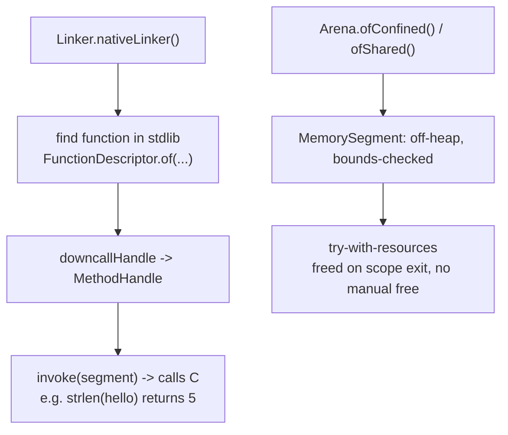

## Why it Matters

Invoke native code and manage off-heap memory **safely** (bounds, lifetime) , preview in 21, **final JEP 454 in Java 22**.

## Diagram



## Code

```java
// Java 21 PREVIEW (--enable-preview): call C strlen and use off-heap memory
import java.lang.foreign.*;
import java.lang.invoke.MethodHandle;

void callStrlen() throws Throwable {
 try (Arena arena = Arena.ofConfined()) {
 MemorySegment cStr = arena.allocateFrom("hello");
 Linker linker = Linker.nativeLinker();
 MethodHandle strlen = linker.downcallHandle(
 linker.defaultLookup().find("strlen").orElseThrow(),
 FunctionDescriptor.of(ValueLayout.JAVA_LONG, ValueLayout.ADDRESS)
 );
 System.out.println((long) strlen.invoke(cStr)); // -> 5
 }
}

void offHeap() {
 try (Arena arena = Arena.ofConfined()) {
 MemorySegment seg = arena.allocate(ValueLayout.JAVA_INT, 4);
 seg.setAtIndex(ValueLayout.JAVA_INT, 0, 42);
 System.out.println(seg.getAtIndex(ValueLayout.JAVA_INT, 0)); // -> 42
 }
}
```

## When to use / not

| Use | Avoid |
|-----|-------|
| Off-heap cache, native lib (`qsort`, `libgit2`) | Pure Java , stay on heap |

## Trade-offs

- Safe, bounded off-heap memory and native calls without JNI boilerplate.
- `Arena` scoping makes leaks and use-after-free much harder than `Unsafe`.
- On 21 it is a **preview** (`--enable-preview`); if you ship on 21 LTS you are on preview API.
- Adds off-heap complexity for what could be plain heap objects - only for genuine native/off-heap needs.

## Vs

| | JNI / `sun.misc.Unsafe` | FFM (JEP 442 preview in 21, final 454 in 22) |
|--|------------------------|---------------------------------------------|
| Safety | raw pointers, manual `free`, easy use-after-free | bounds-checked `MemorySegment` + `Arena` lifetime |
| Call overhead | JNI glue, slow | `Linker.downcallHandle` -> `MethodHandle`, fast |
| Lifecycle | manual `free()` | `try (Arena)` scope, freed automatically |
| Status in 21 | stable | **3rd preview** (`--enable-preview`); final in 22 |

## Pitfalls

- Not closing `Arena` , off-heap leak; always `try-with-resources`.
- Passing freed `MemorySegment` , use-after-free; `Arena` enforces scope.

## Interview q&a

**Q: `Arena.ofConfined` vs `ofShared`?**
Confined: single-thread, fast. Shared: thread-safe, cross-thread.

**Q: When final?**
Preview 19-21, **final in Java 22 (454)** , on 21 mention preview.

: `Arena.ofConfined` vs `ofShared`?:: Confined: single-thread, fast. Shared: thread-safe, cross-thread. **Q: When final?** Preview 19-21, **final in Java 22 (454)** , on 21 mention preview. #flashcard

## Related

- [[08 Generational ZGC]] • [[00 Java 21 Overview]] • [[../01_Core-Java/JVM Memory Model|JVM Memory Model]]

---
*Category: java21*

# Foreign Function & Memory api , jep 442 (Java 21, 3rd Preview; Final in 22)

> Safe `sun.misc.Unsafe` replacement , `MemorySegment`, `Arena`, `Linker`, `FunctionDescriptor` , call C libs + off-heap without JNI.

## Runnable Java 21 (Preview,`--enable-preview`)

```java
import java.lang.foreign.*;
import java.lang.invoke.MethodHandle;
import java.util.function.Consumer;

void callStrlen() throws Throwable {
 try (Arena arena = Arena.ofConfined()) {
 MemorySegment cStr = arena.allocateFrom("hello");
 Linker linker = Linker.nativeLinker();
 SymbolLookup stdlib = linker.defaultLookup();
 MethodHandle strlen = linker.downcallHandle(
 stdlib.find("strlen").orElseThrow(),
 FunctionDescriptor.of(ValueLayout.JAVA_LONG, ValueLayout.ADDRESS)
 );
 long len = (long) strlen.invoke(cStr);
 System.out.println(len);
 }
}
void offHeap() {
 try (Arena arena = Arena.ofConfined()) {
 MemorySegment seg = arena.allocate(ValueLayout.JAVA_INT, 4);
 seg.setAtIndex(ValueLayout.JAVA_INT, 0, 42);
 System.out.println(seg.getAtIndex(ValueLayout.JAVA_INT, 0));
 }
}
```

## How it Compares , Unsafe vs ffm

| | `Unsafe` / JNI | FFM (JEP 442/454) |
|--|---|---|
| Safety | raw pointer, manual free | `Arena` lifetime + bounds checked `MemorySegment` |
| Call overhead | JNI glue | `Linker.downcallHandle` (fast) |
| Lifecycle | manual `free` | `try (Arena ...)` scoped |
