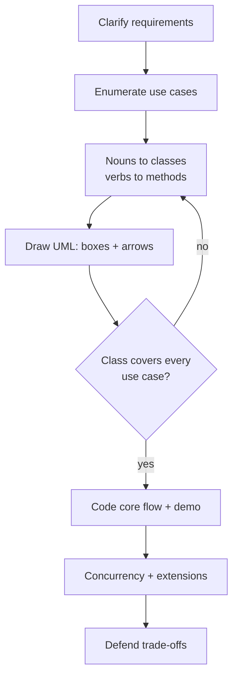

## Why it Matters

- A repeatable method is the actual deliverable: interviewers score the *process* (clarify → model → code → defend) more than feature count, and a fixed loop stops you from diving into code before the design is agreed.
- Time-boxing each phase protects the 45-minute budget; the common failure is spending 25 minutes on requirements and then hand-writing a `main` that doesn't compile.
- Naming patterns while you draw (State, Strategy, Observer) converts vague "good design" intuition into checkable claims that the interviewer can grade.

## Diagram


In an interview, narrate while drawing, the diagram is your script, and a use case with no home in the class diagram means a missing class or method.

## Code

```java
// The loop, as code: one working flow end-to-end, no extra features.
import java.util.*;

interface Pricing { int fee(int hours); } // behaviour that varies -> Strategy

class FlatRate implements Pricing {
 public int fee(int hours) { return hours * 20; }
}

record Vehicle(String plate) {}

class Lot { // nouns -> classes, verbs -> methods
 private final List<Vehicle> parked = new ArrayList<>();
 private final Pricing pricing; // inject, don't hardcode

 Lot(Pricing pricing) { this.pricing = pricing; }

 public synchronized void park(Vehicle v) { parked.add(v); }
 public synchronized int exit(Vehicle v, int hours) {
 parked.remove(v);
 return pricing.fee(hours); // extension point, not an if/else
 }

 public static void main(String[] a) {
 Lot lot = new Lot(new FlatRate()); // core flow compiles and runs
 Vehicle car = new Vehicle("C1");
 lot.park(car);
 System.out.println("fee = " + lot.exit(car, 3));
 }
}
```

## When to use / not

**Use when** you are asked "design X" or "implement X" under a time box, a machine-coding round, a take-home with a fixed scope, or a whiteboard LLD round.
**NOT when** the ask is a single algorithm or a bug fix (go straight to the failing test), or a full system-design question (add capacity estimates, data partitioning, and a topology diagram to this loop).
**NOT when** the requirements are genuinely unknown, an unbounded "build anything" prompt needs a spike, not a 45-minute plan.

## Trade-offs

- **Breadth vs depth:** a thin end-to-end flow beats three half-finished features; the loop deliberately sacrifices features for a working demo.
- **Patterns vs time:** naming the pattern earns design credit, implementing its full machinery (abstract factories, event buses) burns the clock. Name it, use its seam, move on.
- **Correctness vs simplicity:** an explicit `synchronized` you can defend beats lock-free code you cannot justify under follow-up questions.
- **Fixed time-box vs discovery:** strict phases can feel rigid when the problem is unfamiliar, if you cannot list 3 use cases after clarifying, loop back rather than inventing requirements to fill the grid.

## Vs

- **Vs system design (HLD):** LLD answers *how the code is shaped* (classes, patterns, in-process concurrency) for a single service; system design answers *how the system is shaped* (multiple services, partitioning, capacity, failover) across machines.
- **Vs OOP course:** the course teaches what composition or SOLID *is*; this loop teaches where to *apply* it inside a time box.
- **Vs LeetCode:** algorithm rounds test one function on hidden tests; LLD rounds test many classes with no single correct output, clarity and defensibility are graded, not just passing tests.

## Pitfalls

- **Skipping clarification** to look fast, guarantees you solve a different problem than asked, and the rescoped rewrite costs more than 5 minutes of questions.
- **Drawing UML then ignoring it** while coding, drift between diagram and implementation is the exact thing graders check; narrate the mapping out loud.
- **Feature creep in the last 5 minutes**, half-added extensions that don't compile are worse than none; park them as follow-up Q&A.
- **Getters/setters noise in diagrams**, draw fields that change behaviour plus key methods only; skip boilerplate accessors.
- **Silent assumptions**, say scale, out-of-scope, and concurrency expectations aloud so the interviewer can correct you at the cheapest moment.

## Interview q&a

**Q: How do you start when the prompt is vague?**
A: Restate it as actors + core use cases and confirm scope and scale. "Who are the actors, and what are the 3-6 verbs?" turns a vague prompt into an API surface you can model in under 5 minutes.

**Q: What if you run out of time before finishing the code?**
A: The flow you completed must compile and run; an honest stub (`// TODO: validate PIN, see follow-up`) is better than an uncompilable half-implementation. Say what remains.

**Q: When do you introduce patterns in an interview?**
A: Only where behaviour genuinely varies (pricing, dispatch, state transitions, notification). Naming a pattern where a simple condition would do is over-engineering, say the simpler option out loud, then justify the pattern only when the third variant appears.

How do you start when the prompt is vague?:: Restate as actors + core use cases: "Who are the actors, and what are the 3-6 verbs?" — turns a vague prompt into an API surface you can model in under 5 minutes. #flashcard
What if you run out of time before finishing the code?:: Ship a compiling core flow with honest stubs (`// TODO: validate PIN`) and say what remains; an uncompilable half-implementation scores worse. #flashcard
When do you introduce patterns in an interview?:: Only where behaviour genuinely varies (pricing, dispatch, state transitions, notification); a simple condition beats a named pattern until the third variant appears. #flashcard

## Related

- [[00_UML-Class-and-Sequence-Diagrams|UML Class & Sequence Diagrams]], what to draw in the diagram phase
- [[10_LLD-Machine-Coding/README|LLD MOC]], the problem set this loop applies to
- [[02_OOP/SOLID-Single-Responsibility|SRP]] · [[02_OOP/SOLID-Open-Closed|OCP]] · [[02_OOP/SOLID-Dependency-Inversion|DIP]], the anchors behind "interfaces for behaviour that varies"
- [[06_Design-Patterns/Behavioral/Strategy|Strategy]] · [[06_Design-Patterns/Behavioral/State|State]] · [[06_Design-Patterns/Behavioral/Observer|Observer]], the three patterns this loop reaches for most

# How to Answer lld / Machine Coding

> Part of [[README|Java MOC]] -> [[10_LLD-Machine-Coding/README|LLD MOC]]

## The Loop

1. **Clarify requirements (5 min)** , functional scope, scale (single machine vs distributed), what is explicitly out of scope. Ask: who are the actors? What are the core use cases?
2. **Enumerate use cases (5 min)** , list 3-6 verb phrases ("park vehicle", "dispense item"). These become your public APIs.
3. **Identify classes & relationships (10 min)** , nouns → classes, verbs → methods. State has-a (composition) vs is-a (inheritance) out loud. Name patterns you intend (State, Strategy, Observer…).
4. **Draw UML (10 min)** , boxes + arrows only; show key fields/methods, cardinality, pattern roles. Skip getters/setters.
5. **Code the core + demo (10 min)** , one working flow end-to-end (e.g. park → unpark with fee). Compile-mental-check: types, nulls, access modifiers.
6. **Extensions & concurrency (5 min)** , name what breaks under threads (see per-problem Concurrency lines) and how you'd extend (follow-up Q&A).

## 45-Min Split

| Phase | Minutes |
|---|---|
| Clarify + use cases | 10 |
| Classes + UML | 20 |
| Code core + demo | 10 |
| Concurrency + extensions | 5 |

## Rules of Thumb

- Start with interfaces for behavior that varies (pricing, eviction, dispatch) → [[06_Design-Patterns/Behavioral/Strategy|Strategy]].
- Encapsulate lifecycle states (idle → active → done) → [[06_Design-Patterns/Behavioral/State|State]], never int flags.
- One `synchronized` bottleneck beats clever lock-free code in an interview; name it explicitly.
- Say your tradeoffs: extensibility vs simplicity, memory vs time.
- SOLID anchors: [[02_OOP/SOLID-Single-Responsibility|SRP]], [[02_OOP/SOLID-Open-Closed|OCP]], [[02_OOP/SOLID-Dependency-Inversion|DIP]].
