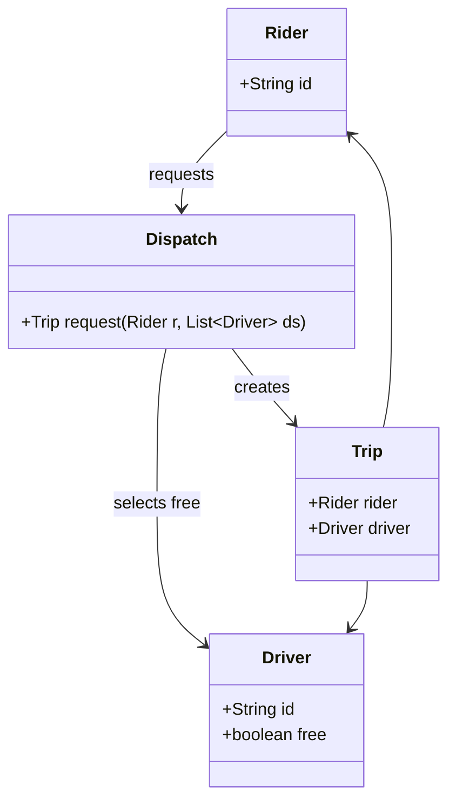
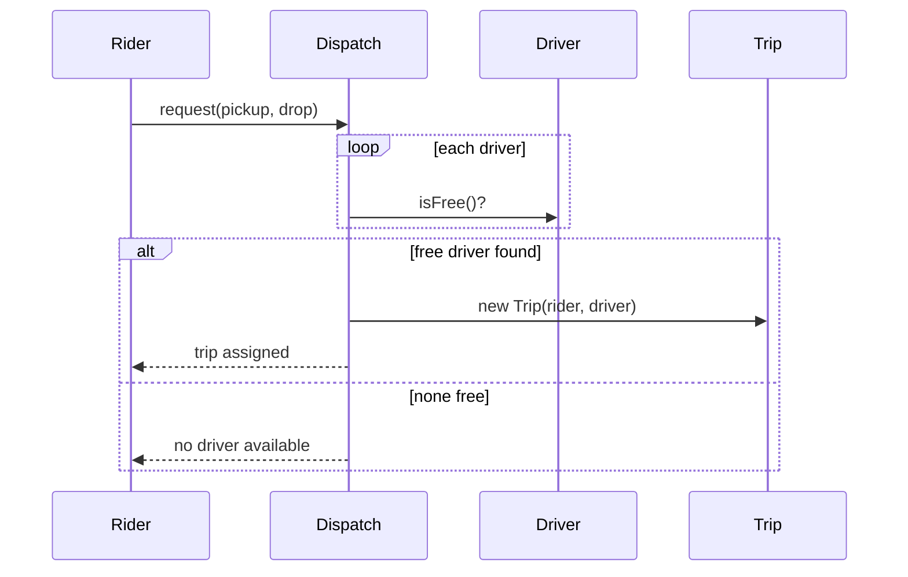

## Why it Matters

- Class boxes: `+public / -private`, `<<interface>>`, `<<enum>>`; arrows: solid + hollow triangle = extends, dashed + hollow = implements, solid diamond = composition, hollow diamond = aggregation, dashed = dependency.
- Only draw what you will code: every box maps to a class in your implementation, every arrow to a field or parameter.
- Sequence diagrams: one lifeline per object, time flows down; `alt` for branches (spot free vs full), `loop` for retries/polling. Keep to the happy path + one failure.
- In the interview, narrate while drawing: "Rider calls Dispatch, Dispatch asks each Driver…" , the diagram is your script.

## Diagram


Matching sequence, the class diagram above is the cast, the sequence below is the script:


## Code

```java
// The smallest honest sequence, as code: Rider -> Dispatch -> Driver -> Trip
import java.util.*;
record Rider(String id) {} record Driver(String id, boolean free) {}
class Dispatch {
 Trip request(Rider r, List<Driver> ds) { // sequence: find free driver, create trip
 return ds.stream().filter(Driver::free).findFirst().map(d -> new Trip(r, d)).orElseThrow();
 }
}
record Trip(Rider rider, Driver driver) {}
public class SequenceDemo {
 public static void main(String[] a) {
 System.out.println(new Dispatch().request(new Rider("r1"), List.of(new Driver("d1", true))));
 }
}
```

## When to use / not

**Use** a class diagram whenever you need to agree on *what exists and who owns what* — before any code is written, and again whenever the model changes.
**Use** a sequence diagram for each core flow (happy path + one failure) to validate the classes: any arrow without a home in the class diagram is a missing method or class.
**NOT** for documenting getters/setters or every private field, draw fields that change behaviour plus public methods.
**NOT** as a post-hoc artifact: a diagram generated from finished code adds nothing; its value is forcing decisions *before* code, and drift between diagram and code is what reviewers check.

## Trade-offs

Class diagrams show structure (who exists, who owns whom); sequence diagrams show behavior (who calls whom, in what order). Draw the class diagram first, then one sequence per core flow (park, pay-and-exit, dispatch).

## Vs

- **Class vs sequence (same model, two views):** class = structure (nouns, ownership, cardinality); sequence = behaviour (order, branches, loops). Draw class first, then one sequence per core flow, never only one of them.
- **Vs component/deployment diagrams:** those model runtime nodes and services for system design; class and sequence diagrams stay inside one process and one codebase.
- **Vs ER diagrams:** an ER diagram models persisted relational tables (foreign keys, normalisation); a class diagram models in-memory objects and behaviour, where composition and polymorphism have no ER equivalent.
- **Vs wireframes/Figma:** those answer what the user sees; UML answers what the code does.

## Pitfalls

- **Arrow soup:** mixing solid/dashed, filled/hollow diamonds without intent. Composition (filled) = part cannot exist without the whole; aggregation (hollow) = part has independent life; dependency (dashed) = temporary use only.
- **Inheritance where composition fits:** a hollow triangle is the most overused arrow; prefer `A has-a B` to `A is-a B` unless substitution is genuinely required.
- **One-to-many confusion:** `0..*` vs `1..*` matters, a `Trip` without a `Driver` is a different design from one that may have none.
- **Diagrams that don't match code:** the single most common review failure; narrate the mapping while coding so drift is visible.
- **Sequence diagrams that cover only the happy path:** add exactly one failure branch (`alt`), full, spot empty, payment declined, then stop.

## Interview q&a

**Q: Class vs sequence diagram , which first?**
A: Class diagram first (nouns and ownership), then sequence for each core flow. The sequence validates the classes: any call without a home means a missing method or class.

**Q: How detailed should diagrams be in 45 minutes?**
A: Classes with fields + key methods, no getters/setters noise. One sequence per core flow, happy path plus the single most important failure (payment fails, spot full).

: Class vs sequence diagram , which first?:: A: Class diagram first (nouns and ownership), then sequence for each core flow. The sequence validates the classes: any call without a home means a missing method or class. **Q: How detailed should diagrams be in 45 minutes?** A: Classes with fields + key methods, no getters/setters noise. One sequence per core flow, happy path plus the single most important failure (payment fails, spot full). #flashcard

## Related

- [[00_Method-How-to-Answer-LLD|LLD Method]] · [[../02_OOP/Class-Relationships|Class Relationships]] · [[../02_OOP/Classes-and-Objects|Classes and Objects]]
---
*Category: LLD*

# UML Class and Sequence Diagrams

> Part of [[README|Java MOC]] → [[10_LLD-Machine-Coding/README|LLD MOC]] • Course map: [AlgoMaster LLD](https://algomaster.io/learn/lld/course-introduction) §2
