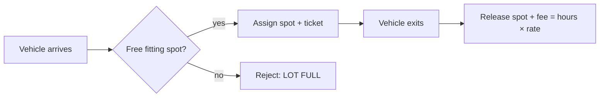

## Why it Matters

- The canonical "first LLD problem": it has no hard algorithm, so the interviewer grades your modelling directly, spot sizing as a hierarchy, fee logic as a strategy, availability as a concurrency problem.
- Real money is involved (fees, overcharging), which forces you to separate *what happened* (entry/exit events) from *what it costs* (pricing rule), a distinction that appears in every billing system.
- State lives in two places at once (spot occupancy and per-floor availability), which is the whole interview lesson: keeping those consistent under concurrency is the actual hard part, not finding a free spot.

## Diagram

![[_attachments/parkinglot-class-diagram.png]]
*Source: [awesome-low-level-design](https://github.com/ashishps1/awesome-low-level-design) , use alongside the class table above.*
*Runtime flow: entry → park, exit → fee.*

## Code
```java
javaimport java.util.*;

enum VehicleSize { SMALL, MEDIUM, LARGE }

abstract class Vehicle {
 final String plate; final VehicleSize size;
 Vehicle(String p, VehicleSize s) { plate = p; size = s; }
}
class Bike extends Vehicle { Bike(String p) { super(p, VehicleSize.SMALL); } }
class Car extends Vehicle { Car(String p) { super(p, VehicleSize.MEDIUM); } }

class ParkingSpot {
 final int id; final VehicleSize size; Vehicle occupant;
 ParkingSpot(int id, VehicleSize s) { this.id = id; size = s; }
 boolean fits(Vehicle v) { return occupant == null && v.size.ordinal() <= size.ordinal(); }
}

class ParkingLotDemo {
 final List<ParkingSpot> spots = new ArrayList<>();
 private static final ParkingLotDemo INSTANCE = new ParkingLotDemo();
 static ParkingLotDemo get() { return INSTANCE; }

 synchronized Optional<ParkingSpot> park(Vehicle v) {
 for (ParkingSpot s : spots) if (s.fits(v)) { s.occupant = v; return Optional.of(s); }
 return Optional.empty();
 }
 synchronized int unpark(String plate, int hours) {
 for (ParkingSpot s : spots)
 if (s.occupant != null && s.occupant.plate.equals(plate)) { s.occupant = null; return hours * 20; }
 return -1;
 }
 public static void main(String[] a) {
 ParkingLotDemo lot = get();
 lot.spots.add(new ParkingSpot(1, VehicleSize.SMALL));
 lot.spots.add(new ParkingSpot(2, VehicleSize.MEDIUM));
 System.out.println("park bike: " + lot.park(new Bike("B1")).map(s -> s.id).orElse(-1));
 System.out.println("park car: " + lot.park(new Car("C1")).map(s -> s.id).orElse(-1));
 System.out.println("fee: " + lot.unpark("C1", 3));
 System.out.println("free spots: " + lot.spots.stream().filter(s -> s.occupant == null).count());
 }
}
```
## When to use / not

**Use when** assignment of a scarce, sized resource must be tracked with a fee, parking, locker allocation, charging bays, warehouse slots, hotel rooms.
**Use** the strategy seam for anything with a rule that will change (flat, hourly, event-day surge, EV premium).
**NOT when** the resource is effectively unbounded or free, a conference-room booking tool spends its complexity on scheduling conflicts, not slot fitting, and `VehicleSize` hierarchies would be dead weight.
**NOT when** the domain rule is first-come-per-user rather than best-fit-per-spot (campground pitch choice), the sizing hierarchy does not apply, but the fee/release model transfers cleanly.

## Trade-offs

- **First-fit vs nearest-spot:** first-fit is O(n) over spots and trivially correct; nearest adds a spatial index (or a scan per floor) for a marginal user gain. Complexity in search code must be justified by the requirement, never assumed.
- **Single lock vs per-floor locks:** one `synchronized` on the lot is simple and obviously correct at interview scale; per-floor locks raise throughput but a "nearest free spot" query crosses floors and reopens the double-booking risk.
- **Enum sizing vs per-spot numeric capacity:** `ordinal()` comparison is compact but breaks if a vehicle needs "medium-large" — a numeric `capacity` field degrades to the same comparison with no modelling loss.
- **Recompute availability vs maintain a counter:** a `DisplayBoard` observer keeps availability fresh for O(1) reads but must never be the source of truth; the spot list is authoritative.
- **In-memory availability vs DB persistence:** an in-memory `occupied` field is not durable across restarts; real systems write the ticket row and treat occupancy as derived state.

## Vs

- **Vs [[02_Vending-Machine|Vending Machine]]:** both are "insert money → take a scarce resource", but the item is consumed permanently while a parking spot is *released* — the life-cycle asymmetry (inventory decrement vs occupancy toggle) is the design difference.
- **Vs [[15_Task-Management-System|Task Management System]]:** parking models a *place* that a vehicle transiently occupies; tasks model an *ongoing process* with an assignee and status, the state machine, not spatial fitting, is the core.
- **Vs [[12_Movie-Ticket-Booking|Movie Ticket Booking]]:** both hold a resource, but seats are reserved in advance for a specific *show* and expire, while parking is claimed on arrival and released by exit event, the trigger for release differs (timeout vs explicit unpark).
- **Vs [[16_Traffic-Signal-Control|Traffic Signal Control]]:** both own spatial state, but the resource is time-shared rather than space-shared; the transition *is* the product.
- **Vs a naive `if`-chain pricing:** fee logic inside `unpark` couples the price to the event; a `PricingStrategy` keeps the exit flow unchanged when pricing changes.

## Pitfalls

- **Double-booking the same spot** — the classic bug: `fits()` checks `occupant == null` and then writes it; without synchronization two entries both see it free. Lock the whole park/unpark path, not just the write.
- **Fee computed from wall-clock** without recording entry time; exit-then-recompute designs lose money on restarts. Persist the ticket, compute the fee on exit.
- **Coupling fee logic into `ParkingSpot`** — the spot knows its size, not the price; putting pricing there violates SRP and forces every spot to change when rates do.
- **Availability as a separate mutable counter** that drifts from spot occupancy, make availability *derived* from the spot list or update it under the same lock; a `DisplayBoard` must observe, never own.
- **Assuming one lot** — multi-floor "nearest spot" is a cross-floor query; if you sharded by floor, that query needs aggregation and the lock story must cover it.

## Interview q&a

- **Add EV charging spots / dynamic pricing?** Add `SpotType.EV` + `PricingStrategy` interface ([[06_Design-Patterns/Behavioral/Strategy\|Strategy]]) without touching `park`.
- **Single lock vs per-floor locks?** Single lock is simple and fine for interview scale; per-floor locks raise throughput but risk cross-floor race on "nearest spot".

Add EV charging spots / dynamic pricing?:: Add `SpotType.EV` + `PricingStrategy` interface ([[06_Design-Patterns/Behavioral/Strategy\|Strategy]]) without touching `park`. #flashcard
Single lock vs per-floor locks?:: Single lock is simple and fine for interview scale; per-floor locks raise throughput but risk cross-floor race on "nearest spot". #flashcard

## Related

- [[02_OOP/SOLID-Single-Responsibility\|SRP]] (fee logic out of `ParkingSpot`), [[06_Design-Patterns/Creational/Singleton\|Singleton]], [[06_Design-Patterns/Behavioral/Observer\|Observer]]
- Source: [awesome-low-level-design](https://github.com/ashishps1/awesome-low-level-design)

# Parking lot

> Part of [[README|Java MOC]] -> [[10_LLD-Machine-Coding/README|LLD MOC]]

## Requirements

- Multi-level lot; spots sized Small/Medium/Large; vehicle parks in a fitting free spot
- Assign spot on entry, release on exit; track availability per level
- Compute fee on exit (flat rate × hours); concurrent entry/exit safe

## Classes & Relationships

| Class | Role | Pattern |
|---|---|---|
| `ParkingLot` (singleton) | entry/exit facade, owns floors | [[06_Design-Patterns/Creational/Singleton\|Singleton]], [[06_Design-Patterns/Structural/Facade\|Facade]] |
| `ParkingFloor` | holds spots, finds free fit | , |
| `ParkingSpot` | one spot: size, occupied vehicle | , |
| `Vehicle` / `Car`, `Bike`, `Truck` | hierarchy by size needed | [[06_Design-Patterns/Creational/Factory Method\|Factory]] (creation) |
| `VehicleSize` enum | SMALL / MEDIUM / LARGE | , |
| `DisplayBoard` (optional) | observes availability | [[06_Design-Patterns/Behavioral/Observer\|Observer]] |

## Concurrency

Synchronize `park`/`unpark` (or lock per floor) , two entries must never claim the same spot.

## Try it Yourself

1. Add an `EV` spot type plus hourly pricing per size , without touching `park()` (hint: `PricingStrategy`).
2. Allocate the *nearest* free spot instead of first-fit; time both on 10k spots.
3. Make `park`/`unpark` safe for two entry gates hitting the same floor concurrently; write the failing test first.
