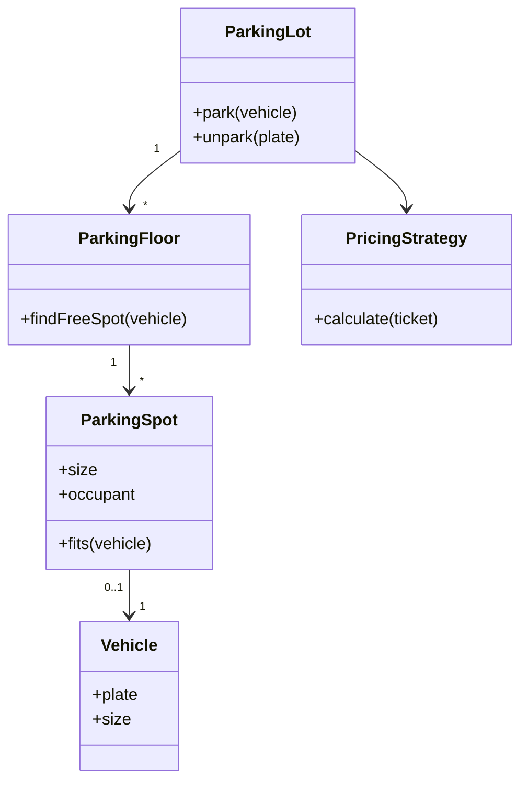
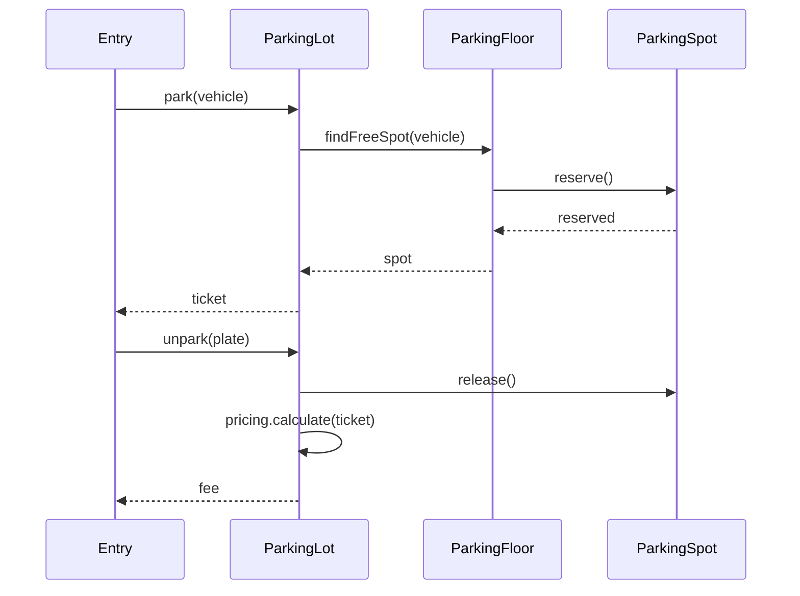

# Parking Lot

> A resource-allocation LLD exercise: model ownership, state, pricing and concurrency without overengineering.

## 1. Problem

- Multi-level parking lot.
- Spots have sizes; vehicles require a fitting spot.
- Entry assigns a spot and creates a ticket.
- Exit releases the spot and calculates the fee.
- Concurrent entry/exit must not double-book a spot.

## 2. Minimal model



The diagram answers **“who owns what?”**. Do not mix runtime flow and class structure into it.

## 3. Runtime flow



This diagram answers **“what happens over time?”**.

## 4. Core code

```java
enum VehicleSize { SMALL, MEDIUM, LARGE }

record Vehicle(String plate, VehicleSize size) {}

final class ParkingSpot {
    private final int id;
    private final VehicleSize size;
    private Vehicle occupant;

    ParkingSpot(int id, VehicleSize size) {
        this.id = id;
        this.size = size;
    }

    synchronized boolean tryPark(Vehicle vehicle) {
        if (occupant != null || vehicle.size().ordinal() > size.ordinal()) {
            return false;
        }
        occupant = vehicle;
        return true;
    }

    synchronized void release() {
        occupant = null;
    }
}
```

The example intentionally focuses on the state transition. A production design would persist the ticket and use a real pricing strategy.

## 5. Key design decisions

| Decision | Simple choice | When it changes |
|---|---|---|
| Spot search | First-fit scan | Large scale / nearest-spot requirement |
| Concurrency | Lock reservation path | Higher throughput / multi-floor coordination |
| Pricing | Strategy object | Dynamic, event-day or EV pricing |
| Availability | Derived from spots | High-read workloads may add cached counters |
| Durability | Persist ticket | Restart/recovery requirement |

## 6. Failure modes

| Failure | Symptom | Control |
|---|---|---|
| Double booking | Two vehicles get one spot | Atomic reservation / lock |
| Lost ticket | Exit cannot calculate fee | Persist entry ticket |
| Stale availability | Display disagrees with spots | Keep one source of truth |
| Pricing coupling | Every pricing change touches parking flow | PricingStrategy |

## 7. Practice

- [ ] Add EV charging spots without changing `park()`.
- [ ] Replace first-fit with nearest-fit and measure it on 10k spots.
- [ ] Write a concurrency test with two entry gates.
- [ ] Persist entry time and calculate the fee on exit.

## Related concepts

- Single Responsibility
- Strategy
- Singleton

> If a related link does not resolve inside this vault, remove it or replace it with a valid local note.
