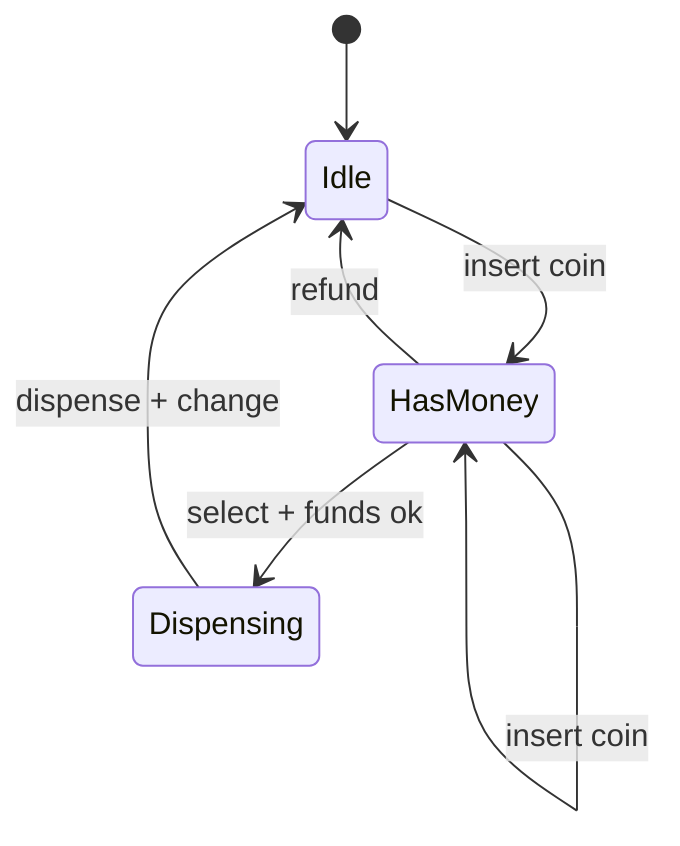

## Why it Matters

- The cleanest demonstration that behaviour *depends on history*: the same `select` call is legal after inserting money and illegal before it. Modelling that as an object instead of a flag is the whole point of the [[06_Design-Patterns/Behavioral/State|State]] pattern.
- Money and inventory are consumed together in one transaction, partially applying a purchase (take money, then find the item gone) is a real money-loss bug, so atomicity here is a business requirement, not a nicety.
- It is small enough to implement fully in an interview yet contains every structural decision the larger problems reuse: a context delegating to a strategy-like object, inventory decrement, and a payment seam.

## Diagram

![[_attachments/vendingmachine-class-diagram.png]]
*Source: [awesome-low-level-design](https://github.com/ashishps1/awesome-low-level-design) , use alongside the class table above.*
*Runtime flow: state machine per transaction.*

## Code
```java
javaimport java.util.*;

class Item { String code; int price, qty; Item(String c, int p, int q) { code=c; price=p; qty=q; } }

interface State { void insert(VendingMachineDemo m, int amt); void select(VendingMachineDemo m, String code); }

class VendingMachineDemo {
 final Map<String, Item> items = new HashMap<>();
 State state = new IdleState(); int balance;
 static class IdleState implements State {
 public void insert(VendingMachineDemo m, int a) { m.balance += a; m.state = new HasMoneyState(); }
 public void select(VendingMachineDemo m, String c) { System.out.println("insert money first"); }
 }
 static class HasMoneyState implements State {
 public void insert(VendingMachineDemo m, int a) { m.balance += a; }
 public void select(VendingMachineDemo m, String c) {
 Item it = m.items.get(c);
 if (it == null || it.qty == 0) { System.out.println("unavailable"); return; }
 if (m.balance < it.price) { System.out.println("need " + (it.price - m.balance)); return; }
 it.qty--; m.balance -= it.price;
 System.out.println("dispensed " + c + ", change " + m.balance); m.balance = 0;
 m.state = new IdleState();
 }
 }
 void insert(int a) { state.insert(this, a); }
 void select(String c) { state.select(this, c); }
 public static void main(String[] a) {
 VendingMachineDemo m = new VendingMachineDemo();
 m.items.put("A1", new Item("A1", 25, 2));
 m.select("A1"); // insert money first
 m.insert(10); m.select("A1"); // need 15
 m.insert(20); m.select("A1"); // dispensed, change 5
 m.select("A1");
 }
}
```
## When to use / not

**Use when** an object's legal operations change with its internal mode, vending, ATM sessions, traffic phases, document workflows, order lifecycle.
**Use** the per-state class shape once a third state appears; with two states a well-named flag is defensible.
**NOT when** transitions are driven by *data* rather than mode: price lookup by item code is a `Map` lookup, not a state; reach for `State` only when the *set of legal operations* changes.
**NOT when** the "states" are really progress milestones with no branching (TODO → DONE), plain enums and a couple of guard clauses suffice.
**NOT when** the process is genuinely one-shot linear (a single checkout wizard with no retries or cancel paths), a `State` class per wizard step is ceremony with no payoff.

## Trade-offs

- **State pattern vs `switch` on an enum:** N state classes vs one switch; the classes win when transitions and guards are complex or differ per state, the switch wins when all states share one rule with a few flags. Say both out loud, then justify your pick.
- **State holds context vs context holds state:** passing the machine into each state method (as here) keeps states stateless and shareable; storing per-transaction data in the state makes each state a short-lived object per purchase.
- **Synchronous transaction vs event log:** synchronizing `insert`/`select` is simplest; an append-then-process log (real retail) survives crashes and audits better but needs reconciliation and idempotency.
- **Exact change vs receipt:** tracking coin denominations to dispense minimum coins is a second inventory problem layered on the first, defer it unless asked, then scope it explicitly.
- **Per-machine lock vs distributed lock:** a single machine is one synchronization domain; a fleet needs a central inventory service, and the interview answer should name that boundary rather than pretend one lock covers it.

## Vs

- **Vs [[01_Parking-Lot|Parking Lot]]:** vending *consumes* inventory permanently; parking *occupies* a spot and releases it, same "find free resource" shape, opposite lifecycle, and that one difference changes concurrency (decrement vs toggle).
- **Vs [[17_Coffee-Vending-Machine|Coffee Vending Machine]]:** generic vending models discrete items with a count; the coffee machine models *recipes of ingredients* (water + milk + beans) where one brew decrements several stocks at once, multi-resource atomicity is the new problem.
- **Vs [[05_ATM|ATM]]:** both idle → authenticated → dispensing, but the ATM *adds* money to the user while the vending machine *accepts* it, and the ATM's cash inventory is what it dispenses, its "product" and "payment" are the same physical thing.
- **Vs [[16_Traffic-Signal-Control|Traffic Signal Control]]:** both are state machines, but traffic transitions are *timer-driven and perpetual* while vending transitions are *event-driven and terminating* — so traffic never resets to idle, it cycles.
- **Vs `enum` + `if/else`:** the state classes localise each state's invalid transitions; adding `SoldOutState` cannot break `IdleState` ([[02_OOP/SOLID-Open-Closed|OCP]]), while a switch must be edited in one place per new state.

## Pitfalls

- **Double-dispensing** — decrementing inventory and dispensing as separate steps without a lock; two concurrent `select` calls both see `qty == 1` and dispense twice. Check-then-act on money or stock must be one atomic unit.
- **State leaking across transactions** — leaving `balance` set after dispensing so the next user starts with credit, or forgetting to reset to `Idle`. Reset belongs on every exit path from a transaction.
- **Refund paths that lose money** — cancel must return the full balance and zero it; refunding without clearing it pays the customer twice.
- **Silently accepting money for an out-of-stock item** — the sold-out guard must fire *before* consuming payment; check inventory before deducting, never after.
- **Putting the price in the state** — `IdleState` and `HasMoneyState` would both need editing when prices change; price belongs to `Item`, transition rules belong to state.
- **Coin-change inventory ignored** — computing change as an integer can promise coins the machine does not hold; if you offer change, track denominations and report a shortfall instead of partial payout.

## Interview q&a

- **Add card payment / promo codes?** New `State` branch stays untouched; add `PaymentStrategy` so cash/card differ only in `pay()`.
- **Why State over if-else on an enum?** Each state's invalid transitions live in one class; adding a state (e.g. `SoldOutState`) can't break others , [[02_OOP/SOLID-Open-Closed\|OCP]].

Add card payment / promo codes?:: New `State` branch stays untouched; add `PaymentStrategy` so cash/card differ only in `pay()`. #flashcard
Why State over if-else on an enum?:: Each state's invalid transitions live in one class; adding a state (e.g. `SoldOutState`) can't break others , [[02_OOP/SOLID-Open-Closed\|OCP]]. #flashcard

## Related

- [[06_Design-Patterns/Behavioral/State\|State]], [[06_Design-Patterns/Behavioral/Strategy\|Strategy]], [[02_OOP/SOLID-Open-Closed\|OCP]]
- Source: [awesome-low-level-design](https://github.com/ashishps1/awesome-low-level-design)

# Vending Machine

> Part of [[README|Java MOC]] -> [[10_LLD-Machine-Coding/README|LLD MOC]]

## Requirements

- Select item, insert money, dispense + return change; reject underpayment / out-of-stock
- Explicit states: idle → has-money → dispensing (+ sold-out); refund on cancel
- Track inventory counts and collected cash

## Classes & Relationships

| Class | Role | Pattern |
|---|---|---|
| `VendingMachine` (context) | delegates to current `State` | [[06_Design-Patterns/Behavioral/State\|State]], [[06_Design-Patterns/Creational/Singleton\|Singleton]] |
| `State` / `IdleState` / `HasMoneyState` / `DispensingState` | per-state rules for insert/select/dispense | [[06_Design-Patterns/Behavioral/State\|State]] |
| `Item` + `Inventory` | code, price, count | , |
| `PaymentStrategy` | cash vs card change logic | [[06_Design-Patterns/Behavioral/Strategy\|Strategy]] |

## Concurrency

Synchronize `insert`/`select` , balance + inventory decrement must be atomic per transaction.

## Try it Yourself

1. Add card payment: new state or new strategy? Implement without editing existing states.
2. Add a `SoldOut` guard , selecting an empty item must not consume money.
3. Track coin inventory so `dispenseChange` gives minimum coins from *available* stock, reporting shortfall.
