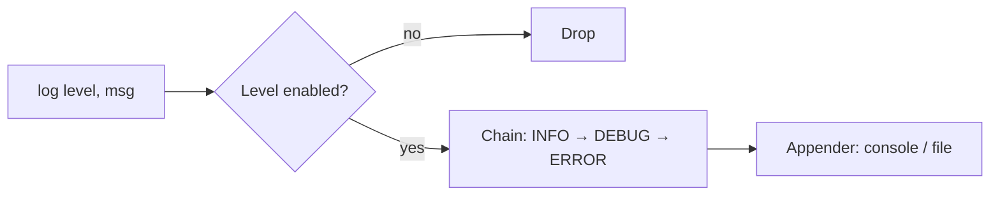

## Why it Matters

- Logging is where "design for variation you cannot predict" is cheapest to learn: the things that vary (destination, format, level policy) are *all* behind interfaces, so adding a JSON appender or an async writer touches nothing existing.
- It is one of the few LLD problems where the non-functional requirements, don't slow the caller down, don't block on disk, are the whole grade, not an afterthought bolted on at the end.
- The chain models a real priority question: should `ERROR` also page someone? If handlers differ per level, a chain earns its keep; if every record goes everywhere, the chain is an indirection layer over one `if`.

## Diagram

![[_attachments/loggingframework-class-diagram.png]]
*Source: [awesome-low-level-design](https://github.com/ashishps1/awesome-low-level-design) , use alongside the class table above.*
*Runtime flow: message down the chain, appender at the end.*

## Code
```java
javaimport java.util.*;

enum Level { DEBUG, INFO, WARN, ERROR }

record LogRecord(Level level, String msg) {}

interface Appender { void append(String formatted); }

class LoggerDemo {
 Level threshold = Level.INFO;
 final List<Appender> appenders = new ArrayList<>();
 private static final LoggerDemo INSTANCE = new LoggerDemo();
 static LoggerDemo get() { return INSTANCE; }
 void addAppender(Appender a) { appenders.add(a); }

 synchronized void log(Level lv, String msg) { // Chain: filter passes down by ordinal
 if (lv.ordinal() >= threshold.ordinal()) {
 String f = "[" + lv + "] " + msg; // format once, fan out (Observer)
 for (Appender a : appenders) a.append(f);
 }
 }
 public static void main(String[] a) {
 LoggerDemo log = get();
 List<String> file = new ArrayList<>();
 log.addAppender(System.out::println); // console appender
 log.addAppender(file::add); // file appender
 log.log(Level.DEBUG, "filtered out");
 log.log(Level.ERROR, "disk full");
 System.out.println("file appender got: " + file);
 }
}
```
## When to use / not

**Use when** a single event must fan out to multiple consumers that you want to add without recompiling the producer, logging, telemetry, audit, notification fan-out.
**Use when** the producer's latency budget cannot include the consumer's cost (disk, network), queue and hand off.
**NOT when** there is exactly one destination and one format: a `System.out.println` behind a `Logger` interface with a single appender is ceremony; a direct call is honest.
**NOT when** ordering across appenders must be strictly guaranteed under load, heterogeneous appenders with unbounded queues make global ordering effectively unsolvable in-process; use one synchronous appender.
**NOT when** the framework would be used to log sensitive data without a redaction stage, put a sanitising appender in the chain, never trust callers to filter.

## Trade-offs

- **Synchronous fan-out vs async queue:** synchronous is observable and ordered; a `BlockingQueue` + single writer thread keeps `log()` at enqueue cost but adds latency, a lost-buffer window on crash, and a bounded-queue overflow policy to decide.
- **Chain of Responsibility vs a level threshold `if`:** the chain wins when handlers differ per level (ERROR pages, INFO writes file); one uniform destination makes the chain pure overhead. Choose by counting distinct handler behaviours.
- **Filter before format vs format before filter:** formatting is CPU on the hot path; filter by level *first* and never build the string for a record that will be dropped.
-- **Push (appender registered) vs pull (appender polled):** push via the observer seam is simplest and immediate; pull decouples rate so a slow appender cannot stall the chain, at the cost of staleness in observability.
- **Bounded vs unbounded async queue:** unbounded hides latency spikes but grows memory without limit under sustained overload (OOM); bounded with a drop-oldest policy caps memory but silently loses logs exactly when you need them, choose explicitly and say which.
- **Per-appender thread vs single writer:** per-appender threads isolate a slow sink (network) from a fast one (console); a single writer keeps ordering trivial but couples all appenders to the slowest.

## Vs

- **Vs [[09_Pub-Sub-System|Pub-Sub System]]:** logging fans one event to many *appenders* inside one process; pub-sub decouples publishers from subscribers across topics with per-subscriber queues and offsets. Same observer shape, different delivery contract (fire-and-forget vs durable replay).
- **Vs `System.out.println`:** direct calls have zero indirection and zero policy, no level filtering, no format consistency, no way to add a file sink without editing call sites. The framework exists so the call site never changes.
- **Vs Chain of Responsibility in [[10_Chess-Game|Chess]] / request pipelines:** a logging chain filters by level and stops or passes on; an auth/validation chain decides whether to *serve* a request. Same structure, different intent (route vs gate).
- **Vs SLF4J/logback:** the real libraries add MDC, markers, and lazy message suppliers (`() -> expensive()`); the design above keeps the seams (level, appender, formatter) that make those features additive.

## Pitfalls

- **Formatting before filtering** — building the string for a `DEBUG` record that the threshold drops wastes CPU on every call; check the level first, always.
- **Appending from multiple threads to a non-thread-safe sink** — `ArrayList` appenders, `System.out`, and file handles need synchronization or a single writer thread; interleaved writes produce unreadable output, not just corrupt data.
- **Unbounded async queue** — a burst with a slow disk sink grows the queue until the process OOMs; bound it and pick a drop policy you can defend.
- **Blocking the caller on a network appender** — the whole point of the async seam is that `log()` returns at enqueue cost; a synchronous remote appender makes every business call latency-dependent on the network.
- **Mutable `LogRecord`** — if a record is handed to N appenders and one mutates it, the others see the change; make records immutable and format once.
- **Levels with no order guarantee** — comparing levels by `ordinal()` silently breaks if the enum is reordered; the chain must rely on declared level order, not happenstance.
- **Classifying this as "solved"** — logback/log4j2 exist; the interview point is not reinventing them but justifying the seams that let them evolve.

## Interview q&a

- **Async logging without slowing callers?** Replace direct fan-out with a `BlockingQueue` + single writer thread; `log()` only enqueues.
- **Chain vs simple `if (level >= threshold)`?** Chain wins when handlers differ per level (e.g. ERROR also pages); a threshold check is enough for uniform routing.

Async logging without slowing callers?:: Replace direct fan-out with a `BlockingQueue` + single writer thread; `log()` only enqueues. #flashcard
Chain vs simple `if (level >= threshold)`?:: Chain wins when handlers differ per level (e.g. ERROR also pages); a threshold check is enough for uniform routing. #flashcard

## Related

- [[06_Design-Patterns/Behavioral/Chain of Responsibility\|Chain of Responsibility]], [[06_Design-Patterns/Behavioral/Observer\|Observer]], [[02_OOP/SOLID-Single-Responsibility\|SRP]]
- Source: [awesome-low-level-design](https://github.com/ashishps1/awesome-low-level-design)

# Logging Framework

> Part of [[README|Java MOC]] -> [[10_LLD-Machine-Coding/README|LLD MOC]]

## Requirements

- Levels DEBUG/INFO/WARN/ERROR; each logger has a threshold
- Route each record to multiple appenders (console, file, network); format once
- Non-blocking for callers; level filtering before formatting

## Classes & Relationships

| Class | Role | Pattern |
|---|---|---|
| `Logger` (singleton facade) | `log(level, msg)`, holds chain head + appenders | [[06_Design-Patterns/Creational/Singleton\|Singleton]], [[06_Design-Patterns/Structural/Facade\|Facade]] |
| `LevelHandler` chain | DEBUG → INFO → WARN → ERROR, first match handles | [[06_Design-Patterns/Behavioral/Chain of Responsibility\|Chain of Responsibility]] |
| `Appender` / `ConsoleAppender` / `ListAppender` | subscribers receiving formatted records | [[06_Design-Patterns/Behavioral/Observer\|Observer]] |
| `LogRecord` + `Formatter` | immutable event + layout | , |

## Concurrency

Synchronize `log` (or use a queue + background writer) , appenders like file/network are not thread-safe.

## Try it Yourself

1. Add an async appender: bounded queue + background thread; what happens when producers outrun the disk?
2. Add log rotation by size (keep N files); which class owns the policy?
3. Add a JSON formatter without touching `Logger` or appenders.
