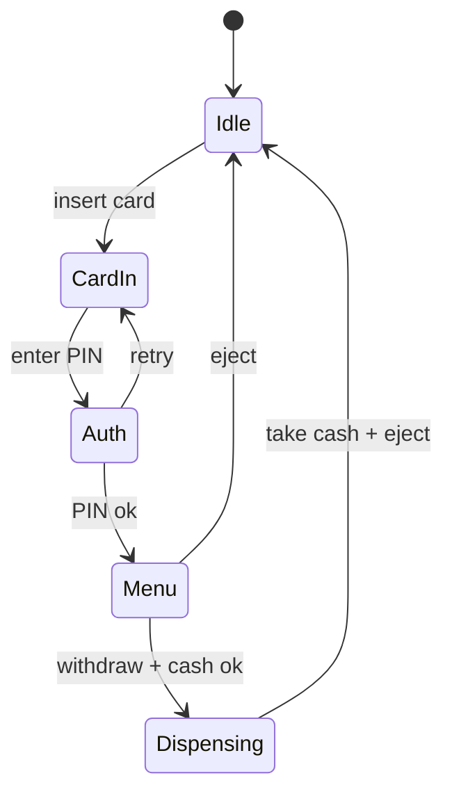

## Why it Matters

- The clearest case that "what you may do depends on where you are": `withdraw` is legal after PIN auth and nonsense from idle. Modelling that with a state object per phase removes the scattered guards that rot in real banking code.
- Money moves in two places at once, bank ledger and cash inventory, so partial success (debit ok, dispenser jams) is a *business* failure mode, not an edge case. Designing the compensation is the point of the problem.
- It shows where LLD legitimately stops and distributed design begins: auth and the ledger live behind an external service seam, so you can state honestly what is in scope and what the real system owns.

## Diagram

![[_attachments/atm-class-diagram.png]]
*Source: [awesome-low-level-design](https://github.com/ashishps1/awesome-low-level-design) , use alongside the class table above.*
*Runtime flow: card session states.*

## Code
```java
javaclass BankService { int balance = 500; boolean auth(String pin) { return "1234".equals(pin); } }

interface AtmState { void pin(ATMDemo m, String p); void withdraw(ATMDemo m, int amt); }

class ATMDemo {
 AtmState state = new Idle(); final BankService bank = new BankService(); int cash = 1000;
 static class Idle implements AtmState {
 public void pin(ATMDemo m, String p) { System.out.println("insert card first"); }
 public void withdraw(ATMDemo m, int a) { System.out.println("insert card first"); }
 }
 static class CardInserted implements AtmState {
 public void pin(ATMDemo m, String p) {
 if (m.bank.auth(p)) { m.state = new Authenticated(); System.out.println("authed"); }
 else System.out.println("bad pin");
 }
 public void withdraw(ATMDemo m, int a) { System.out.println("enter pin first"); }
 }
 static class Authenticated implements AtmState {
 public void pin(ATMDemo m, String p) { System.out.println("already authed"); }
 public void withdraw(ATMDemo m, int a) {
 if (a > m.bank.balance) { System.out.println("insufficient funds"); return; }
 if (a > m.cash) { System.out.println("ATM out of cash"); return; }
 m.bank.balance -= a; m.cash -= a; System.out.println("dispensed " + a);
 }
 }
 void insertCard() { state = new CardInserted(); System.out.println("card in"); }
 void pin(String p) { state.pin(this, p); }
 void withdraw(int a) { state.withdraw(this, a); }
 public static void main(String[] a) {
 ATMDemo m = new ATMDemo();
 m.withdraw(100); // insert card first
 m.insertCard(); m.pin("0000"); // bad pin
 m.pin("1234"); m.withdraw(600); // insufficient funds
 m.withdraw(200); // dispensed 200
 }
}
```
## When to use / not

**Use when** a session progresses through phases and legal operations change per phase, ATM, checkout with payment steps, multi-step forms, kiosks, DSLR-style device workflows.
**Use** a facade when one device exposes many services (auth, cash, receipt, journal) and callers should see one surface.
**Use** a state-per-phase model once a third phase appears or when guards repeat across operations.
**NOT when** the phases are linear with no rejection or cancel paths, a wizard with no "back" needs a step counter, not a state machine.
**NOT when** the "device" is a pure API with no hardware/physical resource, nothing physical is consumed, so cash inventory modelling is dead weight.
**NOT when** the phase depends on data rather than mode: "amount over limit" is a rule check on a value, not a state transition.

## Trade-offs

- **State pattern vs enum + guards:** states localise transition rules and make illegal combinations unrepresentable; a switch is fine for 2-3 phases with uniform rules. Pick by counting guards, not by pattern habit.
- **Facade over services vs calling them directly:** the facade keeps the ATM's API narrow (insert/pin/withdraw/eject) and testable with fakes; direct calls spread bank-service coupling across the state classes.
- **Synchronized withdraw vs per-account lock:** one ATM-wide lock is trivially correct for a single machine; per-account locks (or DB row locks) scale to a fleet. The interview answer states the boundary and picks for the stated scale.
- **Optimistic vs pessimistic on the ledger:** pessimistic (lock account during check-debit-dispense) is simple and safe for low contention; optimistic (CAS on balance) fails on contention and needs retry logic.
- **Dispense-then-debit vs debit-then-dispense:** dispensing first can lose the bank money if the ledger write then fails; debiting first can lose the customer money if the cash jams. Real systems dispense then debit with a journal entry that reconciliation sweeps, say the trade-off, don't hide it.
- **In-memory cash inventory vs persisted:** in-memory is lost on reboot; real ATMs persist the cassette count per transaction and reconcile on boot.

## Vs

- **Vs [[02_Vending-Machine|Vending Machine]]:** identical state-machine shape, opposite money direction, vending *accepts* cash and dispenses a product; the ATM *dispenses* cash and debits a remote ledger. The ATM's product and its cash inventory are the same physical resource, which is why its failure modes are worse.
- **Vs [[17_Coffee-Vending-Machine|Coffee Vending Machine]]:** both are machines with states and inventory, but the coffee machine's inventory is a set of *ingredients* consumed in combination, while the ATM's is denominations of one thing it must *give out* — no ingredient mixing, but a harder partial-failure story.
- **Vs [[12_Movie-Ticket-Booking|Movie Ticket Booking]]:** both hold-then-confirm, but a seat hold expires by timeout while a cash withdrawal is one atomic transaction with no lease; the ATM has no "hold" phase because cash cannot be reserved and returned later.
- **Vs [[05_ATM|online banking]]:** the ATM is a *hardware-attached* client of bank services, cash inventory and physical failure modes are in scope; a pure online banking API has no dispenser and no card slot, so the state machine collapses to auth + ledger.
- **Vs a distributed two-phase commit:** the ATM cannot atomally commit "cash out" with "ledger debit" across a machine and a bank; it uses a journal + reconciliation instead. XA/2PC would give atomicity at the cost of availability and much higher latency.

## Pitfalls

- **Split check-then-act on the withdraw path** — balance checked outside the lock, then debited: two withdrawals on the same account both pass the check and overdraw. The whole check-debit-dispense unit is one lock.
- **Partial success with no compensation** — debit succeeds, dispenser jams: the customer is debited with no cash. Design the failure path (journal + reverse) *before* the happy path, and make it a first-class state.
- **State leaking across cards** — `eject` must reset state *and* stored card/pin/session data; a session left `Authenticated` lets the next user withdraw from the previous account.
- **PIN stored or compared in plaintext** — hold a reference/flag only, never the PIN; compare server-side via `BankService`. Even in a toy this must be explicit.
- **Wrong-PIN count that never resets** — retry counters must reset on success and on card eject, or a user is permanently locked after 2 attempts.
- **Cash inventory modelled as one total** — dispensing requires *denominations*; a total can report "funds available" while no combination covers the amount (no 50s, only 2000s for a 500 request).
- **State transition from `Dispensing` not defined** — every state needs an exit path; an unreachable state is a bug found in production, not an interview follow-up.
- **Card retention implemented as a flag** — 3 wrong PINs physically keeps the card; model it as a transition (card retained → idle) not a boolean, or the machine can accept a retained card.

## Interview q&a

- **Two ATMs on one account?** Move the balance into `BankService` with a transaction lock; ATM keeps only the session state.
- **Why Facade + State together?** Facade gives one simple client API; State keeps each screen's valid actions isolated so illegal flows are unrepresentable.

Two ATMs on one account?:: Move the balance into `BankService` with a transaction lock; ATM keeps only the session state. #flashcard
Why Facade + State together?:: Facade gives one simple client API; State keeps each screen's valid actions isolated so illegal flows are unrepresentable. #flashcard

## Related

- [[06_Design-Patterns/Behavioral/State\|State]], [[06_Design-Patterns/Structural/Facade\|Facade]], [[02_OOP/SOLID-Single-Responsibility\|SRP]]
- Source: [awesome-low-level-design](https://github.com/ashishps1/awesome-low-level-design)

# ATM

> Part of [[README|Java MOC]] -> [[10_LLD-Machine-Coding/README|LLD MOC]]

## Requirements

- Insert card → PIN auth → balance check / withdraw / deposit → eject
- States: idle → card-inserted → authenticated → dispensing; eject resets from any state
- Cash inventory with limited denominations; decline when funds or notes insufficient

## Classes & Relationships

| Class | Role | Pattern |
|---|---|---|
| `ATM` (facade) | `insertCard/pin/withdraw/eject`, owns state + services | [[06_Design-Patterns/Structural/Facade\|Facade]], [[06_Design-Patterns/Creational/Singleton\|Singleton]] |
| `AtmState` / `Idle` / `CardInserted` / `Authenticated` | per-state transition rules | [[06_Design-Patterns/Behavioral/State\|State]] |
| `BankService` | auth + balance + ledger (external system seam) | , |
| `CashDispenser` | denomination breakdown of inventory | , |

## Concurrency

Synchronize the withdraw path (balance check + debit + dispense as one unit) , never split check-then-act across threads.

## Try it Yourself

1. Add transfers between accounts with a daily limit; which state validates the limit?
2. Add a cash-low alert to the bank when inventory drops below threshold (Observer on `CashDispenser`).
3. Add card-retention after 3 wrong PINs; draw the two new transitions first.
