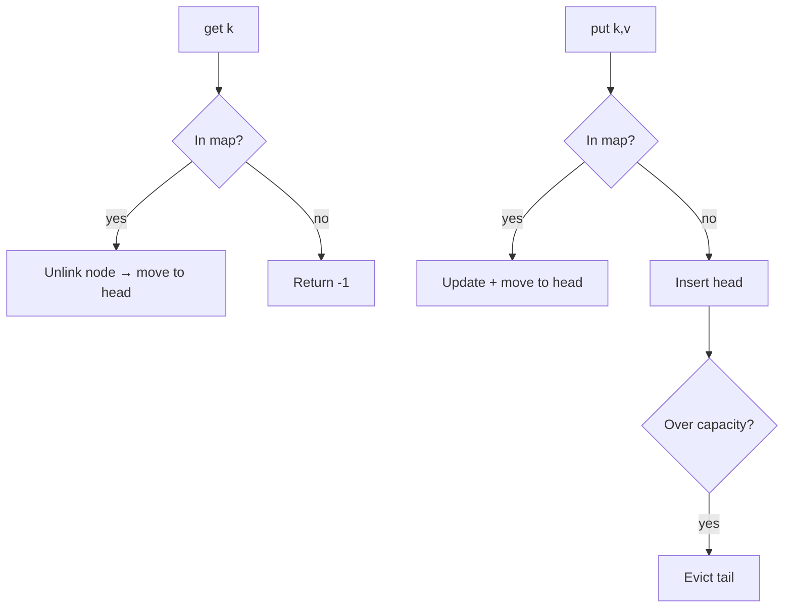

## Why it Matters

- The canonical demonstration that a *data structure* is a design: HashMap for O(1) lookup + doubly-linked list for O(1) recency reordering, glued by holding node references in the map. Neither alone gives both operations in O(1).
- Eviction policy is behaviour, not an accident: "least recently used" is one of many policies (LFU, FIFO, TTL, ARC), and hiding it behind an interface is what lets the cache stay unchanged when the requirement changes.
- Every real cache layer (CPU L2, Redis `allkeys-lru`, Guava/Caffeine, OS page replacement) implements this same trade, so the problem transfers to infra questions and follow-ups about your framework's cache config.

## Diagram

![[_attachments/lrucache-class-diagram.png]]
*Source: [awesome-low-level-design](https://github.com/ashishps1/awesome-low-level-design) , use alongside the class table above.*
*Runtime flow: O(1) get promotes, put evicts tail.*

## Code
```java
javaimport java.util.*;

class LRUCacheDemo {
 static class Node { int k, v; Node prev, next; Node(int k, int v) { this.k = k; this.v = v; } }
 final int cap; final Map<Integer, Node> map = new HashMap<>();
 final Node head = new Node(-1, -1), tail = new Node(-1, -1); // dummy head(MRU)..tail(LRU)

 LRUCacheDemo(int cap) { this.cap = cap; head.next = tail; tail.prev = head; }
 void moveToFront(Node n) { unlink(n); n.prev = head; n.next = head.next; head.next.prev = n; head.next = n; }
 void unlink(Node n) { n.prev.next = n.next; n.next.prev = n.prev; }

 synchronized int get(int k) { Node n = map.get(k); if (n == null) return -1; moveToFront(n); return n.v; }

 synchronized void put(int k, int v) {
 Node n = map.get(k);
 if (n != null) { n.v = v; moveToFront(n); return; }
 if (map.size() == cap) { Node lru = tail.prev; unlink(lru); map.remove(lru.k); }
 Node fresh = new Node(k, v); map.put(k, fresh); moveToFront(fresh);
 }
 public static void main(String[] a) {
 LRUCacheDemo c = new LRUCacheDemo(2);
 c.put(1, 10); c.put(2, 20);
 System.out.println(c.get(1)); // 10, refreshes 1
 c.put(3, 30); // evicts 2
 System.out.println(c.get(2)); // -1
 System.out.println(c.get(3)); // 30
 }
}
```
## When to use / not

**Use when** a bounded store must evict something, and recency is the best cheap predictor of future use, memoization, DB row cache, session/token store, HTTP response cache, image/asset cache.
**Use LRU specifically** when access patterns are temporal (hot keys repeat, cold keys stay cold); LFU suits stable popularity, FIFO suits streaming/queue-like access.
**NOT when** the store is unbounded or the working set fits in memory, eviction machinery is dead weight when nothing is ever evicted.
**NOT when** strict correctness is required (a stale value is a bug), an LRU cache trades freshness for speed; use it only where a cache miss is a safe fallback to the source of truth.
**NOT when** keys are unknown or untrusted, an unbounded key space under a fixed capacity makes the cache an eviction engine with no hits (cache-trashing); a bounded key set or a TTL guard is required.
**NOT when** the eviction target is CPU or memory pressure that an LRU cannot observe, Guava measures *weight* (byte size), not count; size-based eviction needs a weighted policy.

## Trade-offs

- **Count-based vs size/weight-based eviction:** count is trivial to reason about; byte-size (Guava/Caffeine `maximumWeight`) bounds real memory but needs a `weigher` and async maintenance.
- **Synchronized vs striped/read-write locks:** a single `synchronized` is obviously correct and serialises all reads; a `ReentrantReadWriteLock` parallelises reads but the write of recency still blocks; striped locks shard contention further. Match the choice to the read:write ratio and say it.
- **O(1) LRU vs better hit rate:** LRU is O(1) but can thrash on a scan that evicts the working set; ARC/LFU/FIFO variants buy hit rate with bookkeeping and clock cycles.
- **In-memory vs distributed:** in-process is fastest but per-instance (a fleet of N pods has N independent caches); a shared cache (Redis/Memcached) adds network hops and consistency questions.
- **Eviction listener vs not:** a listener (pub eviction events) enables stale-write cleanup but runs inside the write path, keep it cheap or async.
- **Bounded vs unbounded on overflow:** bounding with a drop policy protects memory; unbounded protects no SLA and OOMs.

## Vs

- **Vs [[09_Pub-Sub-System|Pub-Sub System]]:** an LRU is a stateful store that *silently drops* old entries; a pub-sub topic is an append-only log that *keeps* entries for replay by offset. Bounded recency store vs durable log.
- **Vs LFU (least frequently used):** LRU tracks *when* (cheap counters, adapts to shifts in popularity); LFU tracks *how often* (stable popularity, but never forgets cold keys that were once hot, and is costlier to update).
- **Vs FIFO:** FIFO is simpler (one queue) but evicts regardless of reuse, a hot key that arrived first is dropped, which LRU avoids by promoting on access.
- **Vs a plain `HashMap`:** unbounded, no eviction, no capacity policy; correct only when the key set is fixed and small. The LRU's value *is* the policy.
- **Vs [[12_Movie-Ticket-Booking|seat hold expiry]] / TTL caches:** TTL evicts by wall-clock age regardless of use; LRU evicts by *use* regardless of age. TTL is right for data with a validity lifetime (a held seat, a token); LRU is right for capacity pressure.
- **Vs Redis `allkeys-lru`:** same policy, but Redis approximates LRU with sampled eviction (not a true linked-list reordering) to avoid per-access contention, precision traded for throughput.

## Pitfalls

- **HashMap without the linked list** — gives O(1) `get` but no recency: eviction degrades to arbitrary or FIFO. The map must *hold node references* so the list can be fixed up in O(1).
- **Sentinel nodes forgotten** — hand-rolled lists without head/tail sentinels drown in null checks on the boundary nodes, and the first eviction is where the null bug appears.
- **Removing a node twice / leaving dangling prev/next** — unlink must clear both pointers and the map entry together; a node still reachable via `next` after removal corrupts iteration and leaks.
- **`get` that forgets to promote** — returning the value without moving the node makes the cache silently FIFO; the promotion *is* the policy.
- **`put` on an existing key** — must update the value *and* promote to MRU; updating only the value leaves recency stale.
- **Eviction threshold off by one** — comparing `size == capacity` before vs after insert either evicts early or admits one entry over capacity. Place the guard explicitly and test the boundary.
- **Cache stampede** — on a cold key, N threads all miss and compute the same value (and may evict each other's entries); a per-key lock/future (`computeIfAbsent`) or request coalescing is the fix.
- **Mutable cached values** — callers mutating a cached object bypass eviction and produce inconsistent reads; return defensive copies or immutable records.
- **Sizing for the wrong thing** — bounding by entry count when entries are images of wildly different sizes lets a handful of large entries exhaust the heap; bound by weight instead.

## Interview q&a

- **Why HashMap + doubly-linked list?** Map gives O(1) lookup; the list gives O(1) recency reorder + O(1) LRU eviction at the tail.
- **LFU or TTL expiry instead?** LFU needs frequency buckets (`freq → LinkedHashSet`); TTL adds a timestamp + lazy expiry check on `get`.

Why HashMap + doubly-linked list?:: Map gives O(1) lookup; the list gives O(1) recency reorder + O(1) LRU eviction at the tail. #flashcard
LFU or TTL expiry instead?:: LFU needs frequency buckets (`freq → LinkedHashSet`); TTL adds a timestamp + lazy expiry check on `get`. #flashcard

## Related

- [[02_OOP/SOLID-Single-Responsibility\|SRP]] (eviction policy separate from storage), [[06_Design-Patterns/Behavioral/Observer\|Observer]]
- Source: [awesome-low-level-design](https://github.com/ashishps1/awesome-low-level-design)

# LRU Cache

> Part of [[README|Java MOC]] -> [[10_LLD-Machine-Coding/README|LLD MOC]]

## Requirements

- Fixed capacity; `get` + `put` in O(1); on overflow evict least-recently-used
- `get` refreshes recency; `put` on existing key updates value + recency
- Optional: eviction listener, thread safety

## Classes & Relationships

| Class | Role | Pattern |
|---|---|---|
| `LRUCache` | HashMap + doubly-linked list, public `get/put` | , |
| `Node` | key, value, prev/next | , |
| `EvictionListener` (optional) | callback on evict | [[06_Design-Patterns/Behavioral/Observer\|Observer]] |

## Concurrency

Synchronize `get`/`put` (both mutate recency) or use a `ReentrantReadWriteLock`/ConcurrentHashMap + striped locks at scale.

## Try it Yourself

1. Add TTL expiry per key; lazy (check on `get`) vs active (background sweep) , implement lazy, argue active.
2. Wrap it thread-safe with a `ReadWriteLock`; benchmark reads before/after.
3. Convert to LFU (evict least-frequent): what breaks in the node structure?
