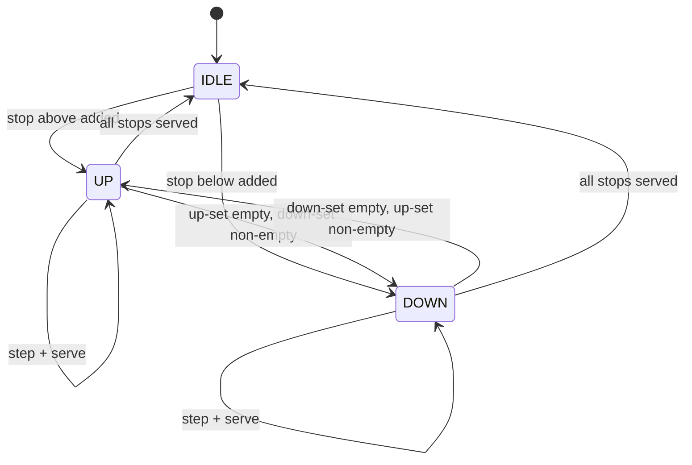

## Why it Matters

- A real-time system whose design is *scheduling policy*, not data: correctness is "pick the right lift", and the policy (SCAN, LOOK, nearest-car, destination dispatch) is a swappable Strategy that changes behaviour without touching `Elevator`.
- It makes fairness vs throughput explicit: SCAN/LOOK serve stops in direction order (fair to a passenger going the other way), while greedy nearest-car minimises per-request wait but can starve a hall call at the far end for minutes.
- Concurrency is *structural*, not a bolt-on: lifts are independent (per-lift locks), and the hall-call queue is the shared seam between many producers and a dispatcher. Lock granularity choices are the whole interview conversation.
- Direction is the eternal state that must survive every operation: reversing direction incorrectly is the classic elevator bug, it creates oscillation, missed floors, or passengers carried away from their destination.

## Diagram

![[_attachments/elevatorsystem-class-diagram.png]]
*Source: [awesome-low-level-design](https://github.com/ashishps1/awesome-low-level-design) , use alongside the class table above.*
*Runtime flow: SCAN serves in direction, reverses at last stop.*

## Code
```
javaimport java.util.*;

public class ElevatorDemo {
 enum Dir { UP, DOWN, IDLE }
 record Request(int floor, Dir dir) {}
 static class Elevator {
 int id, floor = 0; Dir dir = Dir.IDLE;
 TreeSet<Integer> up = new TreeSet<>(), down = new TreeSet<>(Comparator.reverseOrder());
 Elevator(int id) { this.id = id; }
 synchronized void addStop(int f) {
 if (f == floor) return;
 (f > floor ? up : down).add(f);
 if (dir == Dir.IDLE) dir = f > floor ? Dir.UP : Dir.DOWN;
 }
 synchronized void step() {
 if (dir == Dir.UP && !up.isEmpty()) floor++;
 else if (dir == Dir.DOWN && !down.isEmpty()) floor--;
 else { // reverse (LOOK: only as far as last stop)
 if (!up.isEmpty()) dir = Dir.UP;
 else if (!down.isEmpty()) dir = Dir.DOWN;
 else dir = Dir.IDLE; return;
 }
 if (up.remove(floor) || down.remove(floor))
 System.out.println("Lift " + id + " stops at " + floor);
 if (dir == Dir.UP && up.isEmpty()) dir = down.isEmpty() ? Dir.IDLE : Dir.DOWN;
 if (dir == Dir.DOWN && down.isEmpty()) dir = up.isEmpty() ? Dir.IDLE : Dir.UP;
 }
 }
 static class Controller {
 List<Elevator> lifts = new ArrayList<>();
 Controller(int n) { for (int i = 0; i < n; i++) lifts.add(new Elevator(i)); }
 void hallCall(int floor, Dir d) { // nearest idle / same-direction lift
 lifts.stream().min(Comparator.comparingInt(e -> Math.abs(e.floor - floor)))
 .ifPresent(e -> e.addStop(floor));
 }
 }
 public static void main(String[] a) {
 var c = new Controller(2);
 c.hallCall(3, Dir.UP); c.hallCall(1, Dir.UP);
 c.lifts.get(0).addStop(5); // cabin request
 for (int i = 0; i < 8; i++) c.lifts.forEach(Elevator::step);
 }
}
```
## When to use / not

**Use when** a bounded pool of moving resources is dispatched to spatio-temporal requests, elevators, AGVs/warehouse robots, taxis per zone, printer/job scheduling on a shared queue.
**Use** a Strategy seam whenever the assignment rule is a product decision (SCAN vs nearest vs energy-aware) and will be tuned without redeploying the model.
**Use** a state per direction/mode (moving up / moving down / idle / door-open / maintenance) once transitions have guards (never open the door while moving).
**NOT when** there is exactly one servant resource, a single lift needs no dispatch policy at all; the controller and the strategy collapse to "serve the queue in order".
**NOT when** requests are not spatially located: pure job scheduling (render queue) has no direction or location, so direction-aware policies are noise; a simple priority queue is right.
**NOT when** the control must be hard-real-time certified (safety-critical lift control): this model is for the *dispatch* layer; certified PLC-level control with redundancy is a different problem and should be named as out of scope.

## Trade-offs

- **SCAN vs LOOK vs nearest-car:** SCAN rigidly reverses at the extremes (sweeps empty floors); LOOK reverses at the last actual request (no wasted travel); nearest-car minimises wait per call but risks starvation at remote floors. Policy choice = optimising mean wait vs worst-case wait.
- **Per-lift locks vs global lock:** one lock across all lifts serialises the whole system; per-lift locks keep lifts independent and only the hall-call queue needs guarding. Throughput vs complexity of cross-lift queries.
- **Single dispatcher thread vs per-lift worker threads:** one dispatcher assigns all hall calls (simple, ordered, one bottleneck); per-lift threads decouple but need coordination to avoid two lifts answering one call.
- **Pull (lifts poll a queue) vs push (dispatcher assigns):** pull lets each lift apply its own policy locally; push centralises policy and makes global optimisation (destination dispatch, energy-aware) possible.
- **Simulated time (tick/`step()`) vs real timers:** a `step()` model is deterministic and testable (assert "after 3 ticks, lift is at floor 4"); real timers are production-shaped but make tests flaky. Prefer the tick model in an interview.
- **State per direction vs per door phase:** direction state governs scheduling; door state governs safety. Conflating them produces guards that block movement checks behind door checks.

## Vs

- **Vs [[13_Ride-Sharing-Uber|Ride Sharing (Uber)]]:** elevators run on *fixed tracks* with a known finite topology and deterministic travel time; ride-hailing dispatches over open geography with ETA estimation and traffic. Both are Strategy-over-a-pool, but elevator assignment is exactly computable while ride ETA is probabilistic.
- **Vs [[01_Parking-Lot|Parking Lot]]:** an elevator is a *mobile* resource moving toward requests; a parking spot is *fixed* and the user comes to it. Dispatch vs assignment is the axis.
- **Vs [[16_Traffic-Signal-Control|Traffic Signal Control]]:** traffic control arbitrates *conflicting access* to an intersection (never green on both axes) on a timer; elevators are *dedicated* cabins with no mutual exclusion on a shaft, scheduling, not safety arbitration, is the problem.
- **Vs round-robin / FIFO job queue:** FIFO serves the first request regardless of a passing lift travelling the other way; SCAN/LOOK exploit *direction* to batch stops, which is the whole efficiency gain.
- **Vs [[15_Task-Management-System|Task Management System]]:** a task queue with priority is scheduling by declared importance; elevator scheduling is by physical state (floor + direction). Both are queues; only one needs to know where anything *is*.

## Pitfalls

- **Starving a hall call** — nearest-car dispatch that keeps picking up new near requests while a far call waits indefinitely; add aging or a direction-aware cost function, and say the trade-off.
- **Reversing direction with unserved stops in the old direction** — the classic bug: a cabin request for floor 5 exists while travelling up, and the lift flips to down at floor 3. The flip condition must be "no more requests in this direction", checked on every step.
- **Hall call direction lost** — storing just "floor 3 called" without up/down makes the assignment unable to prefer a lift already heading that way; the direction is part of the request identity.
- **A hall call answered twice** — two lifts both see the call before either claims it; claim-and-clear must be atomic (remove from the queue inside the assignment, not after).
- **Global lock across lifts** — one synchronized method for the whole controller serialises all movement; lock per lift and guard the queue separately.
- **`step()` that can move two floors or none** — non-uniform ticks make assertions impossible ("after 3 ticks"); one tick = one floor per lift, always.
- **Door modelling ignored** — a design with no door state can "open" while moving; even a stub must state the guard, or the model is unsafe-by-construction.
- **Cabin vs hall requests conflated** — cabin requests (destination inside) and hall requests (floor + direction outside) have different costs; one queue without the distinction yields wrong assignments.
- **No end condition in simulation** — a run loop with no termination fills the output and hides the result; drive a fixed number of ticks then print state.

## Interview q&a

1. **How would you extend to destination-dispatch (passenger enters floor in lobby)?** Group passengers by destination into the same car; controller assigns cars to destination clusters instead of up/down calls , reduces stops, needs a `Map<destination, lift>` assignment pass.
2. **SCAN vs nearest-first tradeoff?** Nearest-first minimizes wait for one call but starves far floors and causes direction thrash; SCAN/LOOK bounds worst-case wait and is predictable, at the cost of occasionally passing a nearby opposite-direction call.

How would you extend to destination-dispatch (passenger enters floor in lobby)?:: Group passengers by destination into the same car; controller assigns cars to destination clusters instead of up/down calls , reduces stops, needs a `Map<destination, lift>` assignment pass. #flashcard
SCAN vs nearest-first tradeoff?:: Nearest-first minimizes wait for one call but starves far floors and causes direction thrash; SCAN/LOOK bounds worst-case wait and is predictable, at the cost of occasionally passing a nearby opposite-direction call. #flashcard

## Related

- [[06_Design-Patterns/Behavioral/State|State]] (direction / door state machine) · [[06_Design-Patterns/Behavioral/Mediator|Mediator]] (controller as dispatch hub) · [[06_Design-Patterns/Creational/Singleton|Singleton]] (single building controller)
- Source: [awesome-low-level-design](https://github.com/ashishps1/awesome-low-level-design)

# Elevator System

> Part of [[README|Java MOC]] -> [[10_LLD-Machine-Coding/README|LLD MOC]]

## Requirements

- N elevators serving F floors; handle internal (cabin) and external (hall up/down) requests.
- Dispatch via SCAN/LOOK: continue in current direction, serve stops in order, reverse at end.
- Multi-lift controller picks best elevator (nearest, idle preferred, direction-aware).
- Thread-safe request submission from many floors concurrently.

## Classes & Relationships

| Class | Responsibility | Relates to |
|---|---|---|
| `Request` | Floor + direction (hall) or destination (cabin) | , |
| `Elevator` | Current floor, direction, stop sets; `step()` moves one floor | owns `Request` sets |
| `ElevatorController` | Holds lifts, assigns hall calls, ticks simulation | has-many `Elevator` |

## Concurrency

- `addStop`/`step` are `synchronized` per lift; hall-call queue should be a `BlockingQueue<Request>` drained by a dispatcher thread. One lock per elevator keeps lifts independent , never a global lock across all lifts.

## Try it Yourself

1. Add destination-dispatch (passenger enters floor inside, no direction button); how does assignment change?
2. Add fire mode: all lifts to ground, doors open, ignore calls. Implement as a controller flag vs a state?
3. Track per-lift distance travelled; use it to break assignment ties (energy-aware dispatch).
