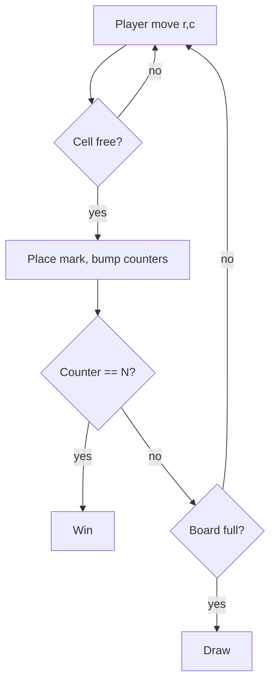

## Why it Matters

- Small enough to implement *completely* in an interview, so it isolates what is actually graded: naming, separation of concerns, and whether the win check is O(1) per move instead of a full-board scan every turn.
- Its core constraint is a *rule*, not data: the game rejects a move on an occupied cell or after the game ends. Modelling that as a status the board owns, rather than a boolean sprinkled in the UI, is what keeps the same code reusable for N×N and K-in-a-row.
- The `Player` abstraction with an injected `nextMove` is the seed of everything larger: it is the seam that lets a bot and a human share one loop, which is exactly how you extend to minimax without touching `Game`.
- It is the cheapest place to learn that behaviour belongs behind an interface: `Player` is the Strategy; `Board` owns rules; `Game` owns the turn order, and crossing those lines is where designs start to rot.

## Diagram

![[_attachments/tictactoe-class-diagram.png]]
*Source: [awesome-low-level-design](https://github.com/ashishps1/awesome-low-level-design) , use alongside the class table above.*
*Runtime flow: alternate moves, O(1) win check per row/col/diag counter.*

## Code
```
javaimport java.util.*;

public class TicTacToeDemo {
 enum Cell { EMPTY, X, O } enum State { IN_PROGRESS, WON, DRAWN }
 static class Board {
 int n; Cell[][] g; int[] rows, cols; int diag, anti;
 Board(int n) { this.n = n; g = new Cell[n][n];
 for (var r : g) Arrays.fill(r, Cell.EMPTY);
 rows = new int[n]; cols = new int[n]; }
 // v = +1 for X, -1 for O; win when |counter| == n. Returns winner or EMPTY.
 Cell place(int r, int c, Cell p) {
 if (g[r][c] != Cell.EMPTY) throw new IllegalArgumentException("occupied");
 g[r][c] = p; int v = p == Cell.X ? 1 : -1;
 rows[r] += v; cols[c] += v;
 if (r == c) diag += v; if (r + c == n - 1) anti += v;
 if (Math.abs(rows[r]) == n || Math.abs(cols[c]) == n
 || Math.abs(diag) == n || Math.abs(anti) == n) return p;
 return Cell.EMPTY;
 }
 }
 public static void main(String[] a) {
 var b = new Board(3); var turn = Cell.X; State s = State.IN_PROGRESS;
 int[][] moves = {{0,0},{1,1},{0,1},{2,2},{0,2}}; int played = 0;
 for (var m : moves) {
 Cell w = b.place(m[0], m[1], turn); played++;
 if (w != Cell.EMPTY) { s = State.WON; System.out.println(w + " wins"); break; }
 turn = turn == Cell.X ? Cell.O : Cell.X;
 }
 if (s == State.IN_PROGRESS && played == 9) s = State.DRAWN;
 System.out.println("State: " + s);
 }
}
```
## When to use / not

**Use when** a bounded grid game with turns, placement, and a terminal condition must be modelled, tic-tac-toe, connect-4, Gomoku, battleship placement, Othello, a kanban board with state rules.
**Use** the injected `Player`/move-strategy seam whenever a human and an AI must share one loop.
**Use** counter-based win detection when the board is small and mostly empty; a full scan per move is honest and simpler if the board is dense or rules are complex.
**NOT when** the grid is huge and sparse, N×N with large N makes per-move counter arrays wasteful relative to a sparse structure or a hash of occupied cells.
**NOT when** the rules are not grid-based (card games), there is no board to own; the state lives in hands and piles, and forcing a `Board` class produces an empty wrapper.
**NOT when** "the game" is really a simulation with no terminal state (a cellular automaton), there is no status state machine and no turn alternation to model.

## Trade-offs

- **O(1) counter win-check vs full-board scan:** counters cost memory proportional to rows+cols+2 diagonals and win in O(1) per move; a scan is O(N²) but zero extra state. For 3×3 either is trivial; the counter design earns its keep when N grows.
- **`Game` owns turn order vs `Board` owns it:** keeping turns in `Game` leaves `Board` as pure rules (reusable, testable in isolation); letting `Board` know the turn couples rules with flow, so undo and variant rules leak into each other.
- **Generalisation vs interview time:** N×N + K-in-a-row generalises cleanly and is the standard follow-up; generalising *too early* burns the 45 minutes and risks shipping nothing that runs.
- **Win by counting the whole line vs counting a run:** for K-in-a-row on a large board, counting the full line is O(N) per move; counting only the run through the placed cell (both directions) is O(K) and scales.
- **Undo via stack of moves vs full-board snapshot:** move stack is cheap (one cell per entry) and enough; a full memento per move is only justified if undo must also restore side state (clocks, captured pieces).
- **Bot in `main` vs behind the `Player` interface:** a bot in `main` is quick; behind the interface it is swappable and unit-testable, and it is the seam that makes minimax additive rather than a rewrite.

## Vs

- **Vs [[10_Chess-Game|Chess Game]]:** tic-tac-toe has *uniform* pieces (every move is a mark) and no capture or movement rules, so validation is "cell empty"; chess has a per-piece rule hierarchy and capture, which changes validation from a guard into a polymorphic method per piece.
- **Vs [[14_Snake-and-Ladder|Snake and Ladder]]:** tic-tac-toe is *pure strategy* — every move is chosen; snake-and-ladder is *pure chance* — the move is a dice roll and the player chooses nothing. Strategy games need a decision seam; chance games need an injectable RNG for testable determinism.
- **Vs [[14_Snake-and-Ladder|Snake and Ladder]] (shared turn loop):** both own an alternating turn loop and a terminal condition; the difference is *who decides* — the player or the dice.
- **Vs [[15_Task-Management-System|Task Management System]]:** a task board is a grid of states with legal transitions (TODO → IN_PROGRESS → DONE) and *no* terminal win condition; tic-tac-toe's board owns rules that *end the game*. Both model a grid; only one has a victory condition.
- **Vs [[02_Vending-Machine|Vending Machine]]:** both reject invalid operations (move on a taken cell / select without money); the difference is that a game's validity depends on *game state*, while a vending machine's depends on *transaction state*. Same guard pattern, different state owner.

## Pitfalls

- **Win check by scanning the whole board every move** — O(N²) per move and the obvious "optimise this" follow-up; maintain row/col/diagonal counters instead and update them at `place()`.
- **Continuing to accept moves after the game ends** — a WON/DRAWN status must make `place` reject, or an extra move can flip the result; the guard belongs in `place`, not in the caller.
- **Win detection only for the last player's symbol** — after each move, check the mover's counters only; checking both symbols wastes half the work and obscures the invariant.
- **Diagonal indexes hardcoded for 3×3** — `i == j` and `i + j == n-1` works, but only after you confirm the board is square; for K-in-a-row generalise to a direction sweep, don't hardcode two diagonals.
- **Turn stored in two places** — `currentPlayer` on `Game` *and* derived from the move count; they drift, and the bug appears as a skipped turn. Single source of truth.
- **Undo that restores the board but not the turn/status** — undo must restore marks, counters, current player, and status as one unit; partial undo corrupts the game.
- **Bot move computed in the UI/controller** — a bot anywhere but behind `Player` means adding minimax requires editing the loop; keep the seam and swap the strategy.
- **Mutable returned board state** — exposing the internal grid lets callers mutate it, bypassing validation and counters; return a copy or an immutable view.

## Interview q&a

1. **How would you add an unbeatable bot?** Add a `BotPlayer` implementing `nextMove` via minimax (3×3 game tree is tiny); keep the `Player` strategy interface so `Game` doesn't change. For NxN use depth-limited minimax + heuristic.
2. **Counter tradeoff vs scanning the board?** Counters give O(1) win checks but only work for full-row/col/diag wins on square boards; K-in-a-row on larger boards needs directional scans from the last move (O(K)) , simpler to generalize, slightly slower.

How would you add an unbeatable bot?:: Add a `BotPlayer` implementing `nextMove` via minimax (3×3 game tree is tiny); keep the `Player` strategy interface so `Game` doesn't change. For NxN use depth-limited minimax + heuristic. #flashcard
Counter tradeoff vs scanning the board?:: Counters give O(1) win checks but only work for full-row/col/diag wins on square boards; K-in-a-row on larger boards needs directional scans from the last move (O(K)) , simpler to generalize, slightly slower. #flashcard

## Related

- [[06_Design-Patterns/Behavioral/State|State]] (game lifecycle) · [[06_Design-Patterns/Behavioral/Strategy|Strategy]] (human vs bot move strategies) · [[06_Design-Patterns/Creational/Factory Method|Factory Method]] (player creation)
- Source: [awesome-low-level-design](https://github.com/ashishps1/awesome-low-level-design)

# Tic-Tac-Toe

> Part of [[README|Java MOC]] -> [[10_LLD-Machine-Coding/README|LLD MOC]]

## Requirements

- N×N board (default 3×3), two players X/O alternating; support human or bot players.
- `Game` state machine: IN_PROGRESS → WON / DRAWN; reject moves on occupied cells or after game end.
- Win check in O(1) per move via row/column/diagonal counters (no full-board scan).
- Extensible to NxN and K-in-a-row without rewriting core loop.

## Classes & Relationships

| Class | Responsibility | Relates to |
|---|---|---|
| `Player` | Symbol + move strategy (`nextMove`) | used by `Game` |
| `Board` | Grid, counters, `place()` + win check | owned by `Game` |
| `Game` | Turn loop, state transitions, result | has-a `Board`, has-many `Player` |

## Concurrency

- Single game loop is inherently single-threaded; for online play guard `place()` with `synchronized` (or a `ReentrantLock`) so two remote players can't claim the same cell. No shared state across games , scale by sharding game sessions.

## Try it Yourself

1. Generalise to N×N with K-in-a-row; keep win-check O(1) per move.
2. Add undo (Command + history stack); what must a memento hold?
3. Add a random-move bot player behind the same `Player` interface, then a minimax one.
