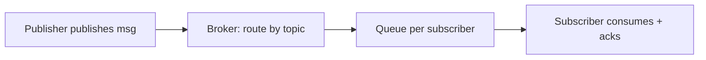

## Why it Matters

- The maximum decoupling statement: publishers publish to a *topic name* and know zero subscribers. Adding, removing, or crashing a consumer changes no producer code, this is the pattern behind every message broker, event bus, and webhook system.
- It makes delivery semantics a *design choice you must state*: at-least-once vs at-most-once vs exactly-once, and durable vs in-memory. Picking silently is the mistake; saying which and why is the answer.
- Slow consumers are the real problem, not fan-out: an unbounded queue hides latency until the process OOMs, and a blocking send makes one slow subscriber stall the publisher. Backpressure policy is where the design earns its keep.
- Ordering and fan-out are in tension by construction: per-subscriber queues preserve per-subscriber order but a slow one drifts from its peers; a shared queue keeps everyone together but serialises all consumers. You cannot have both, so choose and say it.

## Diagram

![[_attachments/pubsubsystem-class-diagram.png]]
*Source: [awesome-low-level-design](https://github.com/ashishps1/awesome-low-level-design) , use alongside the class table above.*
*Runtime flow: publish fans out to topic subscribers.*

## Code
```java
javaimport java.util.*;
import java.util.concurrent.*;

public class PubSubDemo {
 interface Subscriber { void onMessage(String topic, String msg); }
 static class Broker {
 Map<String, List<String>> logs = new ConcurrentHashMap<>();
 Map<String, CopyOnWriteArrayList<Subscriber>> subs = new ConcurrentHashMap<>();
 Executor pool = Executors.newCachedThreadPool();
 void subscribe(String t, Subscriber s) {
 subs.computeIfAbsent(t, k -> new CopyOnWriteArrayList<>()).add(s);
 logs.computeIfAbsent(t, k -> new ArrayList<>());
 }
 void publish(String t, String msg) { // fan-out async: slow subs never block publisher
 logs.computeIfAbsent(t, k -> new ArrayList<>()).add(msg);
 for (var s : subs.getOrDefault(t, new CopyOnWriteArrayList<>()))
 pool.execute(() -> s.onMessage(t, msg));
 }
 }
 public static void main(String[] a) throws Exception {
 var b = new Broker();
 b.subscribe("orders", (t, m) -> System.out.println("email-svc got: " + m));
 b.subscribe("orders", (t, m) -> System.out.println("audit-svc got: " + m));
 b.publish("orders", "order#42 placed");
 Thread.sleep(300); ((ExecutorService) b.pool).shutdown();
 }
}
```
## When to use / not

**Use when** producers and consumers must evolve independently, or when one event legitimately has multiple, differently-paced consumers, event-driven services, audit/notifications from one action, fan-out of domain events, webhook delivery, telemetry.
**Use** a durable log with per-subscriber offsets when a consumer may go down and must replay missed events (Kafka model).
**Use** bounded per-subscriber queues with an explicit drop policy when a consumer can be slow and the system must stay available.
**NOT when** the consumer must return a value to the caller, fire-and-forget cannot answer; use a direct call, a future, or a request/reply correlation ID instead.
**NOT when** there is exactly one consumer that must process before the caller proceeds, that is a synchronous call dressed as a queue; the indirection only adds failure modes.
**NOT when** ordering across *all* consumers is required, with independent per-subscriber queues, consumers drift; strict global order needs a single serialized queue, which kills parallelism.
**NOT for high-volume data pipelines needing backpressure and replay at scale, that is Kafka/Redpina's job; an in-process broker cannot survive a consumer restart without durable storage.

## Trade-offs

- **At-least-once vs at-most-once vs exactly-once:** at-least-once (ack after processing, redeliver on failure) is the pragmatic default and demands idempotent consumers; at-most-once (fire and forget) is cheapest but drops messages on failure; exactly-once requires transactional outbox + dedup IDs and is expensive, state which you chose and why.
- **Per-subscriber queue vs shared queue:** per-subscriber preserves order and isolates slow consumers (a slow one drifts only itself); shared keeps all consumers at the same point but serialises throughput.
- **Bounded vs unbounded queue:** bounded with a drop policy (oldest / newest / block) protects memory and latency; unbounded never drops but grows without limit and OOMs under sustained overload.
- **Push vs pull:** push (broker dispatches) minimises latency; pull (consumer polls its offset) lets the consumer control its rate and makes replay trivially resumable.
- **Synchronous fan-out vs thread-pool dispatch:** synchronous is ordered and simple but a slow subscriber blocks the publisher; a thread pool decouples but makes ordering and error handling per-subscriber.
- **Durable (persisted log) vs in-memory:** durable survives restarts and enables replay; in-memory is fast and simple but a crash loses everything in flight.
- **Wildcard/topic-pattern subscription vs exact match:** wildcard adds a matching engine (and ambiguity); exact match is trivial to reason about and route.

## Vs

- **Vs [[03_Logging-Framework|Logging Framework]]:** logging fans one event to many *appenders* in-process with fire-and-forget; pub-sub decouples *independent services* with durable logs, offsets, and replay. Same observer shape, different delivery contract and durability.
- **Vs the Observer pattern:** Observer is in-process, synchronous-ish, and typically coupled to the subject's lifetime; pub-sub adds a broker, a topic namespace, and independent consumer lifecycles. The names are routinely conflated, the distinguishing feature is the intermediary.
- **Vs a direct method call / REST:** a call answers a value and fails loudly to the caller; pub-sub cannot answer and hides consumer failure from the publisher. Choose by whether the caller needs a result.
- **Vs [[06_LRU-Cache|LRU Cache]]:** a topic is an append-only log that *keeps* entries for replay; an LRU is a bounded store that *silently drops* the least recently used. Durable history vs capacity-bounded present.
- **Vs [[04_Stack-Overflow|Stack Overflow]] badges:** the badge observer is a one-to-few in-process fan-out with no durability; a pub-sub topic is the same fan-out with per-subscriber offsets, backpressure, and crash recovery.

## Pitfalls

- **Unbounded queue** — hides latency growth until OOM; bound it and pick a drop policy you can defend, or the broker dies exactly when load peaks.
- **Slow subscriber blocking the publisher** — synchronous fan-out means one slow consumer stalls every publish; dispatch on a pool or use per-subscriber queues.
- **`ConcurrentModificationException`** — iterating a subscriber list while a subscribe/unsubscribe happens; use `CopyOnWriteArrayList` (reads dominate) or snapshot before dispatch.
- **Ordering broken by a thread pool** — parallel fan-out reorders messages per subscriber; if order matters, one dispatcher per subscriber, not a shared pool.
- **No idempotency on redelivery** — at-least-once delivers duplicates after a crash; consumers must dedupe (id store / offset) or double-charge, double-send, double-insert.
- **Blocking inside `onMessage`** — a consumer doing slow I/O inside the callback holds the dispatch thread; offload or use a bounded queue with backpressure.
- **Offsets committed before processing** — ack-then-process loses messages on crash; ack *after* processing, and accept the duplicate cost.
- **Topics created on the fly with no schema** — producers and consumers diverge silently when the payload shape changes; version the contract or schema-registry it.
- **Assuming a local broker is production-ready** — an in-process broker has no replication, no persistence, and no partitioning; name Kafka/Pulsar as the real scale answer rather than implying the toy is the system.

## Interview q&a

1. **How would you add durable delivery / replay?** Persist each topic log with offsets; track `Map<subscriber, offset>` and on reconnect replay from last ack. Add ack/nack so unacked messages are redelivered , at-least-once semantics.
2. **In-memory fan-out vs real message queue (Kafka/RabbitMQ) tradeoff?** In-memory is microsecond latency and trivial to demo, but loses everything on crash and can't scale past one JVM; a real broker adds durability, partitioning, and horizontal scale at the cost of ops complexity and millisecond latency.

How would you add durable delivery / replay?:: Persist each topic log with offsets; track `Map<subscriber, offset>` and on reconnect replay from last ack. Add ack/nack so unacked messages are redelivered , at-least-once semantics. #flashcard
In-memory fan-out vs real message queue (Kafka/RabbitMQ) tradeoff?:: In-memory is microsecond latency and trivial to demo, but loses everything on crash and can't scale past one JVM; a real broker adds durability, partitioning, and horizontal scale at the cost of ops complexity and millisecond latency. #flashcard

## Related

- [[06_Design-Patterns/Behavioral/Observer|Observer]] (subscribe/notify core) · [[06_Design-Patterns/Behavioral/Mediator|Mediator]] (broker decoupling publishers/subscribers) · [[06_Design-Patterns/Creational/Singleton|Singleton]] (single broker instance)
- Source: [awesome-low-level-design](https://github.com/ashishps1/awesome-low-level-design)

# Pub-Sub System

> Part of [[README|Java MOC]] -> [[10_LLD-Machine-Coding/README|LLD MOC]]

## Requirements

- Topics with dynamic subscribe/unsubscribe; publishers push without knowing subscribers.
- One ordered queue per topic; slow subscribers must not block publishers or each other.
- At-least-once delivery with per-subscriber offsets; replay from offset on reconnect.

## Classes & Relationships

| Class | Responsibility | Relates to |
|---|---|---|
| `Subscriber` | Callback `onMessage(topic, msg)` | registered with `Broker` |
| `Topic` | Append-only log + per-subscriber offsets | owned by `Broker` |
| `Broker` | `publish/subscribe/unsubscribe`, fan-out dispatch | has-many `Topic` |

## Concurrency

- `ConcurrentHashMap` for topics/subs + `CopyOnWriteArrayList` for subscriber lists (reads vastly outnumber subscribes). Fan-out on a thread pool isolates slow consumers; real systems add per-subscriber bounded queues with backpressure (drop-oldest or block) instead of unbounded `execute`.

## Try it Yourself

1. Add durable offsets: a subscriber that disconnects must replay missed messages on return.
2. Add `sports.*` wildcard subscriptions; where does matching live?
3. Add slow-consumer protection: bounded per-subscriber queue + drop policy (oldest vs newest).
