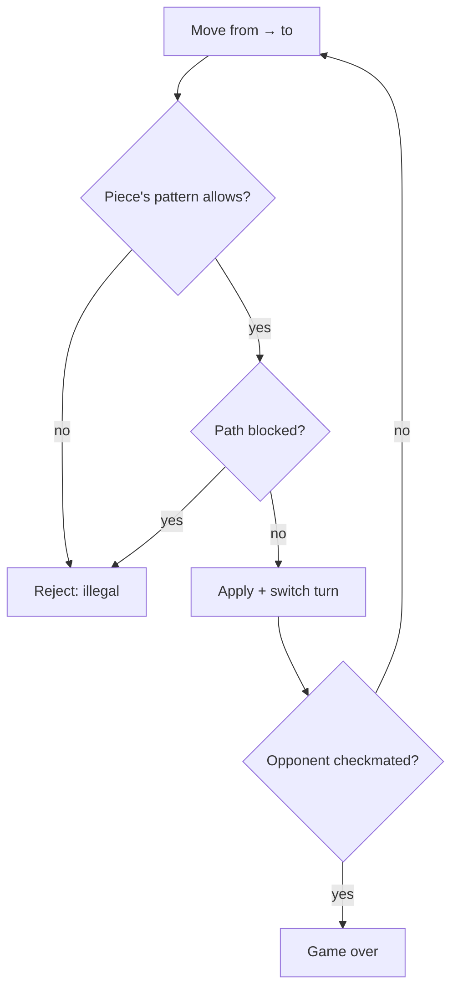

## Why it Matters

- The canonical demonstration that polymorphism beats conditionals: each piece owns its own `isValidMove`, so the board never asks `if (piece == ROOK)`, adding a variant (Chess960, a fairy piece) is a new subclass, not an edit to a switch.
- Move validation is *layered*: per-piece geometry (an L for the knight), then path clearance (something in the way), then board-level legality (turn, own-piece capture, leaving the king in check). Forgetting a layer is the classic bug, and naming the layers is how you defend the design.
- The board is a *grid of nullable pieces*, so "empty" is a first-class concept, and the null-check discipline this forces is exactly what avoids `NullPointerException` in every grid-based model.
- It is the reference point for game design that is *not* about winning fast: the interesting state is who may move, what was moved before (castling rights, en passant, threefold repetition), and that history is what makes undo hard.

## Diagram

![[_attachments/chessgame-class-diagram.png]]
*Source: [awesome-low-level-design](https://github.com/ashishps1/awesome-low-level-design) , use alongside the class table above.*
*Runtime flow: validate → apply → check end state.*

## Code
```java
javaimport java.util.*;

public class ChessDemo {
 enum Color { WHITE, BLACK }
 record Pos(int r, int c) { boolean onBoard() { return r >= 0 && r < 8 && c >= 0 && c < 8; } }
 abstract static class Piece {
 Color color; Piece(Color c) { color = c; }
 abstract boolean isValidMove(Pos from, Pos to, Piece[][] b);
 }
 static class Knight extends Piece { // fully implemented
 Knight(Color c) { super(c); }
 public boolean isValidMove(Pos f, Pos t, Piece[][] b) {
 int dr = Math.abs(f.r - t.r), dc = Math.abs(f.c - t.c);
 return t.onBoard() && ((dr == 2 && dc == 1) || (dr == 1 && dc == 2))
 && (b[t.r][t.c] == null || b[t.r][t.c].color != color);
 }
 }
 // HONEST STUB: other pieces (Pawn/Rook/Bishop/Queen/King) need own
 // isValidMove + path-blocking + castling/en-passant, throw until implemented.
 static class Stub extends Piece {
 Stub(Color c) { super(c); }
 public boolean isValidMove(Pos f, Pos t, Piece[][] b) {
 throw new UnsupportedOperationException("not implemented in demo");
 }
 }
 public static void main(String[] a) {
 Piece[][] b = new Piece[8][8];
 b[7][1] = new Knight(Color.WHITE); b[5][2] = new Stub(Color.BLACK);
 var k = b[7][1];
 System.out.println("N b1->c3 (capture): " + k.isValidMove(new Pos(7,1), new Pos(5,2), b));
 System.out.println("N b1->b2 (invalid): " + k.isValidMove(new Pos(7,1), new Pos(6,1), b));
 }
}
```
## When to use / not

**Use when** a grid hosts actors with different behaviours and rules must validate before mutating, chess, checkers, Othello/Reversi, battleship, tactical RPG movement, board-game engines generally.
**Use** a per-actor behaviour interface (`Piece`) when the number of actor kinds is open-ended or will grow.
**Use** a move-history stack when undo or replay is a requirement.
**NOT when** all actors behave identically, tic-tac-toe's marks need no per-piece rule class, and a `Piece` hierarchy there is empty ceremony (see [[08_Tic-Tac-Toe|Tic-Tac-Toe]]).
**NOT when** the rules have no validation gate at all (a toy grid where any cell can be set), the validation layers carry their cost only when rejection is real behaviour.
**NOT when** the board is unbounded or continuous (an open-world map), an 8×8 fixed grid with nullable cells is the wrong model; spatial indexes apply instead.

## Trade-offs

- **Piece polymorphism vs rule engine:** a `Piece` subclass per type localises rules and makes new pieces additive (OCP); a central ruleset/rule-engine keeps all rules in one readable place and makes cross-piece rules (check, castling) easier to express. Choose by whether rules are per-piece or cross-cutting.
- **Board as `Piece[8][8]` vs `Map<Coordinate, Piece>`:** the array is cache-friendly and direct for a fixed 8×8; the map wins for sparse/large boards (shogi's 9×9 variants, huge tactical maps) at the cost of coordinate hashing.
- **Full rules vs honest scope:** implementing all piece moves plus check/checkmate plus castling in 45 minutes ships nothing that runs; implementing the Knight fully and stubbing the rest honestly is the defensible interview call.
- **Command/Memento for undo vs full-board snapshot:** per-move mementos are cheap and precise; a full-board snapshot is simpler but O(64) per move and loses nothing in practice for a small board.
- **Turn in `Game` vs in `Board`:** turns in `Game` keeps `Board` pure rules; turns in `Board` make a single object authoritative but couple flow to rules.
- **Immutable positions vs in-place move:** immutable `Board` per move makes undo/replay free (keep the old board) but allocates per move and fights the 45-minute budget.

## Vs

- **Vs [[08_Tic-Tac-Toe|Tic-Tac-Toe]]:** chess has a *per-piece* rule hierarchy and capture; tic-tac-toe has uniform marks with one placement rule. The difference is whether validation is polymorphic or a guard.
- **Vs [[14_Snake-and-Ladder|Snake and Ladder]]:** chess is deterministic strategy, every move is a *choice* with full information; snake-and-ladder is pure chance, the move is a dice roll and the player decides nothing. Chess needs a decision/search seam (minimax); a chance game needs an injectable RNG.
- **Vs [[08_Tic-Tac-Toe|Tic-Tac-Toe]] (win detection):** tic-tac-toe ends by a line of marks (O(1) counters); chess ends by a *condition derived from all legal replies* (checkmate), so terminal detection is a search, not a counter, the hardest part of the model.
- **Vs [[07_Elevator-System|Elevator System]]:** both need path-occupancy checks (is a square/floor blocked); elevators schedule mobile resources over time, chess validates one discrete move against a static board.
- **Vs [[12_Movie-Ticket-Booking|Movie Ticket Booking]]:** a chess square holds *at most one piece* (mutual exclusion by occupancy); a seat may be AVAILABLE → HELD → BOOKED, a *third state* that a square never has. Both are "one thing per cell", but only one permits reserving without occupying.

## Pitfalls

- **One rules layer missing** — the move matches knight geometry *and* the destination has no own piece *and* it is this player's turn; omitting any layer lets a player capture their own piece or move twice. Name all three layers in the design.
- **Validating geometry but not path** — a bishop's diagonal is "valid" until a piece blocks the way; sliding pieces need per-square clearance, leapers (knight/king) do not.
- **Null handling on the grid** — reading `board[r][c]` without a null check is the NPE the interviewer is waiting for; model empty as nullable and guard every read.
- **Turn order checked in the UI** — `if (currentPlayer == piece.color)` must live in `move()`/`Board`, or a client can move the opponent's pieces.
- **Mutating the board before validation passes** — capture the piece, then discover the move is illegal; validate fully *then* mutate, or undo the partial mutation.
- **Undo that restores positions but not turn/status** — a memento must capture board, current player, and status together; restoring only the grid hands the turn to the wrong player.
- **Check/checkmate stubbed silently** — saying "game ends when a king is captured" is a red flag: check is the win condition; if scoped out, say so explicitly as a known limitation.
- **Board coordinates mixing (row,col) and (col,row)** — indexing `board[x][y]` on a `board[row][col]` grid silently transposes the board; pick one convention and use it everywhere.
- **Not testing the one fully implemented piece** — the Knight is the code that must actually run; a `main` that moves a knight legally and rejects an illegal L is the minimum proof.

## Interview q&a

1. **How would you add check/checkmate detection?** After each move, locate the king and test whether any opponent piece attacks it (reuse `isValidMove`); checkmate = in check + no legal move for any own piece (simulate all moves , expensive but correct; prune with attack maps in production).
2. **Inheritance-per-piece vs move-strategy tradeoff?** Subclassing keeps piece rules colocated and reads naturally, but explodes classes and complicates variants (e.g. fairy chess); a `MoveRule` strategy list per piece composes better (sliding + leaping rules) at the cost of more wiring.

How would you add check/checkmate detection?:: After each move, locate the king and test whether any opponent piece attacks it (reuse `isValidMove`); checkmate = in check + no legal move for any own piece (simulate all moves , expensive but correct; prune with attack maps in production). #flashcard
Inheritance-per-piece vs move-strategy tradeoff?:: Subclassing keeps piece rules colocated and reads naturally, but explodes classes and complicates variants (e.g. fairy chess); a `MoveRule` strategy list per piece composes better (sliding + leaping rules) at the cost of more wiring. #flashcard

## Related

- [[06_Design-Patterns/Behavioral/Strategy|Strategy]] (pluggable move rules) · [[06_Design-Patterns/Behavioral/State|State]] (game status lifecycle) · [[06_Design-Patterns/Behavioral/Command|Command]] (move as undoable command)
- Source: [awesome-low-level-design](https://github.com/ashishps1/awesome-low-level-design)

# Chess Game

> Part of [[README|Java MOC]] -> [[10_LLD-Machine-Coding/README|LLD MOC]]

## Requirements

- 8×8 board with two players; turn-based moves with validation per piece rules.
- `Piece` hierarchy: each piece implements its own `isValidMove`; board checks path bounds, own-piece capture, and turn order.
- Detect game end (checkmate/stalemate skeleton); support resign and draw offer.
- Fully implement one piece (Knight); others stubbed honestly , see code comment.

## Classes & Relationships

| Class | Responsibility | Relates to |
|---|---|---|
| `Piece` | Color + `isValidMove(from, to, board)` | subclassed per piece |
| `Knight` | L-move validation (fully implemented) | extends `Piece` |
| `Board` | Grid, `move()` with turn + capture checks | has-many `Piece` |
| `Game` | Turn loop, status (ONGOING/DRAWN/WON) | has-a `Board` |

## Concurrency

- Over-the-board play is single-threaded; for online play serialize `move()` per game (`synchronized` on the `Game` instance) so concurrent move submissions can't corrupt turn order. Shard by gameId , games never share state.

## Try it Yourself

1. Implement Rook + Bishop moves behind the same `Piece` interface; what code is shared vs per-piece?
2. Add check detection (is a king attacked?) after every move; then checkmate (no legal reply).
3. Add move history with undo (Memento per move); which state must the snapshot capture?
