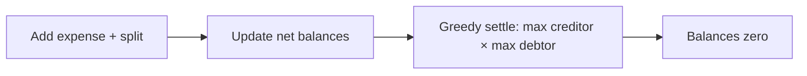

## Why it Matters

- The canonical money-modelling problem: every amount is an integer in the *smallest currency unit* (paise/cents), never a `double`. Floating-point rounding is not an edge case here, it is how real apps lose or create money, and it is a correctness bug that compounds across millions of ledgers.
- It shows the difference between storing *raw events* and deriving *state*: an expense is the event; the balance sheet is a projection. Keeping them separate is what lets you recompute, audit, and add "simplify debts" without touching the expense path.
- Validation is part of the contract, not an afterthought: EXACT shares must sum to the total, PERCENT must total 100. Silently accepting a bad split creates money from nowhere, the constraint is a *business* rule, not defensive coding.
- Debt simplification is a graph problem in disguise (min-cash-flow / greedy settle-up), and it is the standard "how would you extend this" follow-up.

## Diagram

![[_attachments/splitwise-class-diagram.png]]
*Source: [awesome-low-level-design](https://github.com/ashishps1/awesome-low-level-design) , use alongside the class table above.*
*Runtime flow: expenses build balances, settle minimizes transfers.*

## Code
```java
javaimport java.util.*;

public class SplitwiseDemo {
 interface SplitStrategy { Map<String, Double> split(double amt, List<String> users, double... p); }
 static class Equal implements SplitStrategy {
 public Map<String, Double> split(double a, List<String> u, double... p) {
 var m = new LinkedHashMap<String, Double>();
 u.forEach(x -> m.put(x, Math.round(a / u.size() * 100.0) / 100.0)); return m;
 }
 }
 static class Percent implements SplitStrategy {
 public Map<String, Double> split(double a, List<String> u, double... p) {
 if (Arrays.stream(p).sum() != 100) throw new IllegalArgumentException("pct != 100");
 var m = new LinkedHashMap<String, Double>();
 for (int i = 0; i < u.size(); i++) m.put(u.get(i), a * p[i] / 100); return m;
 }
 }
 static class Ledger { // balances: debtor -> (creditor -> amt)
 Map<String, Map<String, Double>> b = new HashMap<>();
 void expense(String paidBy, Map<String, Double> shares) {
 shares.forEach((u, s) -> { if (!u.equals(paidBy))
 b.computeIfAbsent(u, k -> new HashMap<>()).merge(paidBy, s, Double::sum); });
 }
 void show() { b.forEach((d, m) -> m.forEach((c, a) -> System.out.println(d + " owes " + c + ": " + a))); }
 }
 public static void main(String[] a) {
 var users = List.of("A", "B", "C"); var ledger = new Ledger();
 ledger.expense("A", new Equal().split(300, users)); // A paid 300, equal
 ledger.expense("B", new Percent().split(200, users, 50, 30, 20)); // B paid 200, 50/30/20
 ledger.show();
 }
}
```
## When to use / not

**Use when** a shared expense must be divided among participants by a rule, expense sharing, group trips, roommates, splitting a bill, settling a shared tab, group gifting.
**Use** a strategy seam when the split rule is a product variant (EQUAL / EXACT / PERCENT / SHARE / weighted) and more will come.
**Use** the balance-as-derived-projection model whenever an audit or a "recompute from events" requirement exists.
**NOT when** there is exactly one payer and one payee, a payment between two parties needs no ledger projection or simplification; a direct transaction record is the whole design.
**NOT when** amounts are not money (points, tokens with a fixed total), no rounding or settlement graph applies, and the integer-cents discipline is unnecessary.
**NOT when** participants do not share a closed group, open-market payments (invoices to third parties) have no internal settlement to simplify; the graph reduction is meaningless without a closed set.

## Trade-offs

- **Integer cents vs `double`/`BigDecimal`:** integer cents avoids binary-fraction error entirely and is fast; `BigDecimal` handles arbitrary precision and rounding modes explicitly; `double` silently drifts (0.1 + 0.2) and is wrong for money. Use cents or BigDecimal, and say why.
- **Stored balance vs recomputed from events:** storing the running ledger gives O(1) balance reads but risks drift from the event log on any missed update; recomputing is always consistent but costs a replay per query. Store the projection, and make the expense the only writer.
- **Dense `Map<User, Map<User, Long>>` vs sparse edge list:** a dense matrix is O(1) lookup but O(n²) space and mostly zeroes; a sparse list of non-zero edges is memory-friendly but needs a lookup index. Choose by group size and how sparse settled debt is.
- **Greedy settle-up vs optimal min-cash-flow:** greedy (largest creditor vs largest debtor) is simple, near-optimal, and easy to defend; true min-cash-flow is a flow algorithm, exact but costly and hard to justify at interview scale.
- **Per-group lock vs global lock:** per-group locks scale (groups don't contend) but cross-group user totals need a second view; a global lock is trivially correct and a bottleneck. Match to the stated scale.
- **Settlement as a new event vs a balance edit:** recording a settle-up as a payment event keeps the ledger auditable and undoable; directly zeroing an edge destroys history.

## Vs

- **Vs [[01_Parking-Lot|Parking Lot]]:** parking computes a fee for one *transaction* (no debt between parties); Splitwise maintains an ongoing *web of debt* that persists across many expenses and is simplified over time. Fee computation vs obligation graph.
- **Vs [[04_Stack-Overflow|Stack Overflow]]:** Stack Overflow's reputation is a *score* with no settlement (it never needs to be paid out or netted); Splitwise's balances are *claims* that are netted to minimise transactions. Derived rank vs derived debt.
- **Vs [[12_Movie-Ticket-Booking|Movie Ticket Booking]]:** booking is a two-party payment to the system (money goes out); Splitwise is peer-to-peer debt (money is *owed*, not yet paid). The booking's money moves immediately; Splitwise's money moves later, or never (netted away).
- **Vs a payment gateway:** a gateway *moves* money atomally between accounts; Splitwise *accounts* for who owes whom without moving anything. Ledger accounting vs funds transfer, the two are routinely conflated, and the distinction is the interview answer.
- **Vs [[15_Task-Management-System|Task Management System]]:** a task's state machine has *legal transitions* (TODO → DONE); a balance has no transitions, only arithmetic, so the "state" in Splitwise is the numeric projection, not a status enum.

## Pitfalls

- **`double` for money** — `0.1 + 0.2 != 0.3` and the drift is unfixable after the fact; use integer cents or `BigDecimal` from the first line, and state the unit in the field name (`amountCents`).
- **Rounding remainder lost** — splitting 100 into 3 equal parts: 33+33+33 loses 1 cent. Assign the remainder to one participant explicitly (last-payer-gets-remainder) and assert the sum equals the total.
- **Validating EXACT/PERCENT after applying** — accepting an EXACT split that sums to 99 and then recording a 1-cent hole; validate the invariant *before* mutating the ledger.
- **Symmetric balances not kept in sync** — A owes B 10 must mean B is owed 10 by A; updating one side and not the other creates a ledger that does not reconcile with itself.
- **Multi-currency mixed** — a debt in dollars cannot net against one in rupees; mixing currencies in one balance map is a silent correctness bug. Per-currency ledgers or an explicit conversion rule.
- **Simplify-debts that changes history** — settlement must be recorded as an event, not an in-place erasure of edges; otherwise the ledger cannot be audited or undone.
- **No idempotency on expense creation** — a duplicate `addExpense` (retry, double-click) creates double debt; use a client-supplied idempotency key or a unique constraint.
- **Fraud-by-rounding ignored** — tiny intentional over-credits across millions of expenses is a real attack on ledger systems; audit logging is the mitigation, and it is worth naming.
- **Cross-group user balance inconsistent with per-group** — if balances live per group, a user's total across groups must be reconciled as a *derived* view, not a second stored number that drifts.

## Interview q&a

1. **How would you add simplify/minimize settlements?** Greedy: split users into net debtors/creditors, repeatedly settle max debtor against max creditor until zero , O(n log n), minimal-ish transactions. Exact minimum is NP-hard (subset-sum-like), so greedy is the accepted answer.
2. **Strategy-per-split-type vs if/else tradeoff?** Strategy isolates validation per type (EXACT sum check, PERCENT 100 check) and adding a new type (SHARES/weight-based) needs no edits to the manager; if/else is less code for exactly 3 fixed types but violates open/closed on extension.

How would you add simplify/minimize settlements?:: Greedy: split users into net debtors/creditors, repeatedly settle max debtor against max creditor until zero , O(n log n), minimal-ish transactions. Exact minimum is NP-hard (subset-sum-like), so greedy is the accepted answer. #flashcard
Strategy-per-split-type vs if/else tradeoff?:: Strategy isolates validation per type (EXACT sum check, PERCENT 100 check) and adding a new type (SHARES/weight-based) needs no edits to the manager; if/else is less code for exactly 3 fixed types but violates open/closed on extension. #flashcard

## Related

- [[06_Design-Patterns/Behavioral/Strategy|Strategy]] (split algorithms) · [[06_Design-Patterns/Creational/Factory Method|Factory Method]] (strategy per split type) · [[06_Design-Patterns/Behavioral/Command|Command]] (expense as ledger transaction)
- Source: [awesome-low-level-design](https://github.com/ashishps1/awesome-low-level-design)

# Splitwise (Expense Sharing)

> Part of [[README|Java MOC]] -> [[10_LLD-Machine-Coding/README|LLD MOC]]

## Requirements

- Users in groups; `addExpense` splits by EQUAL / EXACT / PERCENT via Strategy.
- Maintain balance sheet: `Map<user, Map<owesTo, amount>>`; validate EXACT sums and PERCENT totals 100.
- `showBalances` per user + `simplify` to minimize settlement transactions (greedy debtor/creditor matching).

## Classes & Relationships

| Class | Responsibility | Relates to |
|---|---|---|
| `User` | Id + name | referenced by `Expense` |
| `SplitStrategy` | `split(amount, users, params)` → shares | used by `ExpenseManager` |
| `ExpenseManager` | Validates, applies expense, keeps balances | has-many `User`, owns ledger |

## Concurrency

- Guard `expense()` + balance updates with a lock per group (or `ConcurrentHashMap` + atomic merges). Balances are per-group ledgers , no cross-group contention, so a group-level `ReentrantLock` scales fine; exact-cent rounding needs the whole expense applied atomically.

## Try it Yourself

1. Add groups (expenses belong to a trip); balances stay global per user , reconcile both views.
2. Implement simplify-debts (min-cash-flow): greedy settle largest creditor vs largest debtor.
3. Add a settle-up transaction that records a payment and zeroes the edge; make it undoable.
