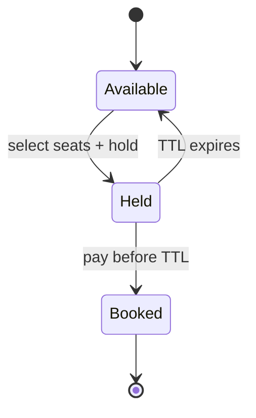

## Why it Matters

- It shows that booking is *two* problems in one: correctness (no double-booking) and liveness (held seats must be released so the show can sell out). Solving only the first produces a system that locks up its own inventory forever.
- The seat state machine, AVAILABLE → HELD → BOOKED, with expiry, is a *timeout-driven* state, which is a fundamentally harder resource model than a parking spot: the resource can transition without any actor acting, so a sweeper or scheduler is part of the design, not an optimisation.
- Partial failures are the default, not an edge case: payment can fail mid-hold, a hold can expire mid-payment, the user can close the app. Each needs a defined outcome, and "undefined" means a lost seat or a lost sale.
- Money and inventory move together, so the atomic unit spans two concerns (seat state + payment), which is exactly where naive check-then-act designs double-book.

## Diagram

![[_attachments/movieticketbookingsystem-class-diagram.png]]
*Source: [awesome-low-level-design](https://github.com/ashishps1/awesome-low-level-design) , use alongside the class table above.*
*Runtime flow: hold expires unless paid.*

## Code
```java
javaimport java.util.*;
import java.util.concurrent.*;

public class MovieTicketDemo {
 enum SeatState { AVAILABLE, HELD, BOOKED }
 static class Seat { String id; double price; SeatState s = SeatState.AVAILABLE; long heldUntil;
 Seat(String id, double p) { this.id = id; price = p; } }
 static class Show {
 Map<String, Seat> seats = new ConcurrentHashMap<>();
 Show(String... ids) { for (int i = 0; i < ids.length; i++) seats.put(ids[i], new Seat(ids[i], 200 + i * 50)); }
 synchronized List<String> hold(List<String> want, long leaseMs) { // atomic multi-seat hold
 for (var id : want) if (seats.get(id).s != SeatState.AVAILABLE) return List.of();
 long exp = System.currentTimeMillis() + leaseMs;
 want.forEach(id -> { var st = seats.get(id); st.s = SeatState.HELD; st.heldUntil = exp; });
 return want;
 }
 synchronized boolean confirm(List<String> ids) {
 for (var id : ids) if (seats.get(id).s != SeatState.HELD) return false;
 ids.forEach(id -> seats.get(id).s = SeatState.BOOKED); return true;
 }
 }
 public static void main(String[] a) {
 var show = new Show("A1", "A2", "A3");
 System.out.println("hold A1,A2: " + show.hold(List.of("A1", "A2"), 600_000));
 System.out.println("hold A2 again: " + show.hold(List.of("A2"), 600_000)); // empty = rejected
 System.out.println("confirm: " + show.confirm(List.of("A1", "A2")));
 }
}
```
## When to use / not

**Use when** a scarce, time-bounded resource must be reserved temporarily before confirmation, cinema seats, concert tickets, hotel rooms, flight seats, restaurant tables, appointment slots.
**Use** a hold-with-expiry pattern whenever a slow step (payment, user confirmation) sits between selection and commitment.
**Use** a saga-style compensation (hold → pay → confirm, with auto-release on expiry) when the transaction cannot be made atomic across services.
**NOT when** availability is not time-bounded or not scarce, a subscription with unlimited seats, or a download with no inventory cap, needs no hold state machine at all.
**NOT when** the resource is unique and identified rather than interchangeable, booking a *specific* named hotel room is a per-resource availability check, not a seat-map scan; the model differs.
**NOT when** commitment is instant, if there is no slow step between selection and confirmation, skip the HOLD state entirely and book directly.
**NOT when** the item is fungible and not seat-specific, generic inventory (a count of tickets) needs a counter, not a per-seat state machine.

## Trade-offs

- **Optimistic (CAS on seat state) vs pessimistic (lock per show):** optimistic scales better under low contention and no lock is held across payment; pessimistic is simpler to reason about but a lock held across a network payment call is a deadlock/timeout hazard.
- **Hold expiry timer vs background sweeper:** per-hold scheduled timers release immediately on expiry but a crash loses the timer; a periodic sweeper is crash-safe and batches work but leaves seats blocked until the next sweep. Choose by how precious the inventory is.
- **Locking the whole show vs per-seat locks:** a show-level lock makes multi-seat holds atomic (no partial bookings) but serialises a whole show's traffic; per-seat locks parallelise but multi-seat holds can deadlock and partially apply.
- **Payment-first vs seat-first:** locking a seat across a payment call risks holding inventory for a user who never pays; charging first risks charging for a seat that expired. The interview-defensible answer is hold → pay → confirm with compensation, and say the failure mode you chose.
- **In-memory expiry vs DB-backed lease:** in-memory is fast and lost on restart; a persisted lease with a TTL column survives a crash and lets any node sweep.
- **Auto-release vs manual release on expiry:** auto-release maximises sell-through; manual review protects against disputes. Sell-through usually wins for perishable inventory.

## Vs

- **Vs [[01_Parking-Lot|Parking Lot]]:** a parking spot is claimed on *arrival* and released by an explicit exit event; a seat is *reserved in advance* and released by a *timeout* if not confirmed. Explicit release vs time-based expiry is the axis.
- **Vs [[10_Chess-Game|Chess Game]]:** a chess square holds at most one piece and has no third state, a seat has AVAILABLE → HELD → BOOKED, so it can be *reserved without being occupied*. Both are one-per-cell, but only one permits a pending state.
- **Vs [[06_LRU-Cache|LRU Cache]]:** the LRU evicts by *recency of use* to bound memory; a seat hold expires by *age* to free inventory. Both reclaim unused capacity; the trigger is use vs time.
- **Vs [[12_Movie-Ticket-Booking|flight/hotel booking]]:** cinema seats within a screen are interchangeable within a tier, so a *seat map* is the right model; a hotel room or flight seat is a named unique resource, so availability is per-resource. Same hold/confirm flow, different inventory model.
- **Vs [[11_Splitwise|Splitwise]]:** booking moves money to the system immediately in exchange for a seat; Splitwise records *debt* that may never be settled (netted away). Immediate payment vs deferred obligation.

## Pitfalls

- **Double-booking** — `if (seat.isAvailable())` outside a lock: two requests both see AVAILABLE and both hold. The state check and transition must be atomic (lock or CAS), never check-then-act across threads.
- **Partial multi-seat holds** — locking per seat while booking 3 seats: 2 succeed, 1 fails, leaving the user with an unusable partial booking. Hold all-or-nothing under one show-level lock, or release what was held on failure.
- **Hold that never expires** — a user abandons the cart and the seat stays HELD forever, silently shrinking sellable inventory. Expiry is mandatory, and the sweeper is part of the design.
- **Expiry racing with payment** — the hold expires while the payment is in flight: confirm lands on an expired hold and either fails or double-sells. Confirm must re-validate the hold *and* win the state race atomically.
- **Lock held across a payment call** — a `synchronized` block spanning a network payment blocks all other bookings for that show and risks a timeout holding seats for minutes. Never hold a lock across an external call.
- **Concurrency on stale seat data** — the client's seat map is a *snapshot*; a seat shown free may already be held. Version the seat map or re-validate on confirm, and tell the user why their selection vanished.
- **Idempotent confirm** — a retried payment that confirms twice issues two bookings or charges twice; use an idempotency key on the payment intent.
- **No show-level scan guard** — a naive "find any available seat" without holding first can return a seat another thread just booked; scan and hold must be one atomic unit per show.
- **Expired-hold sweeper as an afterthought** — if release is a manual cleanup script, inventory drifts in production; make the sweeper an explicit scheduled job with its own tests.

## Interview q&a

1. **How would you extend to payment failure / saga?** Hold → payment → confirm; on payment failure or timeout, compensate by releasing the hold (saga compensation step). Idempotency key per booking prevents double-charge on retries.
2. **Per-show lock vs per-seat lock tradeoff?** Per-show lock is simple and correct for atomic multi-seat holds (adjacent seats together), but caps throughput at one transaction per show; per-seat locks allow parallel bookings of different seats but risk deadlock on multi-seat holds , needs ordered lock acquisition.

How would you extend to payment failure / saga?:: Hold → payment → confirm; on payment failure or timeout, compensate by releasing the hold (saga compensation step). Idempotency key per booking prevents double-charge on retries. #flashcard
Per-show lock vs per-seat lock tradeoff?:: Per-show lock is simple and correct for atomic multi-seat holds (adjacent seats together), but caps throughput at one transaction per show; per-seat locks allow parallel bookings of different seats but risk deadlock on multi-seat holds , needs ordered lock acquisition. #flashcard

## Related

- [[06_Design-Patterns/Behavioral/State|State]] (seat AVAILABLE→HELD→BOOKED) · [[06_Design-Patterns/Creational/Singleton|Singleton]] (booking service) · [[06_Design-Patterns/Structural/Facade|Facade]] (booking API over show/payment)
- Source: [awesome-low-level-design](https://github.com/ashishps1/awesome-low-level-design)

# Movie Ticket Booking

> Part of [[README|Java MOC]] -> [[10_LLD-Machine-Coding/README|LLD MOC]]

## Requirements

- Theatres → Screens → Shows (movie + time); seats have tier + price.
- Two-phase booking: HOLD seats (short lease, e.g. 10 min) → CONFIRM with payment; expired holds auto-release (saga-style compensation within LLD scope).
- No double-booking: seat state machine AVAILABLE → HELD → BOOKED; concurrent holds on the same seat must serialize.

## Classes & Relationships

| Class | Responsibility | Relates to |
|---|---|---|
| `Seat` | Id, tier, price, state + hold expiry | owned by `Show` |
| `Show` | Seat map, `hold()` / `confirm()` / `releaseExpired()` | has-many `Seat` |
| `BookingService` | Orchestrates hold → pay → confirm | uses `Show` |

## Concurrency

- `hold`/`confirm` are `synchronized` per `Show` , atomic multi-seat holds prevent partial double-booking. At scale shard by showId; a background sweeper releases expired holds. Real systems add a distributed lock or DB unique constraint on (showId, seatId) for multi-instance safety.

## Try it Yourself

1. Add dynamic pricing by tier occupancy (price rises past 80% sold); who owns the rule?
2. Add a waitlist: cancelled seats go to the queue head before public sale.
3. Add coupon codes as a Strategy on total; stackable vs exclusive , enforce at confirm time.
