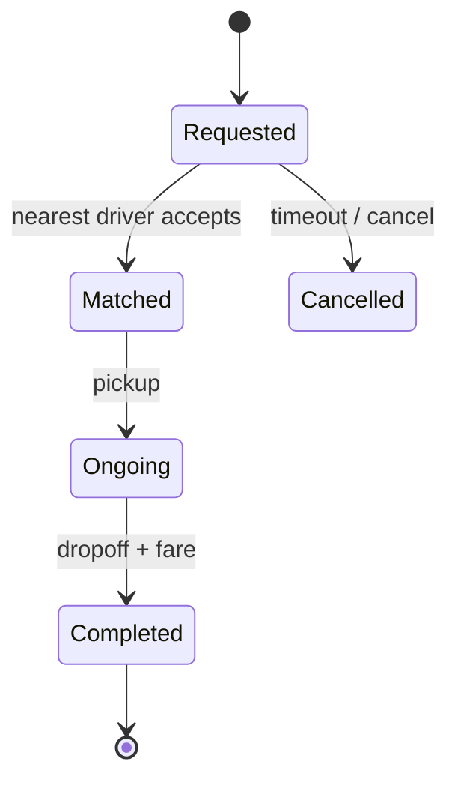

## Why it Matters

- The clearest demonstration of two independent lifecycles that must stay consistent: the *driver's* availability (AVAILABLE ⇄ ON_TRIP) and the *trip's* status (REQUESTED → ASSIGNED → ONGOING → COMPLETED). When they disagree, you get the classic bug, a driver shown free who is already in a ride, and two riders dispatched to one car.
- Dispatch is a *policy*, not a lookup: nearest-free, shortest-ETA, highest-rated, or surge-aware. Hiding it behind a Strategy is what lets the product change matching rules without touching `Trip` or `Driver`.
- It shows where LLD legitimately stops and distributed design begins: the stub's linear scan over drivers is honest *at interview scale*, and naming a geo-hash/quadtree index as the real answer is the expected trade-off statement, not a cop-out.
- Location is high-churn state: drivers emit positions constantly, so "where is the driver" is a read-heavy, write-heavy field whose consistency model must be stated (eventually consistent position vs strongly consistent assignment).

## Diagram

![[_attachments/ridesharingservice-class-diagram.png]]
*Source: [awesome-low-level-design](https://github.com/ashishps1/awesome-low-level-design) , use alongside the class table above.*
*Runtime flow: trip lifecycle.*

## Code
```java
javaimport java.util.*;

public class RideSharingDemo {
 enum TripStatus { REQUESTED, ASSIGNED, ONGOING, COMPLETED, CANCELLED }
 record Loc(double x, double y) { double dist(Loc o) { return Math.hypot(x - o.x, y - o.y); } }
 static class Driver { String id; Loc loc; boolean available = true;
 Driver(String id, Loc l) { this.id = id; loc = l; } }
 static class Trip {
 String rider; Driver driver; TripStatus s = TripStatus.REQUESTED; double fare;
 Trip(String r, Driver d, double km) { rider = r; driver = d; fare = 50 + 15 * km;
 s = TripStatus.ASSIGNED; d.available = false; }
 void start() { s = TripStatus.ONGOING; }
 void complete() { s = TripStatus.COMPLETED; driver.available = true; }
 }
 static class Dispatch { // STUB matching: linear nearest-driver scan
 List<Driver> drivers = new ArrayList<>();
 synchronized Trip requestRide(String rider, Loc pickup, double km) {
 return drivers.stream().filter(d -> d.available)
 .min(Comparator.comparingDouble(d -> d.loc.dist(pickup)))
 .map(d -> new Trip(rider, d, km)).orElse(null);
 }
 }
 public static void main(String[] a) {
 var disp = new Dispatch();
 disp.drivers.add(new Driver("D1", new Loc(0, 0)));
 disp.drivers.add(new Driver("D2", new Loc(10, 10)));
 var t = disp.requestRide("R1", new Loc(1, 1), 8);
 System.out.println("driver=" + t.driver.id + " fare=" + t.fare + " " + t.s);
 t.start(); t.complete(); System.out.println("after: " + t.s + " driver free=" + t.driver.available);
 }
}
```
## When to use / not

**Use when** a nearby, available resource must be matched to a request in open space, ride-hailing, food delivery, on-demand services, courier dispatch, nearest-technician assignment.
**Use** a strategy seam whenever the matching rule is a product decision (nearest vs ETA vs rating vs cost) and will be tuned without redeploying the model.
**Use** a status pair (resource availability + request status) whenever two state machines must agree before a match is valid.
**NOT when** resources are at *fixed* locations, then matching is a spatial index query with no live availability, and the driver-lifecycle state machine is dead weight.
**NOT when** the assignment is manual or rule-based without location, a taxi dispatch desk assigning by rank has no geo-query at all.
**NOT when** the request is not time-critical, scheduled or batch assignment (next-day delivery routing) has no live availability race and needs no atomic claim.
**NOT when** matching is many-to-many and stable, that is an assignment problem (Hungarian/greedy bipartite matching), not nearest-available dispatch.

## Trade-offs

- **Linear scan vs spatial index:** scanning all drivers is O(n) per request and trivially correct for a demo; a quadtree/geohash grid is O(log n + k) but needs index maintenance on every driver movement, which is the dominant write cost at scale.
- **Availability flag vs status machine on the driver:** a boolean `available` is simple and race-prone; a full status machine (AVAILABLE/ON_TRIP/OFFLINE) is expressive but heavier. Choose by how many states the product actually needs.
- **Optimistic CAS vs pessimistic lock on driver claim:** compare-and-set on the availability flag scales (no lock held across riders) and fails cleanly on conflict; a `synchronized` block is simpler but serialises all requests for a driver.
- **Sync assignment vs async queue:** synchronous matching answers immediately but couples the rider's request to driver latency; a queue decouples and smooths peaks but adds polling and staleness.
- **Surge/eta-aware vs nearest-only:** nearest-by-distance ignores traffic and direction (a driver 2km away heading the other way has a 20-minute ETA); ETA-aware matching is more correct and far more expensive to compute.
- **In-memory driver positions vs persisted:** in-memory is fast and lost on node failure; a shared geo index (Redis GEO) survives and is the real-scale answer, state the boundary.
- **Push notifications vs polling:** push is immediate and cheap; polling is simpler and burns battery/bandwidth. Real systems use push with polling fallback.

## Vs

- **Vs [[07_Elevator-System|Elevator System]]:** both dispatch a pool to requests via a Strategy, but elevators move on *fixed tracks* with exactly computable travel, while ride dispatch is over *open geography* with ETA estimation and traffic uncertainty. Deterministic scheduling vs probabilistic ETA matching.
- **Vs [[01_Parking-Lot|Parking Lot]]:** parking assigns a *fixed* spot that the user travels to; ride-hailing dispatches a *mobile* resource that travels to the user. Assignment of a place vs dispatch of an actor.
- **Vs [[13_Ride-Sharing-Uber|public transit routing]]:** transit is fixed routes and schedules, matching is a timetable lookup with no per-vehicle availability; ride-hailing is dynamic, per-vehicle, and real-time. Static schedule vs live fleet state.
- **Vs [[12_Movie-Ticket-Booking|Movie Ticket Booking]]:** both claim a scarce resource, but a driver is a *renewable* resource that becomes free again after the trip, while a seat is *perishable* — once the show starts, an unsold seat is gone forever. Renewable vs perishable inventory.
- **Vs [[15_Task-Management-System|Task Management System]]:** assigning a task to a user changes ownership but not the user's physical location, and no real-time position or ETA is involved; ride dispatch is assignment *plus* spatial state plus travel time.

## Pitfalls

- **Double-dispatch of one driver** — two riders both see the driver free and both get assigned: the availability check and the assignment must be atomic (CAS or lock), never check-then-act across requests.
- **Driver state vs trip state divergence** — the driver is `ON_TRIP` while the trip is still `REQUESTED`, or a trip completes but the driver never returns to `AVAILABLE`. Both transitions must be one unit; a driver stuck unavailable is a driver earning nothing.
- **Matching by distance only** — nearest-by-Euclidean ignores direction and traffic; a driver 1km away facing the wrong way has a longer ETA than one 3km away heading towards the rider. ETA-aware matching, or state the simplification.
- **No CANCELLED transition path** — a rider cancels but the driver is never released back to the pool; every cancellation must restore driver availability explicitly.
- **Race on driver position reads** — positions update constantly; a dispatch decision made on a stale position can assign a driver who is no longer near. Version positions and re-validate before final assignment.
- **Linear scan at scale** — O(drivers) per request is fine for a demo and fatal in production; name the geo-index as the real answer instead of implying the scan is the system.
- **Notification on every transition** — spamming the rider and driver on each status change; batch or throttle, and only notify on transitions that matter to the recipient.
- **Trip fares recomputed differently** — fare computed at request time vs completed time must use one rule source (one `FareStrategy`), or surge changes mid-trip produce disputes.
- **No idempotency on requestRide** — a double-tap or retry creates two trips and dispatches two drivers; use an idempotency key per rider request.
- **Ignoring partial-failure notifications** — a notification failure must not block the trip transition; the transition is the source of truth, notifications are a best-effort side effect.

## Interview q&a

1. **How would you extend matching to surge pricing + ETA?** Fare multiplier per geo-cell from demand/supply ratio; ETA from driver distance ÷ avg speed. Both need a geo index (geohash) so per-cell stats are O(1) lookups instead of global scans.
2. **Linear scan vs spatial index tradeoff?** Linear scan is correct and trivial for a demo but O(drivers) per request , dies at city scale; quadtree/geohash gives O(log n) nearest-driver lookup but adds index maintenance on every location update (drivers move constantly).

How would you extend matching to surge pricing + ETA?:: Fare multiplier per geo-cell from demand/supply ratio; ETA from driver distance ÷ avg speed. Both need a geo index (geohash) so per-cell stats are O(1) lookups instead of global scans. #flashcard
Linear scan vs spatial index tradeoff?:: Linear scan is correct and trivial for a demo but O(drivers) per request , dies at city scale; quadtree/geohash gives O(log n) nearest-driver lookup but adds index maintenance on every location update (drivers move constantly). #flashcard

## Related

- [[06_Design-Patterns/Behavioral/State|State]] (trip + driver lifecycles) · [[06_Design-Patterns/Behavioral/Strategy|Strategy]] (matching / pricing strategies) · [[06_Design-Patterns/Behavioral/Observer|Observer]] (rider/driver notifications)
- Source: [awesome-low-level-design](https://github.com/ashishps1/awesome-low-level-design)

# Ride Sharing (Uber)

> Part of [[README|Java MOC]] -> [[10_LLD-Machine-Coding/README|LLD MOC]]

## Requirements

- Riders request trips (pickup → drop); system matches nearest AVAILABLE driver (stub: linear scan; production uses geo-hash quadtree).
- `Trip` state machine: REQUESTED → ASSIGNED → ONGOING → COMPLETED / CANCELLED; fare = base + per-km.
- Driver lifecycle: AVAILABLE ⇄ ON_TRIP; rider + driver notifications on each transition.

## Classes & Relationships

| Class | Responsibility | Relates to |
|---|---|---|
| `Rider` / `Driver` | Id, location, status | linked by `Trip` |
| `Trip` | Route, fare, status transitions | has-a `Rider` + `Driver` |
| `DispatchService` | `requestRide()` matching, `complete()` | owns drivers + trips |

## Concurrency

- `requestRide` is `synchronized` so two riders can't grab the same driver; per-driver locks scale better (compare-and-set `available` flag). Trip transitions should be guarded per-trip. Real dispatch partitions by geo-cell so only nearby requests contend.

## Try it Yourself

1. Replace linear scan with nearest-free-driver by Euclidean distance; then argue why cells beat it at scale.
2. Add surge pricing (multiplier by local demand/supply ratio) as a Strategy.
3. Add scheduled rides: a pending-trip queue the dispatcher sweeps every minute.
