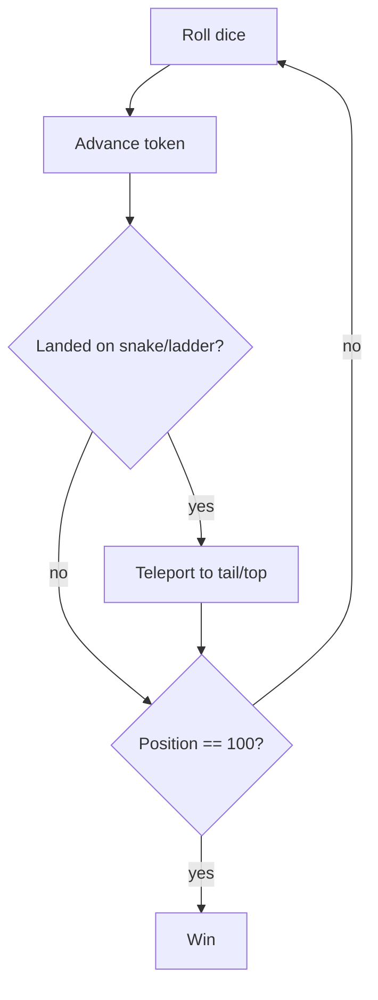

## Why it Matters

- The cleanest demonstration that *chance* changes the design: because the move comes from a dice roll, the player decides nothing, so the interesting seam is the **injectable dice**, which is what makes the game testable at all (a fixed-roll sequence turns a random game into a deterministic assertion).
- The board is not a grid of cells you *occupy*, it is a **number line with jumps**. Modelling it as a 2D array of pieces (like tic-tac-toe) is wrong; the board resolves a landing cell, and that resolution (`position → jump target`) is the whole game logic.
- Infinite loops are a *structural* property, not an edge case: chained jumps (land on a ladder foot whose top is another snake head) can cycle forever, so a cycle guard during resolution is required for termination, not defensive coding.
- It is the reference counter-example for when **not** to apply strategy patterns: the game has no decisions to vary, so a strategy seam is ceremony, and naming that is part of the answer.

## Diagram

![[_attachments/snakeandladder-class-diagram.png]]
*Source: [awesome-low-level-design](https://github.com/ashishps1/awesome-low-level-design) , use alongside the class table above.*
*Runtime flow: roll → move → jump → win check.*

## Code
```java
javaimport java.util.*;

class Board {
 final int size = 100;
 final Map<Integer,Integer> jumps = new HashMap<>(); // snake head OR ladder foot -> dest
 int resolve(int pos) { return jumps.getOrDefault(pos, pos); }
}

class Player { String name; int pos; Player(String n) { name = n; } }

class SnakeLadderDemo {
 final Board board = new Board();
 final List<Player> players = new ArrayList<>();
 final Random dice = new Random();
 int roll() { return dice.nextInt(6) + 1; }

 String playTurn(Player p) {
 int next = p.pos + roll();
 if (next > board.size) return p.name + " overshoots, stays " + p.pos;
 p.pos = board.resolve(next);
 return p.pos == board.size ? p.name + " WINS" : p.name + " -> " + p.pos;
 }
 public static void main(String[] a) {
 SnakeLadderDemo g = new SnakeLadderDemo();
 g.board.jumps.put(16, 6); // snake 16 -> 6
 g.board.jumps.put(4, 25); // ladder 4 -> 25
 g.players.add(new Player("A")); g.players.add(new Player("B"));
 for (int i = 0; i < 6 && g.players.stream().noneMatch(p -> p.pos == 100); i++)
 for (Player p : g.players) { System.out.println(g.playTurn(p)); if (p.pos == 100) break; }
 }
}
```
## When to use / not

**Use when** turn-based progress is driven by chance over a fixed track, snakes & ladders, ludo, monopoly movement, "roll and move" games, board-game engines with dice.
**Use** an injectable dice/RNG seam whenever a random game must be tested deterministically (fixed sequence) or replayed (seeded RNG).
**Use** a `Map<Integer, Integer>` (or array) for jump resolution whenever the domain is "position → effective position" — teleporters, warp tiles, portals, shortcuts.
**Use** a win-condition strategy when the termination rule is a product choice (exact-land vs overshoot-stay vs overshoot-bounce).
**NOT when** players make *decisions* — in a strategy game ([[08_Tic-Tac-Toe|Tic-Tac-Toe]], [[10_Chess-Game|Chess]]) the move is *chosen*, so the seam must be a decision strategy (possibly a bot), not an RNG. This distinction is the whole design.
**NOT when** the board is genuinely spatial and positions are 2D, a 1D number line with jumps is the wrong model for a grid game; a `Position(x,y)` type and a 2D array apply instead.
**NOT when** the game has no turn order or no terminal condition, without alternating turns and a winner, the turn loop and status machine have nothing to do.

## Trade-offs

- **Injectable dice vs `Random` called inline:** injecting a `Dice` interface makes the game deterministic and testable (assert "player lands on the snake"); an inline `Random` is faster to write and untestable. Inject, always, the test is the justification.
- **`Map<Integer,Integer>` vs array indexing:** a map is sparse and readable for a few jumps; a direct `int[]` of size N+1 with 0 for no-jump is faster and cannot hold a jump outside the board.
- **Exact-win vs overshoot rules:** exact-win extends the game and adds bounce/stay variants; overshoot-stay ends faster. Pick one and *state* it, the ambiguity is what makes the win condition a strategy.
- **Single die vs multiple dice (2d6):** the distribution changes game length (a bell curve vs flat 1-6); the model is identical, only the dice strategy differs.
- **Cycle guard cost vs risk:** guarding chained jumps costs a bound on iterations per move (≤ board size); skipping the guard risks an infinite loop on a malformed board. Guarding is cheap insurance, and the loop bound is provable.
- **Resolve-then-check-win vs check-then-resolve:** with chained jumps the *final* position after all jumps is what counts, so resolve fully *then* test the win condition.

## Vs

- **Vs [[08_Tic-Tac-Toe|Tic-Tac-Toe]] / [[10_Chess-Game|Chess]]:** in those games the move is a *chosen* decision, so the seam is a decision strategy (human input or a bot/minimax); in snakes & ladders the move is a *dice roll*, so the seam is a random source. Decision games vs chance games, this single distinction determines the entire interface shape.
- **Vs [[08_Tic-Tac-Toe|Tic-Tac-Toe]] (board model):** tic-tac-toe's board is a grid where cells get *occupied* and blocked; snakes & ladders' board is a track where a position *resolves to another position*. Occupancy grid vs jump function.
- **Vs [[10_Chess-Game|Chess]] (win condition):** chess ends by a *derived condition* (checkmate, a search over legal replies); snakes & ladders ends by a *position test* (cell 100). A search vs a counter check.
- **Vs [[15_Task-Management-System|Task Management System]]:** a task board has legal *transitions* enforced and rejected (TODO → IN_PROGRESS); a game position always advances. Rules that *block* vs rules that *transform*.
- **Vs [[07_Elevator-System|Elevator System]]:** both advance a position by a step count, but an elevator's target is *chosen* by a request while a token's advance is *rolled*. Scheduled movement vs random advance.
- **Vs a dice-utility library:** this is a game *built on* chance with turns, players, and a terminal condition; a dice library is the injectable seam it uses, the two are often conflated, and the game state machine is the difference.

## Pitfalls

- **Infinite loop on chained jumps** — a ladder top landing on another ladder foot (or a snake cycle) resolves forever; resolve in a loop with a *visited guard or a hard iteration bound* (≤ board size), never an unbounded while.
- **`Random` called inside `playTurn`** — the game cannot be tested (an assertion on "lands on a snake" is impossible); inject the dice and drive it with a fixed sequence.
- **Off-by-one on the board** — cell 100 must be reachable and the array sized N+1 (index 0 unused) or the last cell is unreachable; test the boundary explicitly.
- **Applying the jump before the win check** — with chained jumps the *final* resolved position is the candidate; checking for a win at the pre-jump position can declare a false winner or miss a real one.
- **Overshoot rule undefined** — a roll past 100 has no defined outcome (bounce back / stay / ignore) and the game can never end; pick and implement one rule deliberately.
- **Moving a token whose game is over** — a finished game must reject further rolls, or the winner can be overwritten; the status guard belongs in `playTurn`, not the caller.
- **Jump maps built with out-of-range keys** — a snake head at 105 or a ladder top of 0 corrupts resolution; validate jump bounds at construction.
- **Assuming one token per cell** — unlike tic-tac-toe, tokens *may* share a cell (no capture rule here); if a variant adds capture, model it explicitly rather than assuming mutual exclusion.
- **Board modelled as a 2D occupancy grid** — the classic mis-modelling: there are no occupancy constraints, so a grid adds complexity and hides the jump function. The board is a resolver.
- **Turn order broken by concurrency** — for online multiplayer, two rolls moving the same player; guard `playTurn` per game or use a turn queue.

## Interview q&a

- **Snakes and ladders as one map or two?** One `Map<Integer,Integer>` suffices , both are "landing cell → forced destination"; split into two only if rules differ (e.g. snake bite skips next turn).
- **How to test a dice game deterministically?** Inject a `Dice` returning a fixed sequence; assert positions after scripted rolls including a snake, a ladder, and a win.

Snakes and ladders as one map or two?:: One `Map<Integer,Integer>` suffices , both are "landing cell → forced destination"; split into two only if rules differ (e.g. snake bite skips next turn). #flashcard
How to test a dice game deterministically?:: Inject a `Dice` returning a fixed sequence; assert positions after scripted rolls including a snake, a ladder, and a win. #flashcard

## Related

- [[06_Design-Patterns/Structural/Facade\|Facade]], [[06_Design-Patterns/Behavioral/Strategy\|Strategy]], [[02_OOP/SOLID-Open-Closed\|OCP]]
- Source: [awesome-low-level-design](https://github.com/ashishps1/awesome-low-level-design)

# Snake and Ladder

> Part of [[README|Java MOC]] -> [[10_LLD-Machine-Coding/README|LLD MOC]]

## Requirements

- N×N board with numbered cells; 2+ players take turns rolling a 1-6 dice
- Snakes map head→tail (slide down), ladders map foot→top (climb up); maps checked after every move
- Exact-win or overshoot rule (define one); declare winner on reaching cell 100

## Classes & Relationships

| Class | Role | Pattern |
|---|---|---|
| `SnakeLadderGame` | turn loop, win check, facade | [[06_Design-Patterns/Structural/Facade\|Facade]] |
| `Board` | size + snakes/ladders maps, resolves landing cell | , |
| `Player` | name + current position | , |
| `Dice` | `roll()` 1-6 (injectable for tests) | [[06_Design-Patterns/Creational/Strategy\|Strategy]] (roll behavior) |

## Concurrency

Single-threaded turn loop; for online multiplayer guard `playTurn` with a lock or a turn queue so two rolls can't move the same player concurrently.

## Try it Yourself

1. Add exact-win vs overshoot-stay as a `WinStrategy` , swap without touching `playTurn`.
2. Support chained jumps (ladder landing on another ladder foot) with a loop + cycle guard.
3. Make `Dice` injectable (fixed sequence) and write a deterministic test that lands on a snake.
