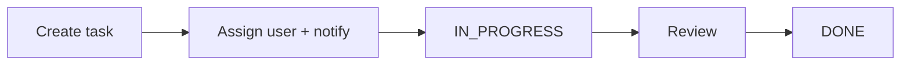

## Why it Matters

- The canonical "state machine is the product" problem: the business rule is *which transitions are legal* (TODO → IN_PROGRESS → DONE), and that rule lives in the domain, not the UI. Encoding it in `setStatus` with a guard makes illegal states unrepresentable; leaving it to the controller makes every client a source of bugs.
- It introduces derived collections: "my tasks", "overdue tasks", "tasks by priority" are *projections* over one store, not separate lists. Maintaining them by hand is where consistency rots; computing them (or indexing them explicitly) is the design decision.
- Notifications are a side effect of state, and separating them (Observer) is what keeps the domain model honest, a status change must not fail because an email gateway is down, and a notification must not be the reason the status didn't save.
- It is the reference point for *administrivia* systems: everything boring and valuable about real software (audit history, assignments, filtering, permissions) shows up here without distracting algorithmic difficulty.

## Diagram

![[_attachments/taskmanagement-class-diagram.png]]
*Source: [awesome-low-level-design](https://github.com/ashishps1/awesome-low-level-design) , use alongside the class table above.*
*Runtime flow: task lifecycle with notify on assign/status.*

## Code
```java
javaimport java.util.*;
import java.util.stream.*;

enum Priority { LOW, MEDIUM, HIGH }
enum Status { TODO, IN_PROGRESS, DONE }

class User { String id, name; User(String id, String n) { this.id = id; name = n; } }

class Task {
 final String id, title; Priority priority; Status status = Status.TODO; User assignee;
 Task(String id, String t, Priority p) { this.id = id; title = t; priority = p; }
 void assign(User u) { assignee = u; System.out.println("notify " + u.name + ": " + title); }
}

class TaskManagerDemo {
 final Map<String, Task> tasks = new HashMap<>();
 void create(String id, String t, Priority p) { tasks.put(id, new Task(id, t, p)); }
 void assign(String id, User u) { tasks.get(id).assign(u); }
 void setStatus(String id, Status s) {
 Task t = tasks.get(id);
 t.status = s;
 if (t.assignee != null) System.out.println("notify " + t.assignee.name + ": " + t.title + " -> " + s);
 }
 List<Task> byAssignee(User u) {
 return tasks.values().stream().filter(t -> u.equals(t.assignee)).collect(Collectors.toList());
 }
 public static void main(String[] a) {
 TaskManagerDemo m = new TaskManagerDemo();
 User dev = new User("u1", "Ada");
 m.create("t1", "Ship LLD notes", Priority.HIGH);
 m.assign("t1", dev); m.setStatus("t1", Status.IN_PROGRESS);
 m.setStatus("t1", Status.DONE);
 System.out.println("Ada's tasks: " + m.byAssignee(dev).size());
 }
}
```
## When to use / not

**Use when** work items move through defined states with owners and rules, task/issue trackers, ticketing, order fulfilment, approval workflows, helpdesk, content publishing pipelines.
**Use** a state machine with explicit legal transitions whenever an illegal transition is a real bug (DONE → TODO, or skipping IN_PROGRESS); guards in the domain are the fix.
**Use** an observer for notifications whenever a status change must notify without being coupled to delivery.
**Use** a repository/index layer when filtering by attribute (assignee, status, priority, due date) is a first-class requirement.
**NOT when** state has no rules, a free-form note can be edited to any value at any time; a state machine there is ceremony, and a plain CRUD record is correct.
**NOT when** the item has no ownership or assignment dimension, without an owner, the notification observer and the assignment model are dead weight.
**NOT when** the lifecycle is trivially linear with no rejection, a two-step flow (pending → done) needs a boolean, not an enum machine.
**NOT when** the workflow is document-shaped with branching, parallel branches, and versioning, that needs a proper workflow/BPMN engine, not a status enum.

## Trade-offs

- **Guard in `setStatus` vs state pattern:** a transition table in `setStatus` (`Set<Pair<Status,Status>>` or a `Map`) is simple and readable for a handful of rules; the State pattern scales to per-state behaviour (different notifications, different available actions) but adds a class per status. Choose by rule count, not by pattern habit.
- **Computed views vs maintained indexes:** computing "tasks for user X" by scanning is always consistent and O(n); maintaining per-user lists gives O(1) reads but must be updated on every assign/reassign under the same lock. Match to scale and say the trade-off.
- **Push notifications vs polling:** push (Observer) is immediate and couples domain to delivery; polling decouples completely and adds latency and load. Real systems push with a retry queue, never a synchronous email inside `setStatus`.
- **`synchronized` vs `ConcurrentHashMap` + per-task lock:** a single lock serialises all task updates; per-task locks scale but a reassignment touches two users' views, so the lock must cover the whole reassignment, not just the task.
- **In-memory store vs database:** in-memory is fast and lost on restart; a DB adds persistence, transactions, and query indexing, and the "index" question becomes a SQL `WHERE`, which is the honest answer at scale.
- **Audit history as events vs snapshot:** an append-only event log (assigned, status-changed) gives full audit and undo for free; storing only the current state is cheaper and unauditable.
- **Priority as enum vs numeric:** enum is type-safe and fixed; numeric allows arbitrary sorting and tie-breaking but needs validation.

## Vs

- **Vs [[16_Traffic-Signal-Control|Traffic Signal Control]]:** both are state machines, but traffic transitions are *timer-driven and perpetual* — the cycle never ends; task transitions are *event-driven and terminal* — every task reaches DONE and stops. Perpetual cycle vs terminating lifecycle.
- **Vs [[08_Tic-Tac-Toe|Tic-Tac-Toe]]:** a game has a *win condition* and a terminal state reached by rules; a task board has *legal transitions* but no victory, the goal is completion of each item, not defeating an opponent. Terminal-by-rules vs terminal-by-completion.
- **Vs [[05_ATM|ATM]]:** the ATM's states are *session-scoped* and reset on eject; a task's lifecycle is *persistent* and outlives any user session. Session state machine vs durable workflow.
- **Vs [[04_Stack-Overflow|Stack Overflow]]:** Stack Overflow's reputation is *derived from community votes* and never settles; a task's status is *set by an actor* and converges to DONE. Emergent score vs assigned status.
- **Vs [[15_Task-Management-System|Jira/kanban board]]:** this model is the engine; a kanban board is the *projection* of that engine by status column. The board is a view, not a separate model, conflating them is why hand-rolled boards drift from the data.
- **Vs a plain CRUD list:** CRUD has no transition rules, no derived views, and no notification side effects; the state machine and the observer are the entire value-add, and they are what the interviewer is grading.

## Pitfalls

- **Illegal transitions allowed** — DONE → TODO silently corrupts reporting and audit; validate transitions in the domain and throw, never trust the client.
- **Lost updates on assign/status from concurrent clients** — read-modify-write without a lock: two clients both edit v3 and one change vanishes. Lock the task (or use version/CAS).
- **Notification inside the domain transaction** — an SMTP failure rolls back the status change, or a slow gateway degrades the API; notifications must be async and best-effort, never on the critical path.
- **Turn stored in two places** — `assignee` on the task *and* a task list per user; they drift, and "my tasks" stops matching reality. Single source of truth, derived view.
- **Reassign not updating the old assignee's view** — removing from the new user's list while leaving the old user's; a reassignment touches two views atomically, and forgetting the second is the classic bug.
- **No audit history** — who changed status and when is unanswerable; append events, don't just overwrite fields.
- **`NULL` assignee unhandled** — unassigned tasks must appear in a defined view, not vanish from all lists; model "unassigned" explicitly.
- **Status enum leaking into the UI as magic strings** — string comparisons ("DONE".equals(...)) break silently on rename; use the enum everywhere.
- **Filters that scale poorly** — scanning every task per query is fine at 10k and fatal at 10M; index the hot query paths (assignee, status) rather than apologising later.
- **Reopen implemented as a new task vs a transition** — reopening a DONE task is either a legal transition or a new linked task; pick one model, or reporting double-counts.

## Interview q&a

- **How to prevent illegal status jumps?** Encode transitions in the `Status` enum (`allowedNext()`) so the rule lives in one place , adding a state can't silently break callers.
- **Notify on assignment vs status change?** Both go through one `notify()` path ([[06_Design-Patterns/Behavioral/Observer\|Observer]]); the manager never hardcodes email/push , subscribers decide.

How to prevent illegal status jumps?:: Encode transitions in the `Status` enum (`allowedNext()`) so the rule lives in one place , adding a state can't silently break callers. #flashcard
Notify on assignment vs status change?:: Both go through one `notify()` path ([[06_Design-Patterns/Behavioral/Observer\|Observer]]); the manager never hardcodes email/push , subscribers decide. #flashcard

## Related

- [[06_Design-Patterns/Creational/Singleton\|Singleton]], [[06_Design-Patterns/Behavioral/Observer\|Observer]], [[02_OOP/SOLID-Single-Responsibility\|SRP]]
- Source: [awesome-low-level-design](https://github.com/ashishps1/awesome-low-level-design)

# Task Management System

> Part of [[README|Java MOC]] -> [[10_LLD-Machine-Coding/README|LLD MOC]]

## Requirements

- Users own/assignee tasks with title, priority (LOW/MED/HIGH), status (TODO → IN_PROGRESS → DONE)
- Assign/reassign tasks, update status and priority, filter by assignee/status/priority
- Notify assignee on assignment and on status change

## Classes & Relationships

| Class | Role | Pattern |
|---|---|---|
| `TaskManager` (singleton) | create/assign/update/filter facade | [[06_Design-Patterns/Creational/Singleton\|Singleton]], [[06_Design-Patterns/Structural/Facade\|Facade]] |
| `Task` | title, priority, status, assignee; observes assignment | [[06_Design-Patterns/Behavioral/Observer\|Observer]] (notification) |
| `User` | id, name, task list | , |
| `Priority` / `Status` enums | LOW/MED/HIGH; TODO/IN_PROGRESS/DONE | , |

## Concurrency

Synchronize `assign`/`setStatus` (or use `ConcurrentHashMap` + per-task lock) , assignment and status updates from two clients must not interleave into a lost update.

## Try it Yourself

1. Enforce legal transitions (TODO → IN_PROGRESS → DONE only) , reject DONE → TODO with an exception.
2. Add due-date + overdue query without touching `Task` (hint: decorator or filter method on the manager).
3. Add comment history per task; cap it and keep `assign`/`setStatus` thread-safe.
