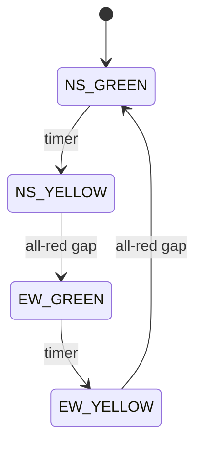

## Why it Matters

- The canonical *safety-by-construction* problem: the invariant is a negative one, never green on both axes, and the design's whole job is to make that state *unrepresentable* rather than merely avoided by careful code. A single mutual-exclusion bug here is a crash, not a degraded UX.
- It makes the distinction between *mode* and *value* sharp: which axis is green is a mode (a State object), and the lamp colours are values derived from it. Updating lamps directly from a timer callback, bypassing the state, is how dual-green happens.
- It is the rare LLD problem where **timers are the driver**, not events: correctness depends on a scheduler thread advancing phases, so the concurrency model (who may write the lamps, and when) is the design rather than an add-on.
- Emergency override is the classic case where a feature request is actually a *priority inversion*: preemption must be safe under any current phase, which is exactly what a well-modelled state transition gives you and an ad-hoc flag does not.

## Diagram

![[_attachments/trafficcontrol-class-diagram.png]]
*Source: [awesome-low-level-design](https://github.com/ashishps1/awesome-low-level-design) , use alongside the class table above.*
*Runtime flow: 4-state cycle, dual-green unrepresentable.*

## Code
```java
javaimport java.util.*;

enum Lamp { RED, YELLOW, GREEN }

interface SignalState { void enter(TrafficDemo c); SignalState next(); }

class TrafficDemo {
 Lamp ns = Lamp.GREEN, ew = Lamp.RED;
 void show() { System.out.println("NS=" + ns + " EW=" + ew); }

 static class NSGreen implements SignalState {
 public void enter(TrafficDemo c) { c.ns = Lamp.GREEN; c.ew = Lamp.RED; }
 public SignalState next() { return new NSYellow(); }
 }
 static class NSYellow implements SignalState {
 public void enter(TrafficDemo c) { c.ns = Lamp.YELLOW; c.ew = Lamp.RED; }
 public SignalState next() { return new EWGreen(); }
 }
 static class EWGreen implements SignalState {
 public void enter(TrafficDemo c) { c.ns = Lamp.RED; c.ew = Lamp.GREEN; }
 public SignalState next() { return new EWYellow(); }
 }
 static class EWYellow implements SignalState {
 public void enter(TrafficDemo c) { c.ns = Lamp.RED; c.ew = Lamp.YELLOW; }
 public SignalState next() { return new NSGreen(); }
 }
 public static void main(String[] a) {
 TrafficDemo c = new TrafficDemo();
 SignalState s = new NSGreen();
 for (int i = 0; i < 4; i++) { s.enter(c); c.show(); s = s.next(); }
 }
}
```
## When to use / not

**Use when** mutually exclusive access to a shared resource is granted in phases over time, traffic intersections, railway signals, shared-lane tunnel control, automated gates, any timed-arbitration device.
**Use** a per-phase state object whenever the set of legal next-phases differs per phase (yellow after green, never green after green).
**Use** a scheduler thread with a `volatile`/atomic phase reference whenever transitions are timer-driven and a hard-real-time override must preempt them.
**NOT when** there is no mutual exclusion requirement, two independent lights on separate corridors with no shared conflict need no shared state machine; modelling them as one intersection is over-engineering.
**NOT when** phases are event-driven rather than timer-driven (a conveyor that advances per item), a timer/scheduler is the wrong driver; an event loop applies.
**NOT when** the control must be certified safety-critical: this model is an *application-layer* design; certified PLC-level interlock hardware with redundancy and failsafe defaults is a different problem and should be named out of scope.
**NOT when** arbitration is not spatial, scheduling CPU or tasks is priority-based, not phase-based; a traffic model is the wrong metaphor.

## Trade-offs

- **State pattern vs a `switch` on a phase enum:** states make illegal transitions unrepresentable (no green→green edge exists in the type system); a switch is compact but must be edited per new phase and can be written to allow illegal edges. Safety-critical → state pattern.
- **One controller vs one per intersection:** a single controller for a corridor keeps coordination (green waves) simple but serialises all intersections; per-intersection controllers parallelise and need a coordination protocol for green waves.
- **Timed transitions vs sensor-driven:** fixed timers are simple and predictable but waste green time on an empty road; sensor/adaptive control (induction loops, cameras) optimises throughput at the cost of sensor trust and failure handling.
- **Central scheduler vs per-signal timers:** one scheduler thread is easy to reason about and a single point of failure; per-signal timers parallelise and drift.
- **Emergency preemption via interrupt flag vs a dedicated state:** an interrupt flag is minimal and must be checked on every transition (a missed check shows dual-green); a dedicated `EmergencyState` makes preemption a first-class transition that resumes the cycle correctly.
- **Fixed-cycle vs demand-aware:** a fixed cycle is fair by construction and indifferent to traffic; demand-aware control serves actual queues and can starve a low-traffic axis without a minimum-green guard.
- **Blocking sleep vs scheduled executor:** `Thread.sleep` in the run loop is simple and inaccurate under load; a `ScheduledExecutorService` is precise, testable, and supports cancellation for preemption.

## Vs

- **Vs [[05_ATM|ATM]]:** the ATM's states are *session-scoped* and terminate on eject; traffic phases are *perpetual* and cycle forever with no terminal state. Terminating session machine vs infinite cycle machine.
- **Vs [[15_Task-Management-System|Task Management System]]:** a task transitions *event-driven* toward a terminal DONE; a signal transitions *timer-driven* and never terminates. The distinction is what drives transitions, user events vs a clock.
- **Vs [[02_Vending-Machine|Vending Machine]]:** both are state machines, but the vending machine's transitions are *triggered by user actions* and terminate; traffic's are *triggered by time* and loop. A stalled transaction is a lost sale; a stalled signal is a traffic jam or a crash.
- **Vs [[07_Elevator-System|Elevator System]]:** both own spatial state and move through phases, but an elevator is a *dedicated* cabin with no mutual exclusion on its shaft, while an intersection *arbitrates conflicting access* between two axes. Scheduling vs safety arbitration is the axis.
- **Vs [[12_Movie-Ticket-Booking|Movie Ticket Booking]]:** booking holds a *specific seat* exclusively among many; traffic grants *temporary* access to a shared lane to one axis at a time. Exclusive ownership vs time-shared access.
- **Vs a mutex/semaphore:** a mutex is a traffic light in software, it grants mutual exclusion with no timing guarantees; a signal controller adds *fairness and timing policy* (yellow clearance, minimum green) on top of the same exclusion. The mutex is the primitive; this is the policy.

## Pitfalls

- **Dual-green** — the namesake failure: two axes green at once. Cause is always a direct lamp write bypassing the state transition, or a transition added without a yellow clearance. Fix: lamps are derived from state, and the only writer is the state machine.
- **No yellow clearance** — green-to-green or green-to-red with no yellow gives drivers no reaction time and is a design defect, not an optimisation; the clearance phase is mandatory, not optional.
- **Lamps mutated directly by the timer callback** — `signal.setGreen()` from a timer task outside the state machine; the phase reference and the lamps diverge, and divergence here means a crash. One writer, always through `next()`.
- **Emergency override racing with a phase transition** — preemption set while a transition is mid-flight can skip the yellow clearance; the preemption must be a state transition that cannot bypass clearance, or applied atomically with the current phase.
- **`Thread.sleep` used for timing** — inaccurate and non-cancellable, so preemption cannot interrupt it; use a scheduled executor or a wait/notify on a cancellation-aware monitor.
- **Visibility of the phase across threads** — the scheduler thread writes the phase; reader threads (sensors, monitoring) can cache a stale value indefinitely without `volatile` or atomic semantics; a stale read is a safety bug here.
- **Minimum green not enforced** — a sensor or pedestrian request that can cut a phase to zero leaves a turning queue stranded; minimum durations are a safety rule, encode them.
- **Pedestrian phase inserted mid-cycle** — inserting an all-red crossing at an arbitrary point can leave the cycle in an inconsistent phase; the crossing must be a transition with clearance before and after.
- **No failure-safe default** — on sensor failure or crash the safe state is all-red (or flashing yellow), never "last lamp stays"; a controller that fails green is a liability.
- **One lock for all intersections** — a global controller lock serialises a whole city's junctions; lock per intersection and coordinate by protocol for green waves.

## Interview q&a

- **Why State over a timer + if-else on an enum?** Each phase owns its lamp settings and successor; adding a phase (all-red clearance) touches one class, and dual-green becomes unrepresentable.
- **Where does the timer live?** The controller schedules; states only declare duration + next , so timing policy and transition logic change independently.

Why State over a timer + if-else on an enum?:: Each phase owns its lamp settings and successor; adding a phase (all-red clearance) touches one class, and dual-green becomes unrepresentable. #flashcard
Where does the timer live?:: The controller schedules; states only declare duration + next , so timing policy and transition logic change independently. #flashcard

## Related

- [[06_Design-Patterns/Behavioral/State\|State]], [[06_Design-Patterns/Creational/Singleton\|Singleton]], [[02_OOP/SOLID-Open-Closed\|OCP]]
- Source: [awesome-low-level-design](https://github.com/ashishps1/awesome-low-level-design)

# Traffic Signal Control

> Part of [[README|Java MOC]] -> [[10_LLD-Machine-Coding/README|LLD MOC]]

## Requirements

- Intersection of NS and EW roads, each with RED/YELLOW/GREEN signals , never green on both axes
- Timer-based transitions: NS-green → NS-yellow → EW-green → EW-yellow → repeat
- Emergency override forces one axis green; pedestrian request shortens the cycle safely

## Classes & Relationships

| Class | Role | Pattern |
|---|---|---|
| `IntersectionController` (singleton) | owns signals, runs the cycle | [[06_Design-Patterns/Creational/Singleton\|Singleton]] |
| `SignalState` / `NSGreenState` / `EWGreenState` / yellow states | per-phase timer + next transition | [[06_Design-Patterns/Behavioral/State\|State]] |
| `TrafficSignal` | one direction's RED/YELLOW/GREEN lamp | , |
| `Direction` enum | NS / EW | , |

## Concurrency

One scheduler thread advances states; signal reads are volatile/atomic , emergency override preempts via an interrupt flag, never by mutating lamps directly.

## Try it Yourself

1. Add durations per state (NS-green 30s, yellow 5s) with a `ScheduledExecutorService` driving `next()`.
2. Add `emergency(Direction)` , force that axis green, then resume the cycle without ever showing dual-green.
3. Add pedestrian `requestCrossing()` that inserts an all-red clearance before the next green.
