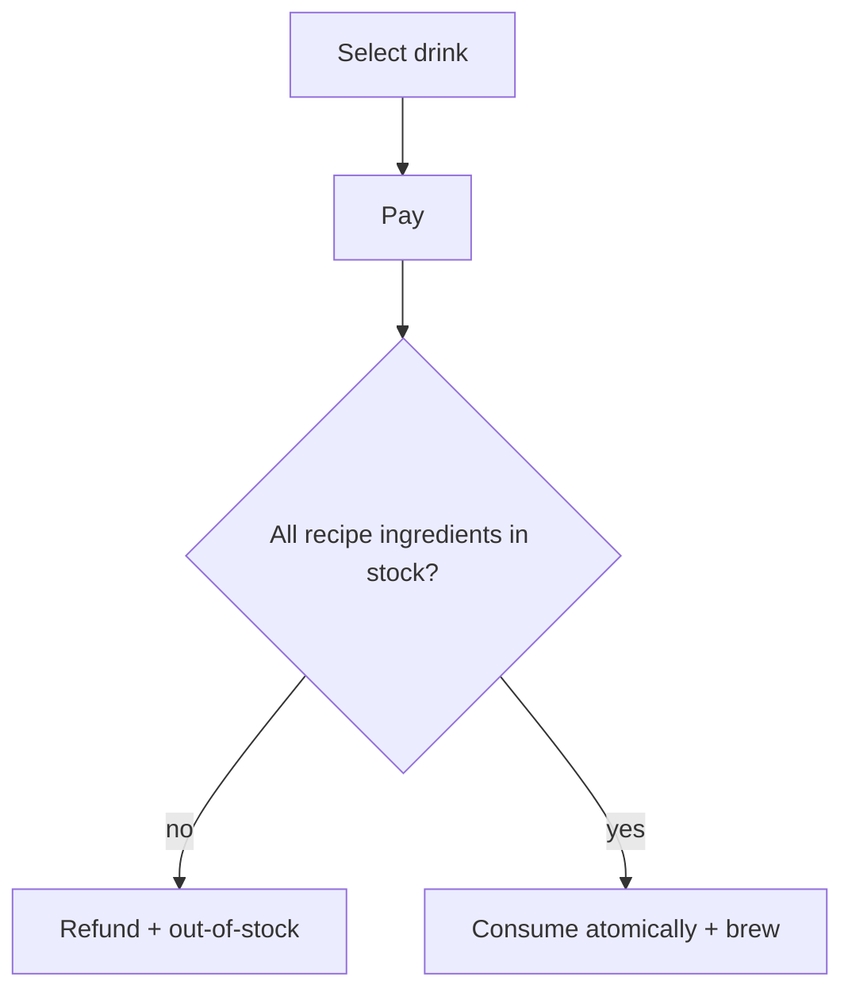

## Why it Matters

- The canonical **multi-resource atomicity** problem: one brew decrements *several* ingredient stocks at once (water + milk + beans), so partial failure means a cup poured with no milk, an undrinkable product that still consumed inventory. Check-then-act across ingredients must be one unit.
- It is the clean demonstration that recipes are *data*, not code: a new drink is a `Recipe` entry, a map of ingredient quantities, and the machine never changes. That is [[02_OOP/SOLID-Open-Closed|OCP]] in a form you can point at in 10 lines.
- It shows where a state machine is *not* the answer: the interesting variation here is not transitions but *behaviour* (payment method, recipe), so Strategy is the right pattern, and reaching for State here is the over-engineering the interviewer is probing for.
- Payment and fulfilment are separable concerns that must still be coordinated: charge before brew, refund on failure, and never brew a drink whose ingredients were already consumed by a failed charge.

## Diagram

![[_attachments/coffeevending-class-diagram.png]]
*Source: [awesome-low-level-design](https://github.com/ashishps1/awesome-low-level-design) , use alongside the class table above.*
*Runtime flow: recipe gates brewing on all ingredients.*

## Code
```
javaimport java.util.*;

class Inventory {
 final Map<String, Integer> stock = new HashMap<>();
 synchronized boolean consume(Map<String, Integer> need) {
 for (var e : need.entrySet())
 if (stock.getOrDefault(e.getKey(), 0) < e.getValue()) return false;
 for (var e : need.entrySet()) stock.merge(e.getKey(), -e.getValue(), Integer::sum);
 return true;
 }
}

class Recipe {
 final String name; final int price; final Map<String, Integer> need;
 Recipe(String n, int p, Map<String,Integer> need) { name = n; price = p; this.need = need; }
}

class CoffeeDemo {
 final Inventory inv = new Inventory();
 final Map<String, Recipe> menu = new HashMap<>();
 synchronized String brew(String drink, int paid) {
 Recipe r = menu.get(drink);
 if (r == null) return "unknown drink";
 if (paid < r.price) return "need " + (r.price - paid);
 if (!inv.consume(r.need)) return "out of ingredients, refund " + paid;
 return "brewed " + drink + ", change " + (paid - r.price);
 }
 public static void main(String[] a) {
 CoffeeDemo m = new CoffeeDemo();
 m.inv.stock.putAll(Map.of("water", 500, "milk", 300, "beans", 100));
 m.menu.put("espresso", new Recipe("espresso", 30, Map.of("water", 50, "beans", 15)));
 m.menu.put("latte", new Recipe("latte", 50, Map.of("water", 50, "milk", 100, "beans", 10)));
 System.out.println(m.brew("latte", 40)); // need 10
 System.out.println(m.brew("latte", 60)); // brewed, change 10
 System.out.println(m.brew("espresso", 30));
 }
}
```
## When to use / not

**Use when** a product is assembled from a combination of consumable resources, each with its own stock level, vending machines, soda fountains with syrups, paint/chemical mixing, recipe-driven manufacturing, restaurant kitchen order fulfilment.
**Use** a recipe-as-data model whenever new products must be added without code changes.
**Use** a strategy seam for payment whenever cash/card/coupon/wallet differ in charge and refund logic.
**NOT when** the product is a single discrete item, a snack vending machine has a count per item, no combination, and no multi-resource atomicity; the ingredient model is dead weight there (see [[02_Vending-Machine|Vending Machine]]).
**NOT when** stock is effectively unbounded or replenished instantly, the whole value of the check-then-consume atomicity evaporates if nothing can run out.
**NOT when** recipes are genuinely one-of-a-kind per order (a bespoke kitchen), a data-driven recipe table adds nothing if every order is custom; model it as a bill of materials per order instead.
**NOT when** fulfilment is asynchronous and long-running (a barista calling your name), a synchronous brew-and-charge model is wrong; a ticket/queue model applies.

## Trade-offs

- **Recipe-as-data vs per-drink class:** a data table (ingredient → qty) makes new drinks additive with zero code and is trivially reconfigurable; a class per drink encapsulates per-drink *process* (brew steps, timing) but must be edited and redeployed per product. Choose by whether drinks differ in *quantities* or in *process*.
- **Check-then-consume in one lock vs optimistic reservation:** one `synchronized` brew is simple and obviously correct at interview scale; optimistic reservation (reserve, charge, commit) scales but needs a compensating release on failure.
- **Payment before vs after brew:** charging first prevents theft but requires refund-on-failure; brewing first risks a wasted cup and an unpaid charge. The defensible order is validate stock → charge → consume → brew, with refund on any failure after the charge.
- **Synchronous brew vs queued brew:** synchronous answers immediately and blocks the caller for the brew duration; a queue decouples and smooths peaks but adds ordering and idempotency concerns.
- **Per-ingredient stock vs aggregated "can make" flag:** per-ingredient counts enable precise reporting and per-ingredient low-stock alerts; a derived boolean hides which ingredient is short and blocks restock prioritisation.
- **In-memory inventory vs persisted:** in-memory is fast and lost on reboot; persisted stock survives restarts and enables reconciliation against actual machine telemetry.
- **Restock by report vs sensor-driven:** manual refill entries are simple and trust the operator; sensor/telemetry-driven counts are accurate and add a sensor-failure trust problem.

## Vs

- **Vs [[02_Vending-Machine|Vending Machine]]:** generic vending models *discrete items* with a count (decrement one); the coffee machine models *ingredient combinations* decremented together (water + milk + beans). Single-stock decrement vs multi-resource atomic transaction.
- **Vs [[05_ATM|ATM]]:** the ATM *dispenses* its own inventory (cash denominations) and debits a remote ledger; the coffee machine *consumes* internal ingredients to produce a product. The ATM's cash is both product and payment; here they are separate.
- **Vs [[01_Parking-Lot|Parking Lot]]:** parking *occupies and releases* a reusable spot; a brew permanently *consumes* ingredients that must be restocked. Reusable resource vs consumable resource.
- **Vs [[12_Movie-Ticket-Booking|Movie Ticket Booking]]:** booking *holds then confirms* a specific seat with a timeout; brewing has no hold phase, stock is consumed atomically and cannot be "released" back mid-transaction.
- **Vs [[11_Splitwise|Splitwise]]:** Splitwise records *who owes whom* (deferred obligation) with no inventory; the coffee machine moves ingredients and money immediately.
- **Vs a recipe/ERP system:** the ERP owns recipes and bills of materials as *planning* data; this machine *executes* them against live stock. Planning model vs execution model, the two share the recipe concept and differ in the atomicity requirement.

## Pitfalls

- **Overselling ingredients** — `hasEnough` checked outside the lock, then consumed inside: two concurrent brews both see 200ml milk and both take 150ml. The check and the decrement must be one atomic unit, always.
- **Partial brew on stockout mid-recipe** — decrementing per-ingredient as you go and failing on the third leaves water and milk gone with no coffee; validate *all* ingredients first, consume *all*, then brew, with refund on any failure.
- **Charge before stock validation** — charging and then discovering "out of beans" forces a refund path; validate stock first, then charge, then consume.
- **Refund without releasing stock** — a failed brew after consumption must not both refund *and* keep the consumed ingredients; each failure path must state which side is authoritative.
- **Recipe hardcoded in the machine** — an `if (drink == LATTE)` chain means a new drink edits the machine (OCP violation); the recipe table is the design, the machine is the executor.
- **Mutable recipe used as working state** — decrementing the recipe's quantities instead of the inventory corrupts every future brew of that drink; recipes are immutable inputs, inventory is the mutable state.
- **Restock racing with brew** — a restock that reads-modifies-writes stock concurrently with a brew still oversells; restock must take the same lock as consume.
- **No low-stock alerting** — a machine that silently runs out mid-order is a field-service problem; the observer threshold is part of the design, and it must fire after the brew under the same lock.
- **Integer units vs floating-point** — millilitres as `double` drift; use integer units (ml as int) or `BigDecimal`, exactly as in any money or measurement problem.
- **One shared lock vs per-ingredient locks** — a single lock serialises all brews; per-ingredient locks parallelise but a multi-ingredient brew must acquire all without deadlock (lock ordering), and the complexity is rarely worth it at interview scale.

## Interview q&a

- **How is this different from a plain Vending Machine?** Stock is multi-ingredient recipes, not per-item counts , one brew touches N inventories atomically; see [[02_Vending-Machine\|Vending Machine]] for the state-machine half.
- **Adding a drink , what changes?** Only a new `Recipe` ([[06_Design-Patterns/Behavioral/Strategy\|Strategy]]); the machine is closed for modification , [[02_OOP/SOLID-Open-Closed\|OCP]].

How is this different from a plain Vending Machine?:: Stock is multi-ingredient recipes, not per-item counts , one brew touches N inventories atomically; see [[02_Vending-Machine\|Vending Machine]] for the state-machine half. #flashcard
Adding a drink , what changes?:: Only a new `Recipe` ([[06_Design-Patterns/Behavioral/Strategy\|Strategy]]); the machine is closed for modification , [[02_OOP/SOLID-Open-Closed\|OCP]]. #flashcard

## Related

- [[02_Vending-Machine\|Vending Machine]], [[06_Design-Patterns/Behavioral/Strategy\|Strategy]], [[06_Design-Patterns/Behavioral/Observer\|Observer]]
- Source: [awesome-low-level-design](https://github.com/ashishps1/awesome-low-level-design)

# Coffee Vending Machine

> Part of [[README|Java MOC]] -> [[10_LLD-Machine-Coding/README|LLD MOC]]

## Requirements

- Recipe-based specialization of vending: each drink (espresso, latte, cappuccino) is a `Recipe` of ingredient quantities
- Ingredients inventory (water, milk, beans, sugar) decremented atomically per brew; reject when short
- Payment before brew, refund on cancel/failure; restock ingredients

## Classes & Relationships

| Class | Role | Pattern |
|---|---|---|
| `CoffeeMachine` (singleton) | brew facade over inventory + recipes | [[06_Design-Patterns/Creational/Singleton\|Singleton]], [[06_Design-Patterns/Structural/Facade\|Facade]] |
| `Recipe` (strategy) | per-drink ingredient map + brew steps | [[06_Design-Patterns/Behavioral/Strategy\|Strategy]] |
| `IngredientsInventory` | stock counts, `hasEnough`/`consume`/`restock` | , |
| `Payment` | cash/card charge + refund | [[06_Design-Patterns/Behavioral/Strategy\|Strategy]] (payment) |

## Concurrency

Synchronize `brew`/`consume` , stock check + decrement must be atomic or two concurrent brews oversell milk.

## Try it Yourself

1. Add a new drink (cappuccino) purely as a `Recipe` entry , no machine code changes; verify OCP holds.
2. Add low-stock alert via Observer when any ingredient drops below threshold after a brew.
3. Make payment a `PaymentStrategy` (cash vs card) so refund logic differs without touching `brew`.
