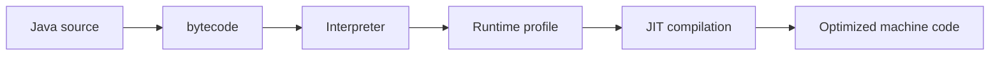

# JIT and Profiling

## Intent

Understand why Java performance changes after warmup and how to measure CPU, allocation, locks, I/O and compiler behavior.

## Mental Model

The JIT can optimize based on observed behavior. A microbenchmark that ignores warmup, forks, dead-code elimination, or measurement noise can produce misleading conclusions.

## Tools

- JFR for broad production-safe event capture.
- async-profiler or equivalent for CPU/allocation investigation when available.
- JMH for microbenchmarks.
- jcmd/jstack/jmap-era commands where appropriate; prefer modern jcmd workflows.

## Questions Before Optimizing

- Is the bottleneck CPU, allocation, lock contention, I/O, GC, or downstream latency?
- Is the problem average latency or tail latency?
- Is the workload warmed up?
- Is the benchmark representative?

## Practice

- [ ] Write a JMH benchmark for one Java operation.
- [ ] Compare allocation-heavy and allocation-light implementations.
- [ ] Use JFR to explain one CPU or allocation hotspot.
