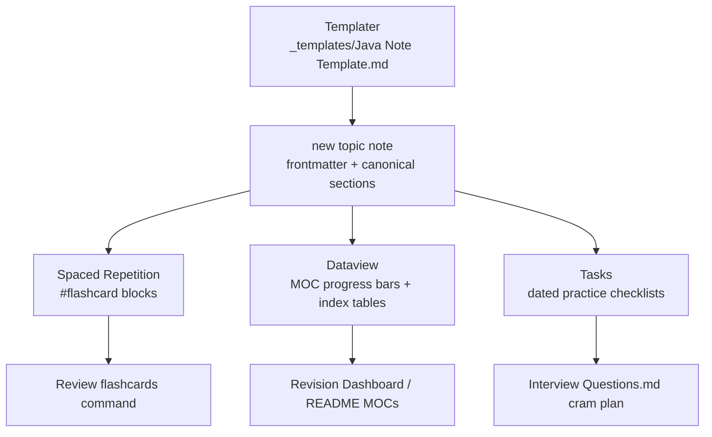

## Why it Matters

This note is the **operating manual** for the vault's revision toolchain: Dataview, Spaced Repetition, Templater, and Tasks. Without it the progress bars, flashcard drills, and dated checklists in every topic note are invisible configuration, and a broken plugin install silently degrades the whole study loop.

## Diagram



## Code

```yaml

## When to use / NOT

| Use | NOT |
|-----|-----|
| Re-run after a fresh vault clone or a plugin upgrade | Memorise the commands, bookmark this page instead |
| Debug a missing progress bar or an empty flashcard queue | Edit `_templates/` mid-revision, layout changes break existing notes |

## Trade-offs

- ✅ One templated structure across 151 notes means every note is drillable, indexable, and progress-tracked.
- ❌ Plugin-dependent: an Obsidian or plugin update can silently change Dataview query behaviour.

## Vs

| | Spaced Repetition | Tasks | Dataview |
|--|-------------------|-------|----------|
| Purpose | long-term recall | dated to-dos | live indexes and progress |
| Trigger | `#flashcard` lines | `- [ ] ... ⏳ date` | `dataview` code blocks |
| Output | `Review flashcards` drill | `tasks` query pane | rendered tables inline |

## Pitfalls

- **Template folder not set**, Templater prompts on every new note; set Settings → Templater → Template folder location → `_templates` once.
- **Line-wrapped flashcards**, the `` block needs one `Question:: answer #flashcard` per line; wrapped cards are skipped silently.
- **Bad YAML hides a note everywhere**, one stray colon in frontmatter drops it from all Dataview tables, not just one.
- **Disabling a plugin leaves dead blocks**, `dataview`/`tasks` queries render as plain text; re-enable or replace them.

## Interview Q&A

**Q: Why spaced repetition over rereading?** Rereading feels productive but decays fast; SR schedules each card just before you would forget it, so the same minutes buy far better retention.

**Q: Why does the vault keep Q&A in each topic note instead of one bank?** Single source of truth: each card sits beside its diagram and code, and `Interview Questions.md` only indexes, so a topic edit never orphans its cards.

## Related

- [[99_Revision/README|Revision MOC]] • [[99_Revision/Study Plan|Study Plan]] • [[99_Revision/Interview Questions|Interview Questions]]
- [[README|Java MOC]]

# Interactive setup , plugins and commands

> Part of [[README|Java MOC]] • [[99_Revision/README|Revision MOC]]

## Installed community plugins

| Plugin | Version | What it powers |
|---|---|---|
| Dataview | existing | MOC progress bars, revision dashboard, index tables |
| Spaced Repetition | 1.15.4 | `#flashcard` review across all 151 topic notes |
| Templater | 2.25.0 | `_templates/Java Note Template.md` scaffolding |
| Tasks | 8.4.0 | Dated checklist queries in revision and topic notes |

Core plugins enabled: Canvas (`[[Curriculum Map]]`), Random note, Slides.

## Commands to use

- `Spaced Repetition: Review flashcards` for daily drill.
- `Templater: Create new note from template` for new topic notes.
- `Open random note` for surprise revision picks.
- `Start presentation` on any note for whiteboard practice.
- Tasks queries render automatically in `99_Revision/Interview Questions.md` and templated notes.

## Verify after Obsidian reload

1. Open Settings → Community plugins and confirm all four show as enabled. If Obsidian asks to trust, accept.
2. Open `[[Curriculum Map]]` and confirm folder cards link to each README.
3. Open any topic note and run flashcard review. Due cards should appear.
4. Templater: Settings → Template folder location → `_templates`. Set it once.

## Files changed 2026-09-04

- `.obsidian/community-plugins.json` plus `plugins/` folders for the three new plugins.
- `.obsidian/core-plugins.json` enables random note and slides.
- `_templates/Java Note Template.md` rewritten for Templater with tasks and SR.
- 109 topic notes gained `` flashcard blocks (151 of 151 topic notes now covered).
- `99_Revision/Interview Questions.md` gained dated cram tasks, progress bar, and review tips.
- `99_Revision/README.md` How to use documents the new workflow.
- `Curriculum Map.canvas` added at vault root.

# Frontmatter every topic note carries — feeds Dataview queries and SR scheduling

---
title: "Stack (DSA)"
category: DSA # drives every index table and quick filter
tags: [dsa, stack]
created: 2026-01-18
updated: 2026-09-04
---
```
```markdown
# One-line Flashcard Format the sr Plugin Parses

Reverse a singly linked list?:: Iterative three-pointer O(n) time O(1) space. #flashcard
```