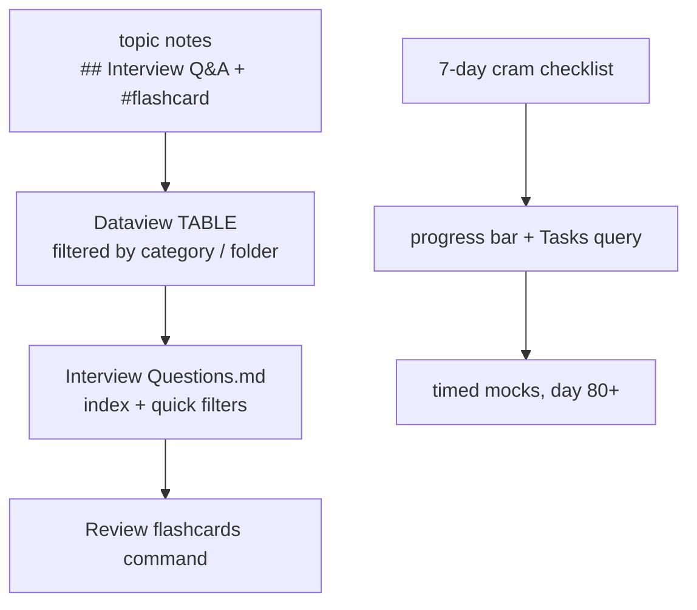

## Why it Matters

This is the **index layer** of the vault's interview prep: it stores no Q&A itself, it aggregates the `## Interview Q&A` blocks from every topic note with Dataview and sequences them into a 7-day cram plan. It keeps the bank de-duplicated and shows, in one screen, which categories still have un-reviewed notes.

## Diagram



## Code

```dataview
TABLE WITHOUT ID file.link as "Source Note", category as "Category"
FROM "Java"
WHERE category AND file.folder != "Java/99_Revision"
SORT category ASC, file.name ASC
```
```markdown-
 [ ] Day 6, Patterns: 22 GoF , be able to whiteboard Factory, Singleton, Observer, Strategy, Decorator intent ⏳ 2026-09-10
```
## When to use / not

| Use | NOT |
|-----|-----|
| Find notes by category before a mock, then drill their cards | Copy Q&A in here, it duplicates and goes stale |
| Track the 7-day cram plan and tick days off | Learn topics from the index, open the source note |

## Trade-offs

- Zero-maintenance index: any note carrying `category` appears automatically.
- Dataview renders only inside Obsidian, so the index is blank in a plain Markdown preview.

## Vs

| | This index (MOC) | Per-note Q&A | Folder cheat sheets |
|--|------------------|--------------|---------------------|
| Content | links only | full Q&A + flashcards | compressed tables |
| Maintained | automatic, via Dataview | by hand, per topic | by hand, per folder |
| Best for | "what haven't I covered" | spaced recall | last-minute skim |

## Pitfalls

- **Duplicating Q&A here** defeats the single-source design; the note's own header says do not duplicate Q&A here.
- **`WHERE category` drops notes** with empty or typoed `category` frontmatter; fix the source note, not the query.
- **Unticked days stall the plan**, the progress bar counts only `- [ ] Day n` lines that actually exist.
- **Stale due dates**, missed days keep their old `⏳` date instead of rescheduling; sweep them weekly.

## Interview q&a

**Q: How do you structure a 60-second "what's new in Java" answer?** Name the LTS, then one JEP per theme: data carriers (records, pattern matching), concurrency (virtual threads, `ScopedValue`), API (sequenced collections), runtime (compact headers, generational ZGC).

**Q: What is the weakest signal in a mock interview?** Restating the question back. The strongest is a one-line intent, one trade-off, and one concrete failure mode.

## Related

- [[99_Revision/Study Plan|Study Plan]] • [[99_Revision/Interactive Setup|Interactive Setup]]
- [[README|Java MOC]] • [[07_DSA/Cheat Sheet|DSA Cheat Sheet]] • [[06_Design-Patterns/Cheat Sheet|Patterns Cheat Sheet]]

# Interview Questions , Index

> Part of [[README|Java MOC]] • [[99_Revision/README|Revision MOC]] , **Do not duplicate Q&A here.** All Q&A lives in `01..07`; this file *indexes* it.

## All Interview q&a , by Topic
```dataviewTABLE
 WITHOUT ID file.link as "Source Note", category as "Category"
FROM "Java"
WHERE category AND file.folder != "Java/99_Revision"
SORT category ASC, file.name ASC
```
> Tip: each source note has `## Interview Q&A` with `> Q:` / `> A:` flashcards. Open them directly , or `Ctrl+O` → `Interview`.

## Quick Filters

### Core Java & oop
```
dataviewTABLE WITHOUT ID file.link as "Note"
FROM "Java/01_Core-Java" OR "Java/02_OOP"
WHERE category
SORT file.path ASC
```
### Collections & dsa
```
dataviewTABLE WITHOUT ID file.link as "Note"
FROM "Java/03_Collections" OR "Java/07_DSA"
WHERE category
SORT file.path ASC
```
### Concurrency & Spring & Patterns
```
dataviewTABLE WITHOUT ID file.link as "Note"
FROM "Java/04_Concurrency" OR "Java/05_Spring" OR "Java/06_Design-Patterns"
WHERE category
SORT file.path ASC
```
## Cram Checklist , 7 day Plan
```
dataviewjsconst tasks = dv.current().file.tasks.where(t => t.text.includes("Day"));
const done = tasks.where(t => t.completed).length;
const total = tasks.length;
const pct = total ? Math.round(done/total*100) : 0;
const bar = "█".repeat(Math.round(pct/100*14)) + "░".repeat(14 - Math.round(pct/100*14));
dv.paragraph(`**Cram progress: ${done}/${total} days** — \`${bar}\` **${pct}%**`);
```
- [ ] Day 1 , Core: `Object` vs `Wrapper` vs `POJO` vs `Singleton`; `Interface` default/static; `Method Overload` rules ⏳ 2026-09-05
- [ ] Day 2 , OOP: 4 pillars + 5 inheritance types (multiple/hybrid via interfaces); `super`/`final`/`sealed` ⏳ 2026-09-06
- [ ] Day 3 , Collections: `ArrayList` vs `LinkedList` vs `Vector`; `HashSet` vs `TreeSet`; `Queue`/`Deque` ops ⏳ 2026-09-07
- [ ] Day 4 , Concurrency: lifecycle (NEW/RUNNABLE/BLOCKED/WAITING/TIMED_WAITING/TERMINATED) + 4 creation ways + 7 issues ⏳ 2026-09-08
- [ ] Day 5 , Spring: IoC/DI/AOP + scopes/lifecycle; `@Transactional` propagation/proxy pitfall; Security filter chain ⏳ 2026-09-09
- [ ] Day 6 , Patterns: 22 GoF , be able to whiteboard Factory, Singleton, Observer, Strategy, Decorator intent ⏳ 2026-09-10
- [ ] Day 7 , DSA + Mock: Array/Linked List/Stack/Queue/HashMap/Tree complexities; do 5 timed mocks from this index ⏳ 2026-09-11
```
tasksnot done
path includes 99_Revision/Interview Questions
sort by due
```
> [!tip] Spaced review
> Flashcards live in each topic note as `Question:: answer #flashcard`. Review them with `Ctrl/Cmd + P` → `Spaced Repetition: Review flashcards`. For a surprise pick, run `Open random note`. To present a topic, run `Start presentation` (Slides) from any note.

## Cross-Links

- [[Threads]] • [[Spring Framework]] • [[Spring Core]] • [[Dependency Injection]] • [[Spring Security]] • [[Spring Transaction]]
- [[Array]] • [[Linked List]] • [[Singly Linked List]] • [[Doubly Linked List]] • [[Stack]] • [[Queue]] • [[HashMap]] • [[Trees]]
- [[README|Java MOC]] • [[99_Revision/README|Revision MOC]]

---
*Category: Revision • Part of [[README|Java MOC]] • Source of truth: each topic's `## Interview Q&A`*
