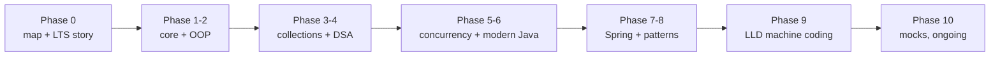

## Why it Matters

One plan covering every folder `00` to `10` plus revision at **1 hour a day with no deadline**. It is the spine of the vault: each day links the exact notes to read and states the goal in one sentence, so the hour is spent learning rather than choosing what to learn.

## Diagram



## Code

```dataview
TABLE WITHOUT ID
 length(filter(file.tasks, (t) => t.completed)) as "Done",
 length(file.tasks) as "Total",
 round(length(filter(file.tasks, (t) => t.completed)) / length(file.tasks) * 100) + "%" as "Progress"
FROM "Java/99_Revision/Study Plan"
```
## When to use / not

| Use | NOT |
|-----|-----|
| Follow one phase at a time and tick days as done | Skip phases 1 to 3 to rush Spring, the gaps resurface |
| Re-route via Fast tracks when an interview date lands | Treat it as a deadline plan, Sundays are review only |

## Trade-offs

- Linear, linked, and tickable: zero planning overhead and visible progress per day.
- One hour a day means roughly three months end to end; the Fast tracks exist because that is often too slow.

## Vs

| | This plan | Ad-hoc problem solving | Bootcamp schedule |
|--|-----------|------------------------|-------------------|
| Source | notes you already own | random problem picks | fixed curriculum |
| Pacing | 1 h/day, no deadline | bursty | full-time, hard deadline |
| Progress | ticks + Dataview percent | none | external reporting |

## Pitfalls

- **Reading without doing**, each day's goal assumes you run one snippet or restate the intent from memory.
- **Never ticking days**, Dataview divides by the tasks present, so an unticked plan still reads 0%.
- **Skipping Sundays**, review-only days are where the spaced repetition cards clear; skipping compounds them.

## Interview q&a

**Q: Why one hour a day instead of weekend marathons?** Spaced practice beats massed practice; seven hours spread over a week encode more than seven hours in one sitting, and it fits a working week.

**Q: How do you know you are ready for a mock?** When you can state each phase's exit criterion cold, for example draw the collection hierarchy or write the virtual-thread executor without notes.

## Related

- [[99_Revision/Interview Questions|Interview Questions]] • [[99_Revision/Interactive Setup|Interactive Setup]]
- [[README|Java MOC]]

# Study Plan,java Vault in one Place

> This is the only study plan. It covers every folder in `Java/`, 00 to 10 plus revision, at 1 hour a day with no deadline. Tick a day when done. The Dataview block below tracks progress live.
```dataview
TABLE WITHOUT ID
 length(filter(file.tasks, (t) => t.completed)) as "Done",
 length(file.tasks) as "Total",
 round(length(filter(file.tasks, (t) => t.completed)) / length(file.tasks) * 100) + "%" as "Progress"
FROM "Java/99_Revision/Study Plan"
```
```dataview
TASK
FROM "Java/99_Revision/Study Plan"
GROUP BY file.link
```

## Daily Hour Shape

Same split every day.

- 35 min build, run one snippet or one small slice and break it once
- 15 min study, why it matters plus when not to use it
- 10 min recall, close the note and answer its Q and A out loud

Stop at 60 min even mid note. Write the next line at the top of the note. Sundays are review only, no new notes. Mark `completed: true` and `reviewed: YYYY-MM-DD` in a note frontmatter only when you answer its Q and A cold.

## Phase 0, Orientation, Days 1 to 3

- [ ] Day 1, map and LTS story: [[Java 25 Roadmap]] plus [[LTS Evolution 8 to 25]]. Goal is one sentence per LTS jump, 8 to 25.
- [ ] Day 2, old LTS baselines: [[Java 8 LTS Overview]] plus [[Java 11 LTS Overview]]. Goal is lambdas, Streams, `java.time`, `var`, HttpClient.
- [ ] Day 3, modern baseline plus exam rules: [[Java 17 LTS Overview]] plus [[Whats New in Java 25]] plus [[Interview Strategy]]. Goal is the 60 second whats new answer with one JEP per claim.

Exit: say what changed at 8, 17, 21, and 25 without notes.

## Phase 1, Core Java, Days 4 to 15

- [ ] Day 4, language basics: [[Classes]] plus [[Interface]] plus [[Method Overload]]. Goal is overload resolution rules.
- [ ] Day 5, object roots: [[Object Class]] plus [[Wrapper Class]] plus [[Abstract Class]]. Goal is caching traps and when abstract beats interface.
- [ ] Day 6, class flavors: [[Final Class]] plus [[Immutable Class]] plus [[Concrete Class]] plus [[POJO Class]]. Goal is how to write a correct immutable class.
- [ ] Day 7, singletons and statics: [[Singleton Class]] plus [[Static Class]]. Goal is enum singleton and why double checked locking broke before `volatile`.
- [ ] Day 8, nested part 1: [[Nested Classes Overview]] plus [[Nested Inner Class]] plus [[Static Nested Class]]. Goal is capture rules and `Outer.this`.
- [ ] Day 9, nested part 2: [[Anonymous Inner Class]] plus [[Method Local Inner Class]] plus [[Anonymous Class]]. Goal is effectively final captures.
- [ ] Day 10, everyday APIs: [[String Handling]] plus [[Annotations]] plus [[Enums]]. Goal is pool and intern, retention policies, enum with fields.
- [ ] Day 11, failure and persistence: [[Exception Handling]] plus [[Serialization]]. Goal is hierarchy, try with resources, `serialVersionUID`.
- [ ] Day 12, runtime and types: [[JVM Memory Model]] plus [[Generics]]. Goal is heap versus stack, PECS, erasure limits.
- [ ] Day 13, functional core: [[Lambdas and Functional Interfaces]] plus [[Streams API]]. Goal is SAM, captures, intermediate versus terminal ops, one collector chain from memory.
- [ ] Day 14, modern utilities: [[Optional]] plus [[Date and Time API]] plus [[IO and NIO]]. Goal is `map` and `flatMap` without `get`, `java.time` basics, Path and Files.
- [ ] Day 15, review: [[01_Core-Java/Cheat Sheet|core cheat sheet]] plus the 3 weakest days above.

Exit: explain heap versus stack, PECS, and one stream collector chain from memory.

## Phase 2, oop and SOLID, Days 16 to 22

- [ ] Day 16, pillars: [[00 - OOP Overview]] plus [[Abstraction]] plus [[Encapsulation]]. Goal is 4 pillars with one Java example each.
- [ ] Day 17, polymorphism and contracts: [[Polymorphism]] plus [[Interfaces]] plus [[Inheritance]]. Goal is overloading versus overriding, interface defaults.
- [ ] Day 18, inheritance shapes: [[Single Inheritance]] plus [[Multilevel Inheritance]] plus [[Hierarchical Inheritance]]. Goal is when each shape fits.
- [ ] Day 19, the diamond: [[Multiple Inheritance]] plus [[Hybrid Inheritance]]. Goal is why classes forbid it and how interfaces solve it, sealed as the modern answer.
- [ ] Day 20, SOLID part 1: [[SOLID-Single-Responsibility]] plus [[SOLID-Open-Closed]] plus [[SOLID-Liskov-Substitution]]. Goal is one violation and one fix per principle.
- [ ] Day 21, SOLID part 2: [[SOLID-Interface-Segregation]] plus [[SOLID-Dependency-Inversion]] plus [[SOLID-Summary]]. Goal is constructor injection as DIP in one snippet.
- [ ] Day 22, design ties: [[Class-Relationships]] plus [[Law-of-Demeter]] plus [[Pragmatic-Principles-DRY-YAGNI-KISS]] plus [[02_OOP/Cheat Sheet|OOP cheat sheet]]. Goal is association versus aggregation versus composition from memory.

Exit: give one Liskov violation example and say when inheritance hurts.

## Phase 3, Collections, Days 23 to 27

- [ ] Day 23, hierarchy: [[Collection]] plus [[List]] plus [[Map]]. Goal is the root interfaces and their contracts.
- [ ] Day 24, sets and queues: [[Set]] plus [[Queue]]. Goal is ordering, duplicates, and null rules per family.
- [ ] Day 25, lists: [[ArrayList]] plus [[LinkedList]] plus [[Vector]] plus [[03_Collections/List/Stack|Stack]]. Goal is growth factors and why Vector is legacy.
- [ ] Day 26, sets: [[HashSet]] plus [[TreeSet]] plus [[Sorted Set]]. Goal is hashing versus ordering, where SequencedCollection changes the answer.
- [ ] Day 27, review: [[03_Collections/Cheat Sheet|collections cheat sheet]] plus redraw the hierarchy from memory.

Exit: draw the hierarchy cold with null and ordering rules per impl.

## Phase 4, dsa Plus Coding Patterns, Days 28 to 40

- [ ] Day 28, arrays and lists: [[Array]] plus [[Linked List]]. Goal is complexities and in place two pointer basics.
- [ ] Day 29, list variants: [[Singly Linked List]] plus [[Doubly Linked List]]. Goal is tradeoffs and reversal by hand.
- [ ] Day 30, LIFO and FIFO: [[07_DSA/Stack|Stack]] plus [[07_DSA/Queue|Queue]]. Goal is array versus linked impls.
- [ ] Day 31, maps and trees: [[HashMap]] plus [[Trees]]. Goal is HashMap internals and tree traversals.
- [ ] Day 32, heaps and graphs: [[Heap]] plus [[Graph]]. Goal is PriorityQueue use and BFS versus DFS.
- [ ] Day 33, review: [[07_DSA/Cheat Sheet|DSA cheat sheet]] plus one easy problem per structure.
- [ ] Day 34, array patterns: [[01 - Prefix Sum]] plus [[02 - Two Pointers]] plus [[03 - Sliding Window]] plus [[04 - Frequency Counting]]. Goal is 2 problems per pattern.
- [ ] Day 35, linked list patterns: [[01 - Fast and Slow Pointers]] plus [[02 - LinkedList In-place Reversal]]. Goal is cycle detect plus reverse from memory.
- [ ] Day 36, heap and stack patterns: [[01 - Monotonic Stack]] plus [[02 - Top K Elements]]. Goal is next greater plus top K from memory.
- [ ] Day 37, search patterns: [[01 - Overlapping Intervals]] plus [[02 - Modified Binary Search]]. Goal is merge template plus rotated search.
- [ ] Day 38, tree and graph patterns: [[01 - Binary Tree Traversal]] plus [[02 - DFS]] plus [[03 - BFS]]. Goal is iterative and recursive each.
- [ ] Day 39, graph extras: [[04 - Shortest Path]] plus [[05 - Trie]] plus [[01 - Matrix Traversal]]. Goal is Dijkstra sketch plus trie insert and search.
- [ ] Day 40, hard patterns: [[01 - Backtracking]] plus [[02 - Dynamic Programming]] plus [[03 - Greedy]] plus [[01 - Bit Manipulation]]. Goal is one template each, memo versus tabulation.

Exit: state time and space per structure and solve one easy plus one medium per pattern block without hints.

## Phase 5, Concurrency, Days 41 to 44

- [ ] Day 41, threads: [[Threads]]. Goal is lifecycle, 4 creation ways, platform versus virtual threads.
- [ ] Day 42, executors and futures: [[Executor Framework]] plus [[CompletableFuture]]. Goal is `newVirtualThreadPerTaskExecutor` plus one async chain from memory.
- [ ] Day 43, safety: [[Locks and Synchronizers]] plus [[Atomics and Volatile]] plus [[Concurrent Collections]]. Goal is `synchronized` no longer pinning since Java 24, CAS basics, ConcurrentHashMap use.
- [ ] Day 44, review: [[04_Concurrency/Cheat Sheet|concurrency cheat sheet]] plus rewrite the virtual executor snippet blind.

Exit: write the virtual thread executor cold and say when not to use virtual threads.

## Phase 6, Modern Java and lts Delta, Days 45 to 51

- [ ] Day 45, data carriers: [[01 Records]] plus [[02 Sealed Classes]]. Goal is compact constructor validation plus permits clauses.
- [ ] Day 46, matching: [[03 Pattern Matching]] plus [[04 Pattern Matching for Switch]]. Goal is guards plus exhaustiveness.
- [ ] Day 47, ordering: [[04 Sequenced Collections]] plus [[02 Sequenced Collections]]. Goal is `getFirst`, `getLast`, `reversed` across List, Deque, LinkedHashSet.
- [ ] Day 48, loom: [[05 Virtual Threads - Loom]] plus [[01 Virtual Threads]]. Goal is JEP 444 scope plus pinning fix JEP 491.
- [ ] Day 49, patterns and sugar: [[03 Record Patterns]] plus [[05 String Templates]] plus [[06 Unnamed Patterns and Variables]] plus [[07 Unnamed Classes and Instance Main]]. Goal is what each removes.
- [ ] Day 50, runtime shape: [[06 ScopedValue]] plus [[08 Compact Object Headers and Performance]] plus [[07 Flexible Constructors and Module Imports]]. Goal is ScopedValue versus ThreadLocal in one paragraph.
- [ ] Day 51, platform: [[08 Generational ZGC]] plus [[09 Foreign Function and Memory API]] plus [[00 Java 21 Overview]] plus [[Interview Strategy]] 60 second answer. Goal is one JEP number per claim.

Exit: deliver the whats new answer with record versus class and ScopedValue versus ThreadLocal included.

## Phase 7, Spring, Days 52 to 60

- [ ] Day 52, container: [[Spring Framework]] plus [[Spring Core]] plus [[Dependency Injection]]. Goal is BeanFactory versus ApplicationContext, scopes, lifecycle.
- [ ] Day 53, patterns behind Spring: [[Dependency Injection Pattern]] plus [[Singleton]] plus [[Factory Method]]. Goal is where Spring uses each.
- [ ] Day 54, Boot: [[Spring Boot]]. Goal is starters, auto config conditions, Actuator, plus `spring.threads.virtual.enabled=true` with a reason.
- [ ] Day 55, web: [[Spring MVC]]. Goal is one CRUD endpoint plus `ProblemDetail` handler, filter versus interceptor versus AOP.
- [ ] Day 56, data: [[Spring Data JPA]]. Goal is entity states, dirty checking, N plus 1 fix with fetch join.
- [ ] Day 57, transactions plus threads: [[Spring Transaction]] plus [[Executor Framework]] plus [[CompletableFuture]]. Goal is propagation, self invocation pitfall, why not to fork inside a transaction.
- [ ] Day 58, security: [[Spring Security]] plus [[Locks and Synchronizers]] plus [[Concurrent Collections]]. Goal is the filter chain plus one secured endpoint.
- [ ] Day 59, review: [[05_Spring/Cheat Sheet|Spring cheat sheet]] plus stale cards.
- [ ] Day 60, build slice part 1: controller plus service with validation and one `@Transactional` method.
- [ ] Day 61, build slice part 2: repository plus virtual threads flag plus error handler. Explain each layer out loud.

Exit: the slice runs and you can draw controller to repository with the transaction proxy pitfall marked.

## Phase 8, Patterns as Spring Uses Them, Days 62 to 67

- [ ] Day 62, creational: [[Singleton]] plus [[Builder]] plus [[Factory Method]] plus [[Abstract Factory]] plus [[Prototype]]. Goal is Factory Method versus Abstract Factory plus where BeanFactory fits.
- [ ] Day 63, structural part 1: [[Adapter]] plus [[Bridge]] plus [[Composite]] plus [[Decorator]]. Goal is decorator versus proxy versus adapter.
- [ ] Day 64, structural part 2: [[Facade]] plus [[Flyweight]] plus [[Proxy]]. Goal is AOP proxy mechanics plus record based flyweight.
- [ ] Day 65, behavioral staples: [[Strategy]] plus [[Observer]] plus [[Template Method]] plus [[Command]] plus [[Chain of Responsibility]]. Goal is strategy plus observer in service code.
- [ ] Day 66, the rest: [[Iterator]] plus [[Mediator]] plus [[Memento]] plus [[State]] plus [[Visitor]] plus [[Interpreter]]. Goal is sealed switch as the modern visitor replacement.
- [ ] Day 67, extras plus review: [[DAO Pattern]] plus [[Dependency Injection Pattern]] plus [[06_Design-Patterns/Cheat Sheet|patterns cheat sheet]].

Exit: name the pattern in any Spring class shown to you, for example RestTemplate, AOP proxy, JdbcTemplate.

## Phase 9, lld Machine Coding, Days 68 to 79

- [ ] Day 68, method: [[00_Method-How-to-Answer-LLD]] plus [[00_UML-Class-and-Sequence-Diagrams]]. Goal is the 35 minute structure plus class versus sequence reads.
- [ ] Day 69, parking part 1: [[01_Parking-Lot]] classes and relationships.
- [ ] Day 70, parking part 2: [[01_Parking-Lot]] thread safety plus pricing extension.
- [ ] Day 71, machines: [[02_Vending-Machine]] plus [[17_Coffee-Vending-Machine]]. Goal is state handling plus inventory concurrency.
- [ ] Day 72, cache: [[06_LRU-Cache]]. Goal is HashMap plus doubly linked list from memory with lock choice stated.
- [ ] Day 73, money: [[05_ATM]] plus [[04_Stack-Overflow]]. Goal is account locking plus vote ranking sketch.
- [ ] Day 74, movement: [[07_Elevator-System]] plus [[08_Tic-Tac-Toe]]. Goal is scheduling plus win detect.
- [ ] Day 75, messaging: [[09_Pub-Sub-System]] plus [[03_Logging-Framework]]. Goal is subscriber fan out plus appenders.
- [ ] Day 76, split and book: [[11_Splitwise]] plus [[12_Movie-Ticket-Booking]]. Goal is settle up logic plus seat hold and expiry.
- [ ] Day 77, ride and game: [[13_Ride-Sharing-Uber]] plus [[14_Snake-and-Ladder]]. Goal is matching sketch plus turn engine.
- [ ] Day 78, ops: [[15_Task-Management-System]] plus [[16_Traffic-Signal-Control]] plus [[10_Chess-Game]] skim. Goal is one clean diagram for the weakest of the three.
- [ ] Day 79, defense: re whiteboard parking lot or LRU in 35 minutes with thread safety callout and one pattern named per class.

Exit: two builds you can defend end to end.

## Phase 10, Mocks, Ongoing from day 80

Folder `99_Revision` plus [[Interview Questions]] bank.

- [ ] Day 80, mock 1: 10 random Q and A from [[Interview Questions]] plus [[07_DSA/Cheat Sheet|DSA cheat sheet]].
- [ ] Day 81, mock 2: timed full stack, 1 DSA plus 1 concurrency snippet plus 1 Spring slice explanation.
- [ ] Weekly after that: 5 random cards, 1 whiteboard feature explanation, overdue sweep in [[Dashboard|the Dashboard]], mark reviewed dates.

Exit is ongoing: no stale note older than 7 days before an interview week.

## Fast Tracks Inside this Plan

- Backend interview soon: phases 0 to 3, then 5 to 7, then 10. Defer LLD and DP depth.
- Architect pivot: overweight days 57, 58, 60, 61, 68 to 79. Add one written tradeoff note per build.
- Java 25 delta only: days 45 to 51 plus the Interview Strategy one liners. Half a day if phases 1 to 5 hold.

---
*Part of [[README|99 Revision MOC]] • [[../00_Java-25-Overview/Realistic Roadmap|Roadmap]] • [[Interview Strategy]] • [[Interview Questions]]*
